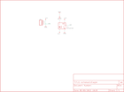

Contents
========

* [PRS9322 > Photo Interrupter Breakout](#prs9322--photo-interrupter-breakout)
	* [Schematic](#schematic)
	* [PCB](#pcb)
	* [Interactive BOM](#interactive-bom)
	* [OOMP Parts](#oomp-parts)
	* [Images](#images)
	* [Tags](#tags)
  
![][im]
# PRS9322 > Photo Interrupter Breakout

- ID: PROJ-SPAR-9322-STAN-01
- Hex ID: PRS9322
- Name: Sparkfun
- Description: Sparkfun
- Long Link: [http://oom.lt/PROJ-SPAR-9322-STAN-01](http://oom.lt/PROJ-SPAR-9322-STAN-01)
- Short Link: [http://oom.lt/PRS9322](http://oom.lt/PRS9322)

## Schematic
  

## PCB
  

## Interactive BOM

- Interactive BOM page: [ibom.html](https://htmlpreview.github.io/?https://github.com/oomlout/oomlout_OOMP_projects/blob/main/PROJ-SPAR-9322-STAN-01/kicad/bom/ibom.html)

## OOMP Parts
  

|OOMP ID|Name|Identifier|
| :---: | :---: | :---: |
|[HEAD-I01-X-PI03-01](https://github.com/oomlout/oomlout_OOMP_parts/tree/main/HEAD-I01-X-PI03-01/)|[2.54 mm 3 Pin Header](https://github.com/oomlout/oomlout_OOMP_parts/tree/main/HEAD-I01-X-PI03-01/)|[JP1](https://github.com/oomlout/oomlout_OOMP_parts/tree/main/HEAD-I01-X-PI03-01/)|
|RESE-UNMATCHED-X-O221-01||R1|
|UNMATCHED-UNMATCHED-X-UNMATCHED-01||U1|

## Images
  
  

|bominteractivefront|bominteractiveback|kicadPcb3d|kicadPcb3dFront|kicadPcb3dBack|kicadSchem|eagleImage|eagleSchemImage|pcbdraw|pcbdrawback|
| :---: | :---: | :---: | :---: | :---: | :---: | :---: | :---: | :---: | :---: |
|||||||||||

## Tags

- hexID: PRS9322
- oompType: PROJ
- oompSize: SPAR
- oompColor: 9322
- oompDesc: STAN
- oompIndex: 01
- oompName: Photo Interrupter Breakout
- sources: All source files from https://github.com/sparkfun/Photo_Interrupter_Breakout (source licence details in srcLicense.md)
- linkBuyPage: https://www.sparkfun.com/products/9322
- oompID: PROJ-SPAR-9322-STAN-01
- oompParts: JP1,HEAD-I01-X-PI03-01
- oompParts: R1,RESE-UNMATCHED-X-O221-01
- oompParts: U1,UNMATCHED-UNMATCHED-X-UNMATCHED-01
- rawParts: JP1,,M03PTH,1X03,Header 3,,
- rawParts: R1,220,RESISTORPTH1,AXIAL-0.3,Resistor,,
- rawParts: U1,GP1A57HR,GP1A57HR,GP1A57HR,,,
- rawParts: U2,LOGO-SFESK,LOGO-SFESK,SFE-LOGO-FLAME,Spark Fun Electronics PCB Logo,,

[im]: kicadPcb3d_450.png
