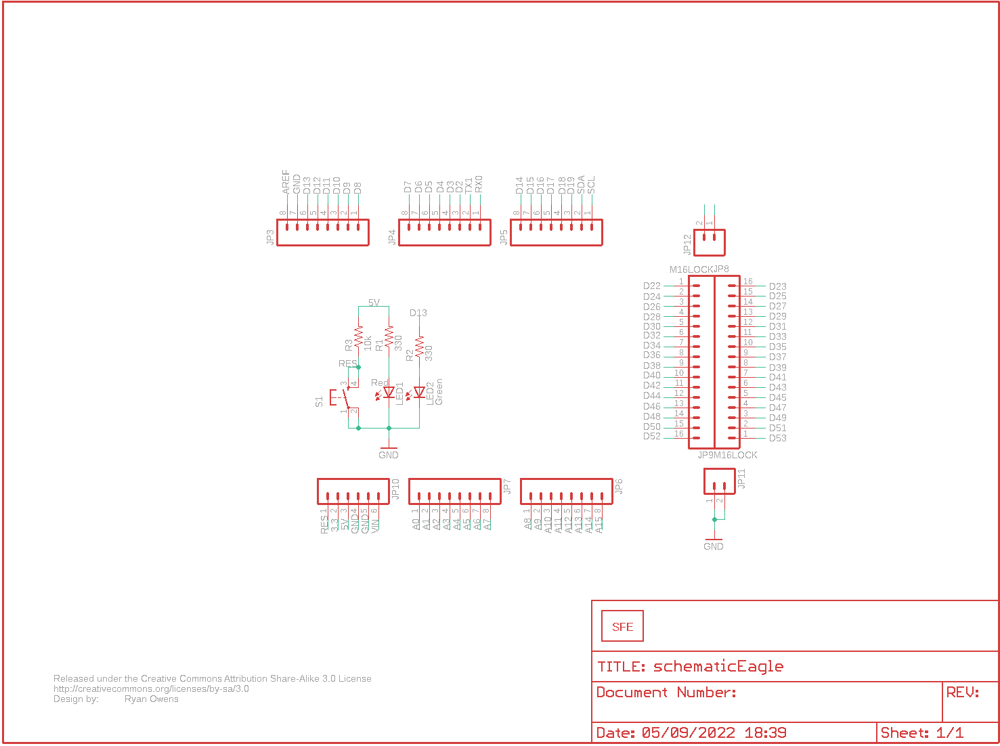
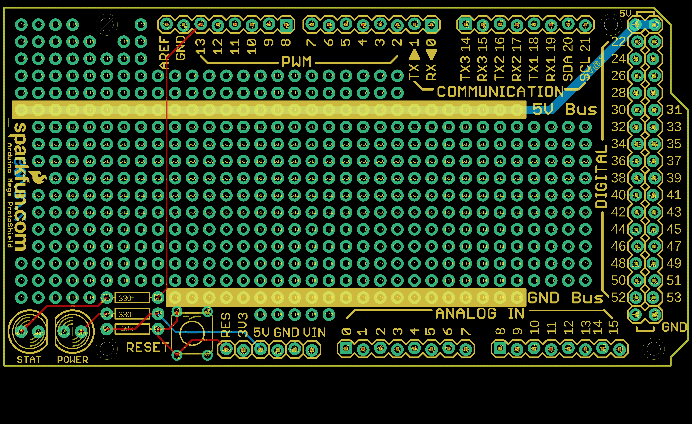
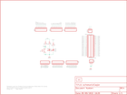

Contents
========

* [PRS9346 > MegaShield Kit](#prs9346--megashield-kit)
	* [Schematic](#schematic)
	* [PCB](#pcb)
	* [OOMP Parts](#oomp-parts)
	* [Images](#images)
	* [Tags](#tags)
  
![][im]
# PRS9346 > MegaShield Kit

- ID: PROJ-SPAR-9346-STAN-01
- Hex ID: PRS9346
- Name: Sparkfun
- Description: Sparkfun
- Long Link: [http://oom.lt/PROJ-SPAR-9346-STAN-01](http://oom.lt/PROJ-SPAR-9346-STAN-01)
- Short Link: [http://oom.lt/PRS9346](http://oom.lt/PRS9346)

## Schematic
  

## PCB
  

## OOMP Parts
  

|OOMP ID|Name|Identifier|
| :---: | :---: | :---: |
|[HEAD-I01-X-PI08-01](https://github.com/oomlout/oomlout_OOMP_parts/tree/main/HEAD-I01-X-PI08-01/)|[2.54 mm 8 Pin Header](https://github.com/oomlout/oomlout_OOMP_parts/tree/main/HEAD-I01-X-PI08-01/)|[JP3, JP4, JP5, JP6, JP7](https://github.com/oomlout/oomlout_OOMP_parts/tree/main/HEAD-I01-X-PI08-01/)|
|[HEAD-I01-X-PI16-01](https://github.com/oomlout/oomlout_OOMP_parts/tree/main/HEAD-I01-X-PI16-01/)|[2.54 mm 16 Pin Header](https://github.com/oomlout/oomlout_OOMP_parts/tree/main/HEAD-I01-X-PI16-01/)|[JP8, JP9](https://github.com/oomlout/oomlout_OOMP_parts/tree/main/HEAD-I01-X-PI16-01/)|
|[HEAD-I01-X-PI06-01](https://github.com/oomlout/oomlout_OOMP_parts/tree/main/HEAD-I01-X-PI06-01/)|[2.54 mm 6 Pin Header](https://github.com/oomlout/oomlout_OOMP_parts/tree/main/HEAD-I01-X-PI06-01/)|[JP10](https://github.com/oomlout/oomlout_OOMP_parts/tree/main/HEAD-I01-X-PI06-01/)|
|[HEAD-I01-X-PI02-01](https://github.com/oomlout/oomlout_OOMP_parts/tree/main/HEAD-I01-X-PI02-01/)|[2.54 mm 2 Pin Header](https://github.com/oomlout/oomlout_OOMP_parts/tree/main/HEAD-I01-X-PI02-01/)|[JP11, JP12](https://github.com/oomlout/oomlout_OOMP_parts/tree/main/HEAD-I01-X-PI02-01/)|
|LEDS-UNMATCHED-R-STAN-01||LED1|
|LEDS-UNMATCHED-G-STAN-01||LED2|
|RESE-UNMATCHED-X-O331-01||R1, R2|
|RESE-UNMATCHED-X-O103-01||R3|
|UNMATCHED-UNMATCHED-X-UNMATCHED-01||S1|

## Images
  
  

|kicadPcb3d|kicadPcb3dFront|kicadPcb3dBack|eagleImage|eagleSchemImage|
| :---: | :---: | :---: | :---: | :---: |
||||||

## Tags

- hexID: PRS9346
- oompType: PROJ
- oompSize: SPAR
- oompColor: 9346
- oompDesc: STAN
- oompIndex: 01
- oompName: MegaShield Kit
- sources: All source files from https://github.com/sparkfun/MegaShield_Kit (source licence details in srcLicense.md)
- linkBuyPage: https://www.sparkfun.com/products/9346
- oompID: PROJ-SPAR-9346-STAN-01
- oompParts: JP3,HEAD-I01-X-PI08-01
- oompParts: JP4,HEAD-I01-X-PI08-01
- oompParts: JP5,HEAD-I01-X-PI08-01
- oompParts: JP6,HEAD-I01-X-PI08-01
- oompParts: JP7,HEAD-I01-X-PI08-01
- oompParts: JP8,HEAD-I01-X-PI16-01
- oompParts: JP9,HEAD-I01-X-PI16-01
- oompParts: JP10,HEAD-I01-X-PI06-01
- oompParts: JP11,HEAD-I01-X-PI02-01
- oompParts: JP12,HEAD-I01-X-PI02-01
- oompParts: LED1,LEDS-UNMATCHED-R-STAN-01
- oompParts: LED2,LEDS-UNMATCHED-G-STAN-01
- oompParts: R1,RESE-UNMATCHED-X-O331-01
- oompParts: R2,RESE-UNMATCHED-X-O331-01
- oompParts: R3,RESE-UNMATCHED-X-O103-01
- oompParts: S1,UNMATCHED-UNMATCHED-X-UNMATCHED-01
- rawParts: JP3,,M08LOCK,1X08_LOCK,Header 8,,
- rawParts: JP4,,M08LOCK,1X08_LOCK,Header 8,,
- rawParts: JP5,,M08LOCK,1X08_LOCK,Header 8,,
- rawParts: JP6,,M08LOCK,1X08_LOCK,Header 8,,
- rawParts: JP7,,M08LOCK,1X08_LOCK,Header 8,,
- rawParts: JP8,M16LOCK,M16LOCK,1X16_LOCK,,,
- rawParts: JP9,M16LOCK,M16LOCK,1X16_LOCK,,,
- rawParts: JP10,,M06LOCK,1X06_LOCK,Header 6,,
- rawParts: JP11,,M02LOCK,1X02_LOCK,Header 2,,
- rawParts: JP12,,M02LOCK,1X02_LOCK,Header 2,,
- rawParts: LED1,Red,LED5MM,LED5MM,LEDs,,
- rawParts: LED2,Green,LED5MM,LED5MM,LEDs,,
- rawParts: R1,330,RESISTORPTH1,AXIAL-0.3,Resistor,,
- rawParts: R2,330,RESISTORPTH1,AXIAL-0.3,Resistor,,
- rawParts: R3,10k,RESISTORPTH1,AXIAL-0.3,Resistor,,
- rawParts: S1,,TAC_SWITCHPTH,TACTILE-PTH,Momentary Switch,,
- rawParts: U$1,LOGO-SFENEW,LOGO-SFENEW,SFE-NEW-WEBLOGO,Spark Fun Electronics PCB Logo,,
- rawParts: U$2,CREATIVE_COMMONS,CREATIVE_COMMONS,CREATIVE_COMMONS,,,

[im]: kicadPcb3d_450.png
