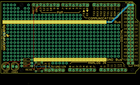

Contents
========

* [PROJ-SPAR-9346-STAN-01>MegaShield Kit](#proj-spar-9346-stan-01megashield-kit)
	* [Images](#images)
	* [Tags](#tags)
  
![][im]
# PROJ-SPAR-9346-STAN-01>MegaShield Kit

- ID: PROJ-SPAR-9346-STAN-01
- Hex ID: PRS9346
- Name: MegaShield Kit
- Description: 

## Images
  
  

|eagleImage|kicadPcb3dFront|kicadPcb3dBack|kicadPcb3d|
| :---: | :---: | :---: | :---: |
|||||

## Tags

- hexID: PRS9346
- oompType: PROJ
- oompSize: SPAR
- oompColor: 9346
- oompDesc: STAN
- oompIndex: 01
- oompName: MegaShield Kit
- sources: All source files from https://github.com/sparkfun/MegaShield_Kit (source licence details in srcLicense.md)
- linkBuyPage: https://www.sparkfun.com/products/9346
- oompID: PROJ-SPAR-9346-STAN-01

[im]: kicadPcb3d_450.png
