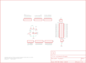

Contents
========

* [PRS9346 > MegaShield Kit](#prs9346--megashield-kit)
	* [Schematic](#schematic)
	* [PCB](#pcb)
	* [Images](#images)
	* [Tags](#tags)
  
![][im]
# PRS9346 > MegaShield Kit

- ID: PROJ-SPAR-9346-STAN-01
- Hex ID: PRS9346
- Name: Sparkfun
- Description: Sparkfun
- Long Link: [http://oom.lt/PROJ-SPAR-9346-STAN-01](http://oom.lt/PROJ-SPAR-9346-STAN-01)
- Short Link: [http://oom.lt/PRS9346](http://oom.lt/PRS9346)

## Schematic
  

## PCB
  

## Images
  
  

|kicadPcb3d|kicadPcb3dFront|kicadPcb3dBack|eagleImage|eagleSchemImage|
| :---: | :---: | :---: | :---: | :---: |
||||||

## Tags

- hexID: PRS9346
- oompType: PROJ
- oompSize: SPAR
- oompColor: 9346
- oompDesc: STAN
- oompIndex: 01
- oompName: MegaShield Kit
- sources: All source files from https://github.com/sparkfun/MegaShield_Kit (source licence details in srcLicense.md)
- linkBuyPage: https://www.sparkfun.com/products/9346
- oompID: PROJ-SPAR-9346-STAN-01

[im]: kicadPcb3d_450.png
