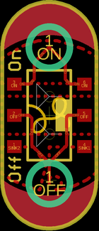

Contents
========

* [PRS9350 > Sparkfun](#prs9350--sparkfun)
	* [Schematic](#schematic)
	* [Interactive BOM](#interactive-bom)
	* [Images](#images)
	* [Tags](#tags)

# PRS9350 > Sparkfun

- ID: PROJ-SPAR-9350-STAN-01
- Hex ID: PRS9350
- Name: Sparkfun
- Description: Sparkfun
- Long Link: [http://oom.lt/PROJ-SPAR-9350-STAN-01](http://oom.lt/PROJ-SPAR-9350-STAN-01)
- Long Link: [http://oom.lt/PRS9350](http://oom.lt/PRS9350)

## Schematic
  
![][schem]
## Interactive BOM

- Interactive BOM page: [ibom.html](https://htmlpreview.github.io/?https://github.com/oomlout/oomlout_OOMP_projects/blob/main/PROJ-SPAR-9350-STAN-01/kicad/bom/ibom.html)

## Images
  
  

|eagleImage|
| :---: |
||

## Tags

- hexID: PRS9350
- oompType: PROJ
- oompSize: SPAR
- oompColor: 9350
- oompDesc: STAN
- oompIndex: 01
- oompName: LilyPad Slide Switch
- sources: All source files from https://github.com/sparkfun/LilyPad_Slide_Switch (source licence details in srcLicense.md)
- linkBuyPage: https://www.sparkfun.com/products/9350
- oompID: PROJ-SPAR-9350-STAN-01

[schem]: eagleSchemImage.png
