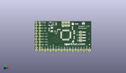
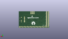
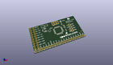

Contents
========

* [PROJ-SPAR-9352-STAN-01>GraphicLCD Serial Backpack](#proj-spar-9352-stan-01graphiclcd-serial-backpack)
	* [Images](#images)
	* [Interactive BOM](#interactive-bom)
	* [OOMP Parts](#oomp-parts)
	* [Tags](#tags)
  
![][im]
# PROJ-SPAR-9352-STAN-01>GraphicLCD Serial Backpack

- ID: PROJ-SPAR-9352-STAN-01
- Hex ID: PRS9352
- Name: GraphicLCD Serial Backpack
- Description: 

## Images
  
  

|eagleImage|kicadPcb3dFront|kicadPcb3dBack|kicadPcb3d|
| :---: | :---: | :---: | :---: |
|||||

## Interactive BOM

- Interactive BOM page: [ibom.html](kicad/bom/ibom.html)

## OOMP Parts
  

|OOMP Parts|
| :---: |
|CAPE-0603-X-NF100-01, C1, 12.954, 20.574, 270,C1, 0.1uF, 0603-CAP, SparkFun, (12.954, 20.574), R270|
|CAPE-0603-X-NF100-01, C2, 35.814, 13.224, 90,C2, 0.1uF, 0603-CAP, SparkFun, (35.814, 13.224), R90|
|CAPE-UNMATCHED-X-UNMATCHED-01, C4, 15.494, 20.574, 90,C4, 10uF, EIA3216, SparkFun, (15.494, 20.574), R90|
|UNMATCHED-UNMATCHED-X-UNMATCHED-01, JP1, 49.784, 14.224, 90,JP1, 1X04-SMD, SparkFun, (49.784, 14.224), R90|
|UNMATCHED-UNMATCHED-X-UNMATCHED-01, JP2, 41.656, 10.414, 90,JP2, 1X04, SparkFun, (41.656, 10.414), R90|
|UNMATCHED-UNMATCHED-X-UNMATCHED-01, JP3, 49.784, 1.524, 180,JP3, M20SPECIAL, 1X20_LOCK_SPECIAL, SparkFun, (49.784, 1.524), R180|
|UNMATCHED-UNMATCHED-X-UNMATCHED-01, JP4, 2.794, 15.494, M270,JP4, M10X2SPECIAL, 2X10_LOCK_SPECIAL, SparkFun, (2.794, 15.494), MR270|
|UNMATCHED-UNMATCHED-X-UNMATCHED-01, Q1, 19.304, 18.034, 180,Q1, TRANSISTOR_PNPSMD, SOT23-3, SparkFun, (19.304, 18.034), R180|
|<table><tr><td></td><td> R1</td><td>[RESE-0603-X-O103-01 SMD (0603) 10k Ohm Resistor](https://github.com/oomlout/oomlout_OOMP_parts/tree/main/RESE-0603-X-O103-01/)</td><td>[R6103](https://github.com/oomlout/oomlout_OOMP_parts/tree/main/RESE-0603-X-O103-01/)</td></tr></table>|
|<table><tr><td></td><td> R2</td><td>[RESE-0603-X-O331-01 SMD (0603) 330 Ohm Resistor](https://github.com/oomlout/oomlout_OOMP_parts/tree/main/RESE-0603-X-O331-01/)</td><td>[R6331](https://github.com/oomlout/oomlout_OOMP_parts/tree/main/RESE-0603-X-O331-01/)</td></tr></table>|
|RESE-UNMATCHED-X-UNMATCHED-01, R3, 14.224, 25.654, 0,R3, TRIMPOTSMD, TRIMPOT-3MM, SparkFun, (14.224, 25.654), R0|
|RESE-0603-X-UNMATCHED-01, R4, 38.084, 25.654, 180,R4, 4.7K, 0603-RES, SparkFun, (38.084, 25.654), R180|
|UNMATCHED-UNMATCHED-X-UNMATCHED-01, SJ1, 34.544, 25.654, 180,SJ1, SOLDERJUMPERNC2, SJ_2S-NOTRACE, SparkFun, (34.544, 25.654), R180|
|UNMATCHED-UNMATCHED-X-UNMATCHED-01, TP1, 46.99, 10.16, M0,TP1, RXD, PAD.03X.05, SparkFun, (46.99, 10.16), MR0|
|UNMATCHED-UNMATCHED-X-UNMATCHED-01, TP2, 46.99, 12.7, M0,TP2, TXD, PAD.03X.05, SparkFun, (46.99, 12.7), MR0|
|UNMATCHED-UNMATCHED-X-UNMATCHED-01, TP3, 46.99, 17.78, M0,TP3, VIN, PAD.03X.05, SparkFun, (46.99, 17.78), MR0|
|UNMATCHED-UNMATCHED-X-UNMATCHED-01, U1, 18.034, 25.654, 90,U1, V_REG_LDOSMD, SOT23-5, SparkFun, (18.034, 25.654), R90|
|UNMATCHED-UNMATCHED-X-UNMATCHED-01, U2, 28.194, 15.494, 180,U2, ATMEGA168, TQFP32-08, SparkFun, (28.194, 15.494), R180|
|UNMATCHED-UNMATCHED-X-UNMATCHED-01, Y1, 35.814, 18.034, 90,Y1, RESONATORSMD, RESONATOR-SMD, SparkFun, (35.814, 18.034), R90|

## Tags

- hexID: PRS9352
- oompType: PROJ
- oompSize: SPAR
- oompColor: 9352
- oompDesc: STAN
- oompIndex: 01
- oompName: GraphicLCD Serial Backpack
- sources: All source files from https://github.com/sparkfun/GraphicLCD_Serial_Backpack (source licence details in srcLicense.md)
- linkBuyPage: https://www.sparkfun.com/products/9352
- oompPart: CAPE-0603-X-NF100-01, C1, 12.954, 20.574, 270
- oompPart: CAPE-0603-X-NF100-01, C2, 35.814, 13.224, 90
- oompPart: CAPE-UNMATCHED-X-UNMATCHED-01, C4, 15.494, 20.574, 90
- oompPart: UNMATCHED-UNMATCHED-X-UNMATCHED-01, JP1, 49.784, 14.224, 90
- oompPart: UNMATCHED-UNMATCHED-X-UNMATCHED-01, JP2, 41.656, 10.414, 90
- oompPart: UNMATCHED-UNMATCHED-X-UNMATCHED-01, JP3, 49.784, 1.524, 180
- oompPart: UNMATCHED-UNMATCHED-X-UNMATCHED-01, JP4, 2.794, 15.494, M270
- oompPart: UNMATCHED-UNMATCHED-X-UNMATCHED-01, Q1, 19.304, 18.034, 180
- oompPart: RESE-0603-X-O103-01, R1, 34.274, 21.844, 270
- oompPart: RESE-0603-X-O331-01, R2, 21.844, 20.574, 180
- oompPart: RESE-UNMATCHED-X-UNMATCHED-01, R3, 14.224, 25.654, 0
- oompPart: RESE-0603-X-UNMATCHED-01, R4, 38.084, 25.654, 180
- oompPart: UNMATCHED-UNMATCHED-X-UNMATCHED-01, SJ1, 34.544, 25.654, 180
- oompPart: UNMATCHED-UNMATCHED-X-UNMATCHED-01, TP1, 46.99, 10.16, M0
- oompPart: UNMATCHED-UNMATCHED-X-UNMATCHED-01, TP2, 46.99, 12.7, M0
- oompPart: UNMATCHED-UNMATCHED-X-UNMATCHED-01, TP3, 46.99, 17.78, M0
- oompPart: SKIP-UNMATCHED-X-UNMATCHED-01, U$2, 25.654, 24.384, 0
- oompPart: SKIP-UNMATCHED-X-UNMATCHED-01, U$9, 9.144, 26.924, 0
- oompPart: SKIP-UNMATCHED-X-UNMATCHED-01, U$10, 49.784, 6.604, 0
- oompPart: UNMATCHED-UNMATCHED-X-UNMATCHED-01, U1, 18.034, 25.654, 90
- oompPart: UNMATCHED-UNMATCHED-X-UNMATCHED-01, U2, 28.194, 15.494, 180
- oompPart: UNMATCHED-UNMATCHED-X-UNMATCHED-01, Y1, 35.814, 18.034, 90
- rawPart: C1, 0.1uF, 0603-CAP, SparkFun, (12.954, 20.574), R270
- rawPart: C2, 0.1uF, 0603-CAP, SparkFun, (35.814, 13.224), R90
- rawPart: C4, 10uF, EIA3216, SparkFun, (15.494, 20.574), R90
- rawPart: JP1, 1X04-SMD, SparkFun, (49.784, 14.224), R90
- rawPart: JP2, 1X04, SparkFun, (41.656, 10.414), R90
- rawPart: JP3, M20SPECIAL, 1X20_LOCK_SPECIAL, SparkFun, (49.784, 1.524), R180
- rawPart: JP4, M10X2SPECIAL, 2X10_LOCK_SPECIAL, SparkFun, (2.794, 15.494), MR270
- rawPart: Q1, TRANSISTOR_PNPSMD, SOT23-3, SparkFun, (19.304, 18.034), R180
- rawPart: R1, 10K, 0603-RES, SparkFun, (34.274, 21.844), R270
- rawPart: R2, 330, 0603-RES, SparkFun, (21.844, 20.574), R180
- rawPart: R3, TRIMPOTSMD, TRIMPOT-3MM, SparkFun, (14.224, 25.654), R0
- rawPart: R4, 4.7K, 0603-RES, SparkFun, (38.084, 25.654), R180
- rawPart: SJ1, SOLDERJUMPERNC2, SJ_2S-NOTRACE, SparkFun, (34.544, 25.654), R180
- rawPart: TP1, RXD, PAD.03X.05, SparkFun, (46.99, 10.16), MR0
- rawPart: TP2, TXD, PAD.03X.05, SparkFun, (46.99, 12.7), MR0
- rawPart: TP3, VIN, PAD.03X.05, SparkFun, (46.99, 17.78), MR0
- rawPart: U$2, AVR_SPI_PRG_6PTH, 2X3, SparkFun, (25.654, 24.384), R0
- rawPart: U$9, FIDUCIAL1X2, FIDUCIAL-1X2, SparkFun, (9.144, 26.924), R0
- rawPart: U$10, FIDUCIAL1X2, FIDUCIAL-1X2, SparkFun, (49.784, 6.604), R0
- rawPart: U1, V_REG_LDOSMD, SOT23-5, SparkFun, (18.034, 25.654), R90
- rawPart: U2, ATMEGA168, TQFP32-08, SparkFun, (28.194, 15.494), R180
- rawPart: Y1, RESONATORSMD, RESONATOR-SMD, SparkFun, (35.814, 18.034), R90

[im]: kicadPcb3d_450.png
