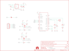
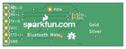

Contents
========

* [PRS9358 > Bluetooth Mate](#prs9358--bluetooth-mate)
	* [Schematic](#schematic)
	* [PCB](#pcb)
	* [Interactive BOM](#interactive-bom)
	* [Images](#images)
	* [Tags](#tags)
  
![][im]
# PRS9358 > Bluetooth Mate

- ID: PROJ-SPAR-9358-STAN-01
- Hex ID: PRS9358
- Name: Sparkfun
- Description: Sparkfun
- Long Link: [http://oom.lt/PROJ-SPAR-9358-STAN-01](http://oom.lt/PROJ-SPAR-9358-STAN-01)
- Short Link: [http://oom.lt/PRS9358](http://oom.lt/PRS9358)

## Schematic
  

## PCB
  

## Interactive BOM

- Interactive BOM page: [ibom.html](https://htmlpreview.github.io/?https://github.com/oomlout/oomlout_OOMP_projects/blob/main/PROJ-SPAR-9358-STAN-01/kicad/bom/ibom.html)

## Images
  
  

|bominteractivefront|bominteractiveback|kicadPcb3d|kicadPcb3dFront|kicadPcb3dBack|eagleImage|eagleSchemImage|pcbdraw|pcbdrawback|
| :---: | :---: | :---: | :---: | :---: | :---: | :---: | :---: | :---: |
||||||||||

## Tags

- hexID: PRS9358
- oompType: PROJ
- oompSize: SPAR
- oompColor: 9358
- oompDesc: STAN
- oompIndex: 01
- oompName: Bluetooth Mate
- sources: All source files from https://github.com/sparkfun/Bluetooth_Mate (source licence details in srcLicense.md)
- linkBuyPage: https://www.sparkfun.com/products/9358
- oompID: PROJ-SPAR-9358-STAN-01
- rawParts: C1,10uF,CAP_POL1206,EIA3216,Capacitor Polarized,,
- rawParts: C3,10uF,CAP_POL1206,EIA3216,Capacitor Polarized,,
- rawParts: C4,1uF,CAP0603-CAP,0603-CAP,Capacitor,,
- rawParts: D1,Red,LED0603,LED-0603,LEDs,,
- rawParts: D2,Green,LED0603,LED-0603,LEDs,,
- rawParts: FRAME1,FRAME-LETTER,FRAME-LETTER,CREATIVE_COMMONS,Schematic Frame,,
- rawParts: JP1,FIDUCIAL1X2.5,FIDUCIAL1X2.5,FIDUCIAL-1X2.5,Fiducial Alignment Points,,
- rawParts: JP2,M01SMDNS,M01SMDNS,1X01NS,Header 1,,
- rawParts: JP3,,ARDUINO_SERIAL_PROGRAMPTH,1X06,,,
- rawParts: JP4,FIDUCIAL1X2.5,FIDUCIAL1X2.5,FIDUCIAL-1X2.5,Fiducial Alignment Points,,
- rawParts: LOGO1,OSHW-LOGOS,OSHW-LOGOS,OSHW-LOGO-S,Open Source Hardware Logo This logo indicates the piece of hardware it is found on incorporates a OSHW license and/or adheres to the definition of open source hardware found here: http://freedomdefined.org/OSHW,,
- rawParts: Q1,MOSFET-NCHANNELSMD,MOSFET-NCHANNELSMD,SOT23-3,,,
- rawParts: Q2,MOSFET-NCHANNELSMD,MOSFET-NCHANNELSMD,SOT23-3,,,
- rawParts: R1,330,RESISTOR0603-RES,0603-RES,Resistor,,
- rawParts: R2,10K,RESISTOR0603-RES,0603-RES,Resistor,,
- rawParts: R3,10K,RESISTOR0603-RES,0603-RES,Resistor,,
- rawParts: R4,10K,RESISTOR0603-RES,0603-RES,Resistor,,
- rawParts: R5,10K,RESISTOR0603-RES,0603-RES,Resistor,,
- rawParts: R6,330,RESISTOR0603-RES,0603-RES,Resistor,,
- rawParts: R7,10K,RESISTOR0603-RES,0603-RES,Resistor,,
- rawParts: R8,10K,RESISTOR0603-RES,0603-RES,Resistor,,
- rawParts: R9,10K,RESISTOR0603-RES,0603-RES,Resistor,,
- rawParts: SJ1,SOLDERJUMPERNO,SOLDERJUMPERNO,SJ_2S-NO,Solder Jumper,,
- rawParts: TP1,,TEST-POINT3X5,PAD.03X.05,,,
- rawParts: U$1,LOGO-SFENEW,LOGO-SFENEW,SFE-NEW-WEBLOGO,Spark Fun Electronics PCB Logo,,
- rawParts: U$2,REVISION,REVISION,REVISION,,,
- rawParts: U1,BLUETOOTH-RN41,BLUETOOTH-RN41,RN41,Bluetooth SMD module,,
- rawParts: U3,V_REG_LDOSMD,V_REG_LDOSMD,SOT23-5,Voltage Regulator LDO,,

[im]: kicadPcb3d_450.png
