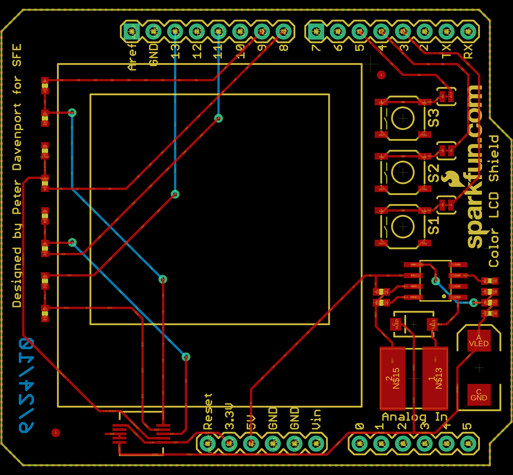
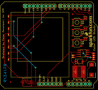
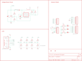

Contents
========

* [PRS9363 > ColorLCDShield](#prs9363--colorlcdshield)
	* [Schematic](#schematic)
	* [PCB](#pcb)
	* [OOMP Parts](#oomp-parts)
	* [Images](#images)
	* [Tags](#tags)

# PRS9363 > ColorLCDShield

- ID: PROJ-SPAR-9363-STAN-01
- Hex ID: PRS9363
- Name: Sparkfun
- Description: Sparkfun
- Long Link: [http://oom.lt/PROJ-SPAR-9363-STAN-01](http://oom.lt/PROJ-SPAR-9363-STAN-01)
- Short Link: [http://oom.lt/PRS9363](http://oom.lt/PRS9363)

## Schematic
  

## PCB
  

## OOMP Parts
  

|OOMP ID|Name|Identifier|
| :---: | :---: | :---: |
|[HEAD-I01-X-PI06-01](https://github.com/oomlout/oomlout_OOMP_parts/tree/main/HEAD-I01-X-PI06-01/)|[2.54 mm 6 Pin Header](https://github.com/oomlout/oomlout_OOMP_parts/tree/main/HEAD-I01-X-PI06-01/)|[ANALOG, POWER](https://github.com/oomlout/oomlout_OOMP_parts/tree/main/HEAD-I01-X-PI06-01/)|
|[CAPC-0402-X-NF1-V50](https://github.com/oomlout/oomlout_OOMP_parts/tree/main/CAPC-0402-X-NF1-V50/)|[SMD (0402) 1 nF Capacitor (Ceramic) 50v](https://github.com/oomlout/oomlout_OOMP_parts/tree/main/CAPC-0402-X-NF1-V50/)|[C1](https://github.com/oomlout/oomlout_OOMP_parts/tree/main/CAPC-0402-X-NF1-V50/)|
|[CAPC-0402-X-NF100-V10](https://github.com/oomlout/oomlout_OOMP_parts/tree/main/CAPC-0402-X-NF100-V10/)|[SMD (0402) 100 nF Capacitor (Ceramic) 10v](https://github.com/oomlout/oomlout_OOMP_parts/tree/main/CAPC-0402-X-NF100-V10/)|[C2](https://github.com/oomlout/oomlout_OOMP_parts/tree/main/CAPC-0402-X-NF100-V10/)|
|CAPX-7343-X-UF100-01||C3|
|DIOD-UNMATCHED-X-UNMATCHED-01||D1|
|[HEAD-I01-X-PI08-01](https://github.com/oomlout/oomlout_OOMP_parts/tree/main/HEAD-I01-X-PI08-01/)|[2.54 mm 8 Pin Header](https://github.com/oomlout/oomlout_OOMP_parts/tree/main/HEAD-I01-X-PI08-01/)|[DIGITAL_0_7, DIGITAL_8_13](https://github.com/oomlout/oomlout_OOMP_parts/tree/main/HEAD-I01-X-PI08-01/)|
|UNMATCHED-UNMATCHED-X-UNMATCHED-01||L1, S1, S3, S4, U$1, U1|
|RESE-0402-X-UNMATCHED-01||R1, R4, R5, R6, R7, R8, R9, R10, R11, R12|
|[RESE-0402-X-O153-01](https://github.com/oomlout/oomlout_OOMP_parts/tree/main/RESE-0402-X-O153-01/)|[SMD (0402) 15k Ohm Resistor](https://github.com/oomlout/oomlout_OOMP_parts/tree/main/RESE-0402-X-O153-01/)|[R2](https://github.com/oomlout/oomlout_OOMP_parts/tree/main/RESE-0402-X-O153-01/)|
|[RESE-0402-X-O181-01](https://github.com/oomlout/oomlout_OOMP_parts/tree/main/RESE-0402-X-O181-01/)|[SMD (0402) 180 Ohm Resistor](https://github.com/oomlout/oomlout_OOMP_parts/tree/main/RESE-0402-X-O181-01/)|[R3](https://github.com/oomlout/oomlout_OOMP_parts/tree/main/RESE-0402-X-O181-01/)|

## Images
  
  

|eagleImage|eagleSchemImage|
| :---: | :---: |
|||

## Tags

- hexID: PRS9363
- oompType: PROJ
- oompSize: SPAR
- oompColor: 9363
- oompDesc: STAN
- oompIndex: 01
- oompName: ColorLCDShield
- sources: All source files from https://github.com/sparkfun/ColorLCDShield (source licence details in srcLicense.md)
- linkBuyPage: https://www.sparkfun.com/products/9363
- oompID: PROJ-SPAR-9363-STAN-01
- oompParts: ANALOG,HEAD-I01-X-PI06-01
- oompParts: C1,CAPC-0402-X-NF1-V50
- oompParts: C2,CAPC-0402-X-NF100-V10
- oompParts: C3,CAPX-7343-X-UF100-01
- oompParts: D1,DIOD-UNMATCHED-X-UNMATCHED-01
- oompParts: DIGITAL_0_7,HEAD-I01-X-PI08-01
- oompParts: DIGITAL_8_13,HEAD-I01-X-PI08-01
- oompParts: L1,UNMATCHED-UNMATCHED-X-UNMATCHED-01
- oompParts: POWER,HEAD-I01-X-PI06-01
- oompParts: R1,RESE-0402-X-UNMATCHED-01
- oompParts: R2,RESE-0402-X-O153-01
- oompParts: R3,RESE-0402-X-O181-01
- oompParts: R4,RESE-0402-X-UNMATCHED-01
- oompParts: R5,RESE-0402-X-UNMATCHED-01
- oompParts: R6,RESE-0402-X-UNMATCHED-01
- oompParts: R7,RESE-0402-X-UNMATCHED-01
- oompParts: R8,RESE-0402-X-UNMATCHED-01
- oompParts: R9,RESE-0402-X-UNMATCHED-01
- oompParts: R10,RESE-0402-X-UNMATCHED-01
- oompParts: R11,RESE-0402-X-UNMATCHED-01
- oompParts: R12,RESE-0402-X-UNMATCHED-01
- oompParts: S1,UNMATCHED-UNMATCHED-X-UNMATCHED-01
- oompParts: S3,UNMATCHED-UNMATCHED-X-UNMATCHED-01
- oompParts: S4,UNMATCHED-UNMATCHED-X-UNMATCHED-01
- oompParts: U$1,UNMATCHED-UNMATCHED-X-UNMATCHED-01
- oompParts: U1,UNMATCHED-UNMATCHED-X-UNMATCHED-01
- rawParts: ANALOG,,M06SIP,1X06,Header 6,,
- rawParts: C1,1nF,CAP0402-CAP,0402-CAP,Capacitor,,
- rawParts: C2,.1uF,CAP0402-CAP,0402-CAP,Capacitor,,
- rawParts: C3,100uF,CAP_POL7343,EIA7343,Capacitor Polarized,,
- rawParts: D1,MBRA140,DIODESMA,SMA-DIODE,Diode,,
- rawParts: DIGITAL_0_7,,M08,1X08,Header 8,,
- rawParts: DIGITAL_8_13,,M08,1X08,Header 8,,
- rawParts: JP1,LOGO-SFENEW,LOGO-SFENEW,SFE-NEW-WEBLOGO,Spark Fun Electronics PCB Logo,,
- rawParts: JP2,FIDUCIAL1X2,FIDUCIAL1X2,FIDUCIAL-1X2,Fiducial Alignment Points,,
- rawParts: JP3,FIDUCIAL1X2,FIDUCIAL1X2,FIDUCIAL-1X2,Fiducial Alignment Points,,
- rawParts: L1,220uH,INDUCTORNPI75C,NPI75C,Inductors,,
- rawParts: POWER,,M06SIP,1X06,Header 6,,
- rawParts: R1,3.3k,RESISTOR0402-RES,0402-RES,Resistor,,
- rawParts: R2,15k,RESISTOR0402-RES,0402-RES,Resistor,,
- rawParts: R3,180,RESISTOR0402-RES,0402-RES,Resistor,,
- rawParts: R4,.27,RESISTOR0402-RES,0402-RES,Resistor,,
- rawParts: R5,3.3k,RESISTOR0402-RES,0402-RES,Resistor,,
- rawParts: R6,1.8k,RESISTOR0402-RES,0402-RES,Resistor,,
- rawParts: R7,3.3k,RESISTOR0402-RES,0402-RES,Resistor,,
- rawParts: R8,1.8k,RESISTOR0402-RES,0402-RES,Resistor,,
- rawParts: R9,3.3k,RESISTOR0402-RES,0402-RES,Resistor,,
- rawParts: R10,1.8k,RESISTOR0402-RES,0402-RES,Resistor,,
- rawParts: R11,3.3k,RESISTOR0402-RES,0402-RES,Resistor,,
- rawParts: R12,1.8k,RESISTOR0402-RES,0402-RES,Resistor,,
- rawParts: S1,,TAC_SWITCHSMD,TACTILE_SWITCH_SMD,Momentary Switch,,
- rawParts: S3,,TAC_SWITCHSMD,TACTILE_SWITCH_SMD,Momentary Switch,,
- rawParts: S4,,TAC_SWITCHSMD,TACTILE_SWITCH_SMD,Momentary Switch,,
- rawParts: SJ1,SOLDERJUMPERTRACE,SOLDERJUMPERTRACE,SJ_2S-TRACE,Solder Jumper,,
- rawParts: SJ2,SOLDERJUMPERTRACE,SOLDERJUMPERTRACE,SJ_2S-TRACE,Solder Jumper,,
- rawParts: SJ3,SOLDERJUMPERTRACE,SOLDERJUMPERTRACE,SJ_2S-TRACE,Solder Jumper,,
- rawParts: U$1,NOKIA6100_LCD,NOKIA6100_LCD,NOKIA6100_LCD,Nokia 6100 Color LCD,,
- rawParts: U1,MC34063SMD,MC34063SMD,SO08,,,
