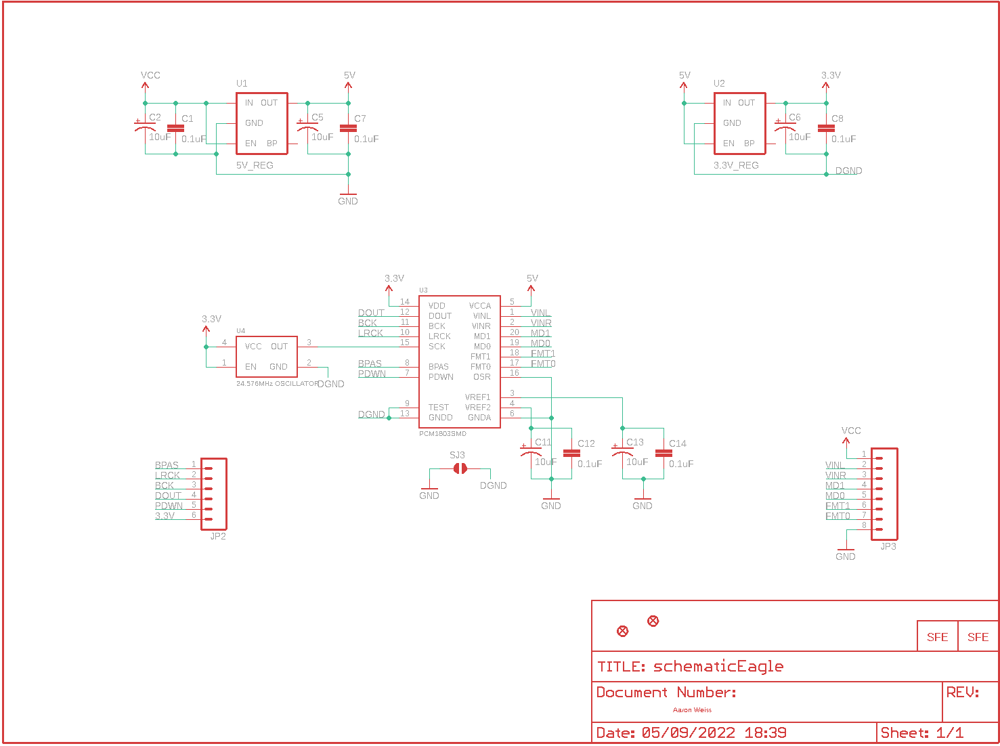
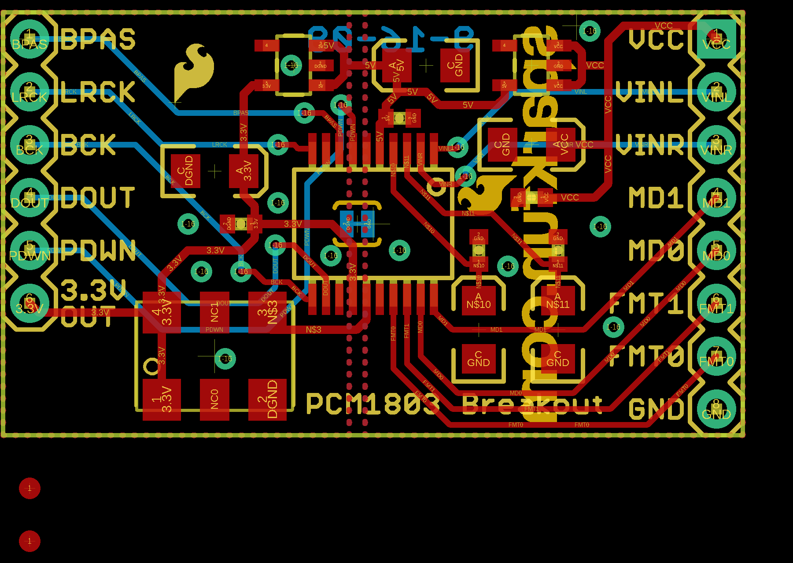
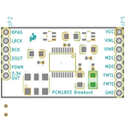
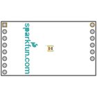
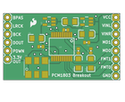
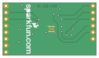

Contents
========

* [PRS9365 > AD Stereo Converter-PCM1803A](#prs9365--ad-stereo-converter-pcm1803a)
	* [Schematic](#schematic)
	* [PCB](#pcb)
	* [Interactive BOM](#interactive-bom)
	* [Images](#images)
	* [Tags](#tags)
  
![][im]
# PRS9365 > AD Stereo Converter-PCM1803A

- ID: PROJ-SPAR-9365-STAN-01
- Hex ID: PRS9365
- Name: Sparkfun
- Description: Sparkfun
- Long Link: [http://oom.lt/PROJ-SPAR-9365-STAN-01](http://oom.lt/PROJ-SPAR-9365-STAN-01)
- Short Link: [http://oom.lt/PRS9365](http://oom.lt/PRS9365)

## Schematic
  

## PCB
  

## Interactive BOM

- Interactive BOM page: [ibom.html](https://htmlpreview.github.io/?https://github.com/oomlout/oomlout_OOMP_projects/blob/main/PROJ-SPAR-9365-STAN-01/kicad/bom/ibom.html)

## Images
  
  

|bominteractivefront|bominteractiveback|kicadPcb3d|kicadPcb3dFront|kicadPcb3dBack|eagleImage|eagleSchemImage|pcbdraw|pcbdrawback|
| :---: | :---: | :---: | :---: | :---: | :---: | :---: | :---: | :---: |
||||||||||

## Tags

- hexID: PRS9365
- oompType: PROJ
- oompSize: SPAR
- oompColor: 9365
- oompDesc: STAN
- oompIndex: 01
- oompName: AD Stereo Converter-PCM1803A
- sources: All source files from https://github.com/sparkfun/AD_Stereo_Converter-PCM1803A (source licence details in srcLicense.md)
- linkBuyPage: https://www.sparkfun.com/products/9365
- oompID: PROJ-SPAR-9365-STAN-01
- rawParts: C1,0.1uF,CAP0402-CAP,0402-CAP,Capacitor,,
- rawParts: C2,10uF,CAP_POL1206,EIA3216,Capacitor Polarized,,
- rawParts: C5,10uF,CAP_POL1206,EIA3216,Capacitor Polarized,,
- rawParts: C6,10uF,CAP_POL1206,EIA3216,Capacitor Polarized,,
- rawParts: C7,0.1uF,CAP0402-CAP,0402-CAP,Capacitor,,
- rawParts: C8,0.1uF,CAP0402-CAP,0402-CAP,Capacitor,,
- rawParts: C11,10uF,CAP_POL1206,EIA3216,Capacitor Polarized,,
- rawParts: C12,0.1uF,CAP0402-CAP,0402-CAP,Capacitor,,
- rawParts: C13,10uF,CAP_POL1206,EIA3216,Capacitor Polarized,,
- rawParts: C14,0.1uF,CAP0402-CAP,0402-CAP,Capacitor,,
- rawParts: JP1,LOGO-SFESK,LOGO-SFESK,SFE-LOGO-FLAME,Spark Fun Electronics PCB Logo,,
- rawParts: JP2,,M06SIP,1X06,Header 6,,
- rawParts: JP3,,M08,1X08,Header 8,,
- rawParts: JP4,FIDUCIAL1X2,FIDUCIAL1X2,FIDUCIAL-1X2,Fiducial Alignment Points,,
- rawParts: JP5,FIDUCIAL1X2,FIDUCIAL1X2,FIDUCIAL-1X2,Fiducial Alignment Points,,
- rawParts: SJ3,SOLDERJUMPERTRACE,SOLDERJUMPERTRACE,SJ_2S-TRACE,Solder Jumper,,
- rawParts: U$4,LOGO-SFENEW,LOGO-SFENEW,SFE-NEW-WEBLOGO,Spark Fun Electronics PCB Logo,,
- rawParts: U1,5V_REG,V_REG_LDOSMD,SOT23-5,Voltage Regulator LDO,,
- rawParts: U2,3.3V_REG,V_REG_LDOSMD,SOT23-5,Voltage Regulator LDO,,
- rawParts: U3,PCM1803SMD,PCM1803SMD,SSOP20,24-bit ADC,,
- rawParts: U4,24.576MHz OSCILLATOR,OSCILLATORSMD6,CRYSTAL-SMD-7.5X5.2-6PIN,,,

[im]: kicadPcb3d_450.png
