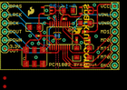
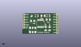
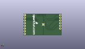
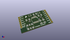

Contents
========

* [PROJ-SPAR-9365-STAN-01>AD Stereo Converter-PCM1803A](#proj-spar-9365-stan-01ad-stereo-converter-pcm1803a)
	* [Images](#images)
	* [Interactive BOM](#interactive-bom)
	* [OOMP Parts](#oomp-parts)
	* [Tags](#tags)
  
![][im]
# PROJ-SPAR-9365-STAN-01>AD Stereo Converter-PCM1803A

- ID: PROJ-SPAR-9365-STAN-01
- Hex ID: PRS9365
- Name: AD Stereo Converter-PCM1803A
- Description: 

## Images
  
  

|eagleImage|kicadPcb3dFront|kicadPcb3dBack|kicadPcb3d|
| :---: | :---: | :---: | :---: |
|||||

## Interactive BOM

- Interactive BOM page: [ibom.html](kicad/bom/ibom.html)

## OOMP Parts
  

|OOMP Parts|
| :---: |
|CAPE-0402-X-NF100-01, C1, 25.4, 11.43, 180,C1, 0.1uF, 0402-CAP, SparkFun, (1, 0.45), R180|
|CAPE-UNMATCHED-X-UNMATCHED-01, C2, 25.4, 13.97, 0,C2, 10uF, EIA3216, SparkFun, (1, 0.55), R0|
|CAPE-UNMATCHED-X-UNMATCHED-01, C5, 20.32, 17.779999999999998, 180,C5, 10uF, EIA3216, SparkFun, (0.8, 0.7), R180|
|CAPE-UNMATCHED-X-UNMATCHED-01, C6, 10.16, 12.7, 0,C6, 10uF, EIA3216, SparkFun, (0.4, 0.5), R0|
|CAPE-0402-X-NF100-01, C7, 19.049999999999997, 15.239999999999998, 0,C7, 0.1uF, 0402-CAP, SparkFun, (0.75, 0.6), R0|
|CAPE-0402-X-NF100-01, C8, 11.43, 10.16, 180,C8, 0.1uF, 0402-CAP, SparkFun, (0.45, 0.4), R180|
|CAPE-UNMATCHED-X-UNMATCHED-01, C11, 22.86, 5.08, 90,C11, 10uF, EIA3216, SparkFun, (0.9, 0.2), R90|
|CAPE-0402-X-NF100-01, C12, 22.86, 8.889999999999999, 90,C12, 0.1uF, 0402-CAP, SparkFun, (0.9, 0.35), R90|
|CAPE-UNMATCHED-X-UNMATCHED-01, C13, 26.669999999999998, 5.08, 90,C13, 10uF, EIA3216, SparkFun, (1.05, 0.2), R90|
|CAPE-0402-X-NF100-01, C14, 26.669999999999998, 8.889999999999999, 90,C14, 0.1uF, 0402-CAP, SparkFun, (1.05, 0.35), R90|
|UNMATCHED-UNMATCHED-X-UNMATCHED-01, JP2, 1.27, 19.049999999999997, 270,JP2, 1X06, SparkFun, (0.05, 0.75), R270|
|UNMATCHED-UNMATCHED-X-UNMATCHED-01, JP3, 34.29, 19.049999999999997, 270,JP3, 1X08, SparkFun, (1.35, 0.75), R270|
|UNMATCHED-UNMATCHED-X-UNMATCHED-01, JP4, 1.27, -2.54, 0,JP4, FIDUCIAL1X2, FIDUCIAL-1X2, SparkFun, (0.05, -0.1), R0|
|UNMATCHED-UNMATCHED-X-UNMATCHED-01, JP5, 1.27, -5.08, 0,JP5, FIDUCIAL1X2, FIDUCIAL-1X2, SparkFun, (0.05, -0.2), R0|
|UNMATCHED-UNMATCHED-X-UNMATCHED-01, SJ3, 17.018, 10.16, M0,SJ3, SOLDERJUMPERTRACE, SJ_2S-TRACE, SparkFun, (0.67, 0.4), MR0|
|UNMATCHED-UNMATCHED-X-UNMATCHED-01, U1, 25.4, 17.779999999999998, 90,U1, 5V_REG, SOT23-5, SparkFun, (1, 0.7), R90|
|UNMATCHED-UNMATCHED-X-UNMATCHED-01, U2, 13.97, 17.779999999999998, 90,U2, 3.3V_REG, SOT23-5, SparkFun, (0.55, 0.7), R90|
|UNMATCHED-UNMATCHED-X-UNMATCHED-01, U3, 17.779999999999998, 10.16, 180,U3, PCM1803SMD, SSOP20, SparkFun, (0.7, 0.4), R180|
|ERROR, U4 24.576MHz OSCILLATOR, 0, 0, 0,U4, 24.576MHz, OSCILLATOR, CRYSTAL-SMD-7.5X5.2-6PIN, SparkFun, (0.4, 0.15), R0|

## Tags

- hexID: PRS9365
- oompType: PROJ
- oompSize: SPAR
- oompColor: 9365
- oompDesc: STAN
- oompIndex: 01
- oompName: AD Stereo Converter-PCM1803A
- sources: All source files from https://github.com/sparkfun/AD_Stereo_Converter-PCM1803A (source licence details in srcLicense.md)
- linkBuyPage: https://www.sparkfun.com/products/9365
- oompPart: CAPE-0402-X-NF100-01, C1, 25.4, 11.43, 180
- oompPart: CAPE-UNMATCHED-X-UNMATCHED-01, C2, 25.4, 13.97, 0
- oompPart: CAPE-UNMATCHED-X-UNMATCHED-01, C5, 20.32, 17.779999999999998, 180
- oompPart: CAPE-UNMATCHED-X-UNMATCHED-01, C6, 10.16, 12.7, 0
- oompPart: CAPE-0402-X-NF100-01, C7, 19.049999999999997, 15.239999999999998, 0
- oompPart: CAPE-0402-X-NF100-01, C8, 11.43, 10.16, 180
- oompPart: CAPE-UNMATCHED-X-UNMATCHED-01, C11, 22.86, 5.08, 90
- oompPart: CAPE-0402-X-NF100-01, C12, 22.86, 8.889999999999999, 90
- oompPart: CAPE-UNMATCHED-X-UNMATCHED-01, C13, 26.669999999999998, 5.08, 90
- oompPart: CAPE-0402-X-NF100-01, C14, 26.669999999999998, 8.889999999999999, 90
- oompPart: UNMATCHED-UNMATCHED-X-UNMATCHED-01, JP2, 1.27, 19.049999999999997, 270
- oompPart: UNMATCHED-UNMATCHED-X-UNMATCHED-01, JP3, 34.29, 19.049999999999997, 270
- oompPart: UNMATCHED-UNMATCHED-X-UNMATCHED-01, JP4, 1.27, -2.54, 0
- oompPart: UNMATCHED-UNMATCHED-X-UNMATCHED-01, JP5, 1.27, -5.08, 0
- oompPart: UNMATCHED-UNMATCHED-X-UNMATCHED-01, SJ3, 17.018, 10.16, M0
- oompPart: UNMATCHED-UNMATCHED-X-UNMATCHED-01, U1, 25.4, 17.779999999999998, 90
- oompPart: UNMATCHED-UNMATCHED-X-UNMATCHED-01, U2, 13.97, 17.779999999999998, 90
- oompPart: UNMATCHED-UNMATCHED-X-UNMATCHED-01, U3, 17.779999999999998, 10.16, 180
- oompPart: ERROR, U4 24.576MHz OSCILLATOR, 0, 0, 0
- rawPart: C1, 0.1uF, 0402-CAP, SparkFun, (1, 0.45), R180
- rawPart: C2, 10uF, EIA3216, SparkFun, (1, 0.55), R0
- rawPart: C5, 10uF, EIA3216, SparkFun, (0.8, 0.7), R180
- rawPart: C6, 10uF, EIA3216, SparkFun, (0.4, 0.5), R0
- rawPart: C7, 0.1uF, 0402-CAP, SparkFun, (0.75, 0.6), R0
- rawPart: C8, 0.1uF, 0402-CAP, SparkFun, (0.45, 0.4), R180
- rawPart: C11, 10uF, EIA3216, SparkFun, (0.9, 0.2), R90
- rawPart: C12, 0.1uF, 0402-CAP, SparkFun, (0.9, 0.35), R90
- rawPart: C13, 10uF, EIA3216, SparkFun, (1.05, 0.2), R90
- rawPart: C14, 0.1uF, 0402-CAP, SparkFun, (1.05, 0.35), R90
- rawPart: JP2, 1X06, SparkFun, (0.05, 0.75), R270
- rawPart: JP3, 1X08, SparkFun, (1.35, 0.75), R270
- rawPart: JP4, FIDUCIAL1X2, FIDUCIAL-1X2, SparkFun, (0.05, -0.1), R0
- rawPart: JP5, FIDUCIAL1X2, FIDUCIAL-1X2, SparkFun, (0.05, -0.2), R0
- rawPart: SJ3, SOLDERJUMPERTRACE, SJ_2S-TRACE, SparkFun, (0.67, 0.4), MR0
- rawPart: U1, 5V_REG, SOT23-5, SparkFun, (1, 0.7), R90
- rawPart: U2, 3.3V_REG, SOT23-5, SparkFun, (0.55, 0.7), R90
- rawPart: U3, PCM1803SMD, SSOP20, SparkFun, (0.7, 0.4), R180
- rawPart: U4, 24.576MHz, OSCILLATOR, CRYSTAL-SMD-7.5X5.2-6PIN, SparkFun, (0.4, 0.15), R0

[im]: kicadPcb3d_450.png
