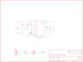

Contents
========

* [PRS9370 > DC-DC Converter Breakout](#prs9370--dc-dc-converter-breakout)
	* [Schematic](#schematic)
	* [PCB](#pcb)
	* [Interactive BOM](#interactive-bom)
	* [OOMP Parts](#oomp-parts)
	* [Images](#images)
	* [Tags](#tags)
  
![][im]
# PRS9370 > DC-DC Converter Breakout

- ID: PROJ-SPAR-9370-STAN-01
- Hex ID: PRS9370
- Name: Sparkfun 9370
- Description: Sparkfun 9370
- Long Link: [http://oom.lt/PROJ-SPAR-9370-STAN-01](http://oom.lt/PROJ-SPAR-9370-STAN-01)
- Short Link: [http://oom.lt/PRS9370](http://oom.lt/PRS9370)

## Schematic
  

## PCB
  

## Interactive BOM

- Interactive BOM page: [ibom.html](https://htmlpreview.github.io/?https://github.com/oomlout/oomlout_OOMP_projects/blob/main/PROJ-SPAR-9370-STAN-01/kicad/bom/ibom.html)

## OOMP Parts
  

|OOMP ID|Name|Identifier|
| :---: | :---: | :---: |
|CAPX-UNMATCHED-X-UNMATCHED-V25||C1|
|CAPE-PANC-X-UNMATCHED-01||C2|
|[CAPC-0603-X-NF100-V50](https://github.com/oomlout/oomlout_OOMP_parts/tree/main/CAPC-0603-X-NF100-V50/)|[SMD (0603) 100 nF Capacitor (Ceramic) 50v](https://github.com/oomlout/oomlout_OOMP_parts/tree/main/CAPC-0603-X-NF100-V50/)|[C3](https://github.com/oomlout/oomlout_OOMP_parts/tree/main/CAPC-0603-X-NF100-V50/)|
|[HEAD-I01-X-PI05-01](https://github.com/oomlout/oomlout_OOMP_parts/tree/main/HEAD-I01-X-PI05-01/)|[2.54 mm 5 Pin Header](https://github.com/oomlout/oomlout_OOMP_parts/tree/main/HEAD-I01-X-PI05-01/)|[IN](https://github.com/oomlout/oomlout_OOMP_parts/tree/main/HEAD-I01-X-PI05-01/)|
|[HEAD-I01-X-PI03-01](https://github.com/oomlout/oomlout_OOMP_parts/tree/main/HEAD-I01-X-PI03-01/)|[2.54 mm 3 Pin Header](https://github.com/oomlout/oomlout_OOMP_parts/tree/main/HEAD-I01-X-PI03-01/)|[OUT](https://github.com/oomlout/oomlout_OOMP_parts/tree/main/HEAD-I01-X-PI03-01/)|
|UNMATCHED-SO23-X-UNMATCHED-01||Q1|
|[RESE-0603-X-O223-01](https://github.com/oomlout/oomlout_OOMP_parts/tree/main/RESE-0603-X-O223-01/)|[SMD (0603) 22k Ohm Resistor](https://github.com/oomlout/oomlout_OOMP_parts/tree/main/RESE-0603-X-O223-01/)|[R1](https://github.com/oomlout/oomlout_OOMP_parts/tree/main/RESE-0603-X-O223-01/)|
|RESE-0603-X-O1003-01||R2|
|UNMATCHED-UNMATCHED-X-UNMATCHED-01||U1|

## Images
  
  

|bominteractivefront|bominteractiveback|kicadPcb3d|kicadPcb3dFront|kicadPcb3dBack|kicadSchem|eagleImage|eagleSchemImage|pcbdraw|pcbdrawback|
| :---: | :---: | :---: | :---: | :---: | :---: | :---: | :---: | :---: | :---: |
|||||||||||

## Tags

- hexID: PRS9370
- oompType: PROJ
- oompSize: SPAR
- oompColor: 9370
- oompDesc: STAN
- oompIndex: 01
- oompName: DC-DC Converter Breakout
- sources: All source files from https://github.com/sparkfun/DC-DC_Converter_Breakout (source licence details in srcLicense.md)
- linkBuyPage: https://www.sparkfun.com/products/9370
- oompID: PROJ-SPAR-9370-STAN-01
- oompParts: C1,CAPX-UNMATCHED-X-UNMATCHED-V25
- oompParts: C2,CAPE-PANC-X-UNMATCHED-01
- oompParts: C3,CAPC-0603-X-NF100-V50
- oompParts: IN,HEAD-I01-X-PI05-01
- oompParts: OUT,HEAD-I01-X-PI03-01
- oompParts: Q1,UNMATCHED-SO23-X-UNMATCHED-01
- oompParts: R1,RESE-0603-X-O223-01
- oompParts: R2,RESE-0603-X-O1003-01
- oompParts: U1,UNMATCHED-UNMATCHED-X-UNMATCHED-01
- rawParts: C1,100uF-25V,CAP_POL,NIPPON_F80,Capacitor Polarized,,
- rawParts: C2,22uF-35v,CAP_POLC,PANASONIC_C,Capacitor Polarized,,
- rawParts: C3,0.1uF,CAP0603-CAP,0603-CAP,Capacitor,,
- rawParts: FID1,FIDUCIAL1X2,FIDUCIAL1X2,FIDUCIAL-1X2,Fiducial Alignment Points,,
- rawParts: FID2,FIDUCIAL1X2,FIDUCIAL1X2,FIDUCIAL-1X2,Fiducial Alignment Points,,
- rawParts: IN,,M05PTH,1X05,Header 5,,
- rawParts: OUT,,M03PTH,1X03,Header 3,,
- rawParts: Q1,MOSFET-NCHANNELSMD,MOSFET-NCHANNELSMD,SOT23-3,,,
- rawParts: R1,22K,RESISTOR0603-RES,0603-RES,Resistor,,
- rawParts: R2,100K,RESISTOR0603-RES,0603-RES,Resistor,,
- rawParts: U$1,STAND-OFF,STAND-OFF,STAND-OFF,Stand Off,,
- rawParts: U$2,LOGO-SFENEW,LOGO-SFENEW,SFE-NEW-WEBLOGO,Spark Fun Electronics PCB Logo,,
- rawParts: U$3,STAND-OFF,STAND-OFF,STAND-OFF,Stand Off,,
- rawParts: U$4,STAND-OFF,STAND-OFF,STAND-OFF,Stand Off,,
- rawParts: U$5,STAND-OFF,STAND-OFF,STAND-OFF,Stand Off,,
- rawParts: U1,DC-DC_CONVERTER,DC-DC_CONVERTER,DC-DC_CONVERTER,,,

[im]: kicadPcb3d_450.png
