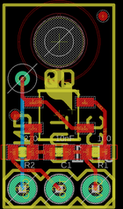
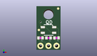
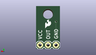
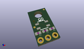

Contents
========

* [PROJ-SPAR-9454-STAN-01>QRE1113 Line Sensor Breakout-Digital](#proj-spar-9454-stan-01qre1113-line-sensor-breakout-digital)
	* [Images](#images)
	* [Interactive BOM](#interactive-bom)
	* [OOMP Parts](#oomp-parts)
	* [Tags](#tags)
  
![][im]
# PROJ-SPAR-9454-STAN-01>QRE1113 Line Sensor Breakout-Digital

- ID: PROJ-SPAR-9454-STAN-01
- Hex ID: PRS9454
- Name: QRE1113 Line Sensor Breakout-Digital
- Description: 

## Images
  
  

|eagleImage|kicadPcb3dFront|kicadPcb3dBack|kicadPcb3d|
| :---: | :---: | :---: | :---: |
|||||

## Interactive BOM

- Interactive BOM page: [ibom.html](kicad/bom/ibom.html)

## OOMP Parts
  

|OOMP Parts|
| :---: |
|CAPC-0402-X-UNMATCHED-01, C1, 3.8099999999999996, 3.8099999999999996, 180,C1, 10nF, 0402-CAP, SparkFun, (0.15, 0.15), R180|
|<table><tr><td></td><td> JP1</td><td>[HEAD-I01-X-PI03-01 2.54 mm 3 Pin Header](https://github.com/oomlout/oomlout_OOMP_parts/tree/main/HEAD-I01-X-PI03-01/)</td><td>[H03](https://github.com/oomlout/oomlout_OOMP_parts/tree/main/HEAD-I01-X-PI03-01/)</td></tr></table>|
|RESE-0402-X-UNMATCHED-01, R1, 6.35, 3.8099999999999996, 180,R1, 100, 0402-RES, SparkFun, (0.25, 0.15), R180|
|RESE-0402-X-O221-01, R2, 1.27, 3.8099999999999996, 180,R2, 220, 0402-RES, SparkFun, (0.05, 0.15), R180|
|UNMATCHED-UNMATCHED-X-UNMATCHED-01, U1, 3.8099999999999996, 6.35, 180,U1, QRE1113, QRE1113, SparkFun, (0.15, 0.25), R180|

## Tags

- hexID: PRS9454
- oompType: PROJ
- oompSize: SPAR
- oompColor: 9454
- oompDesc: STAN
- oompIndex: 01
- oompName: QRE1113 Line Sensor Breakout-Digital
- sources: All source files from https://github.com/sparkfun/QRE1113_Line_Sensor_Breakout-Digital (source licence details in srcLicense.md)
- linkBuyPage: https://www.sparkfun.com/products/9454
- oompID: PROJ-SPAR-9454-STAN-01
- oompPart: CAPC-0402-X-UNMATCHED-01, C1, 3.8099999999999996, 3.8099999999999996, 180
- oompPart: SKIP-UNMATCHED-X-UNMATCHED-01, FID1, 6.858, 13.208, 0
- oompPart: SKIP-UNMATCHED-X-UNMATCHED-01, FID2, 0.7619999999999999, 6.35, 0
- oompPart: HEAD-I01-X-PI03-01, JP1, 6.35, 1.27, M0
- oompPart: RESE-0402-X-UNMATCHED-01, R1, 6.35, 3.8099999999999996, 180
- oompPart: RESE-0402-X-O221-01, R2, 1.27, 3.8099999999999996, 180
- oompPart: UNMATCHED-UNMATCHED-X-UNMATCHED-01, U1, 3.8099999999999996, 6.35, 180
- rawPart: C1, 10nF, 0402-CAP, SparkFun, (0.15, 0.15), R180
- rawPart: FID1, FIDUCIALUFIDUCIAL, MICRO-FIDUCIAL, SparkFun-Aesthetics, (0.27, 0.52), R0
- rawPart: FID2, FIDUCIALUFIDUCIAL, MICRO-FIDUCIAL, SparkFun-Aesthetics, (0.03, 0.25), R0
- rawPart: JP1, 1X03, SparkFun, (0.25, 0.05), MR0
- rawPart: R1, 100, 0402-RES, SparkFun, (0.25, 0.15), R180
- rawPart: R2, 220, 0402-RES, SparkFun, (0.05, 0.15), R180
- rawPart: U1, QRE1113, QRE1113, SparkFun, (0.15, 0.25), R180

[im]: kicadPcb3d_450.png
