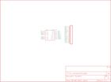

Contents
========

* [PRS9540 > Full Bridge Motor Driver Breakout-L298N](#prs9540--full-bridge-motor-driver-breakout-l298n)
	* [Schematic](#schematic)
	* [PCB](#pcb)
	* [Interactive BOM](#interactive-bom)
	* [OOMP Parts](#oomp-parts)
	* [Images](#images)
	* [Tags](#tags)
  
![][im]
# PRS9540 > Full Bridge Motor Driver Breakout-L298N

- ID: PROJ-SPAR-9540-STAN-01
- Hex ID: PRS9540
- Name: Sparkfun
- Description: Sparkfun
- Long Link: [http://oom.lt/PROJ-SPAR-9540-STAN-01](http://oom.lt/PROJ-SPAR-9540-STAN-01)
- Short Link: [http://oom.lt/PRS9540](http://oom.lt/PRS9540)

## Schematic
  

## PCB
  

## Interactive BOM

- Interactive BOM page: [ibom.html](https://htmlpreview.github.io/?https://github.com/oomlout/oomlout_OOMP_projects/blob/main/PROJ-SPAR-9540-STAN-01/kicad/bom/ibom.html)

## OOMP Parts
  

|OOMP ID|Name|Identifier|
| :---: | :---: | :---: |
|HEAD-I01-X-PI15-01||JP1|
|UNMATCHED-UNMATCHED-X-UNMATCHED-01||L298N|

## Images
  
  

|bominteractivefront|bominteractiveback|kicadPcb3d|kicadPcb3dFront|kicadPcb3dBack|kicadSchem|eagleImage|eagleSchemImage|pcbdraw|pcbdrawback|
| :---: | :---: | :---: | :---: | :---: | :---: | :---: | :---: | :---: | :---: |
|||||||||||

## Tags

- hexID: PRS9540
- oompType: PROJ
- oompSize: SPAR
- oompColor: 9540
- oompDesc: STAN
- oompIndex: 01
- oompName: Full Bridge Motor Driver Breakout-L298N
- sources: All source files from https://github.com/sparkfun/Full_Bridge_Motor_Driver_Breakout-L298N (source licence details in srcLicense.md)
- linkBuyPage: https://www.sparkfun.com/products/9540
- oompID: PROJ-SPAR-9540-STAN-01
- oompParts: JP1,HEAD-I01-X-PI15-01
- oompParts: L298N,UNMATCHED-UNMATCHED-X-UNMATCHED-01
- rawParts: JP1,M15,M15,1X15,Header 15,,
- rawParts: JP2,STAND-OFF,STAND-OFF,STAND-OFF,Stand Off,,
- rawParts: JP3,STAND-OFF,STAND-OFF,STAND-OFF,Stand Off,,
- rawParts: JP4,LOGO-SFENEW,LOGO-SFENEW,SFE-NEW-WEBLOGO,Spark Fun Electronics PCB Logo,,
- rawParts: L298N,L298HEATSINK,L298HEATSINK,MULTIWATT15_6400BGHEATSINK,L298 Dual Full Bridge Driver,,

[im]: kicadPcb3d_450.png
