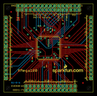
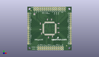
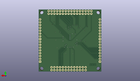
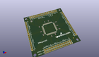

Contents
========

* [PROJ-SPAR-9546-STAN-01>XMega100 Breakout](#proj-spar-9546-stan-01xmega100-breakout)
	* [Images](#images)
	* [Interactive BOM](#interactive-bom)
	* [OOMP Parts](#oomp-parts)
	* [Tags](#tags)
  
![][im]
# PROJ-SPAR-9546-STAN-01>XMega100 Breakout

- ID: PROJ-SPAR-9546-STAN-01
- Hex ID: PRS9546
- Name: XMega100 Breakout
- Description: 

## Images
  
  

|eagleImage|kicadPcb3dFront|kicadPcb3dBack|kicadPcb3d|
| :---: | :---: | :---: | :---: |
|||||

## Interactive BOM

- Interactive BOM page: [ibom.html](kicad/bom/ibom.html)

## OOMP Parts
  

|OOMP Parts|
| :---: |
|CAPE-0402-X-NF100-01, C3, 25.4, 39.37, 90,C3, 0.1uF, 0402-CAP, SparkFun, (1, 1.55), R90|
|CAPE-0402-X-NF100-01, C4, 26.669999999999998, 16.509999999999998, 270,C4, 0.1uF, 0402-CAP, SparkFun, (1.05, 0.65), R270|
|CAPE-0402-X-NF100-01, C5, 17.779999999999998, 21.59, 270,C5, 0.1uF, 0402-CAP, SparkFun, (0.7, 0.85), R270|
|CAPE-0402-X-NF100-01, C6, 31.75, 17.779999999999998, 270,C6, 0.1uF, 0402-CAP, SparkFun, (1.25, 0.7), R270|
|CAPE-0402-X-NF100-01, C7, 16.509999999999998, 26.669999999999998, 180,C7, 0.1uF, 0402-CAP, SparkFun, (0.65, 1.05), R180|
|CAPE-0402-X-NF100-01, C8, 38.8112, 28.448, 0,C8, 0.1uF, 0402-CAP, SparkFun, (1.528, 1.12), R0|
|CAPE-0402-X-NF100-01, C9, 30.479999999999997, 39.37, 90,C9, 0.1uF, 0402-CAP, SparkFun, (1.2, 1.55), R90|
|CAPE-0402-X-NF100-01, C10, 39.37, 22.86, 0,C10, 0.1uF, 0402-CAP, SparkFun, (1.55, 0.9), R0|
|CAPE-0402-X-NF100-01, C11, 39.37, 34.29, 0,C11, 0.1uF, 0402-CAP, SparkFun, (1.55, 1.35), R0|
|CAPE-0402-X-NF100-01, C13, 16.509999999999998, 34.29, 90,C13, 0.1uF, 0402-CAP, SparkFun, (0.65, 1.35), R90|
|ERROR, JP6 Left Port, 0, 0, 0,JP6, Left, Port, B, 1X08, SparkFun, (0.05, 1.15), R90|
|ERROR, JP7 Left Port, 0, 0, 0,JP7, Left, Port, C, 1X08, SparkFun, (0.05, 0.35), R90|
|ERROR, JP8 Right Port, 0, 0, 0,JP8, Right, Port, H, 1X08, SparkFun, (2.15, 0.35), R90|
|ERROR, JP9 Right Port, 0, 0, 0,JP9, Right, Port, J, 1X08, SparkFun, (2.15, 1.15), R90|
|UNMATCHED-UNMATCHED-X-UNMATCHED-01, JP10, 8.889999999999999, 54.60999999999999, 0,JP10, TopEdge, 1X16, SparkFun, (0.35, 2.15), R0|
|UNMATCHED-UNMATCHED-X-UNMATCHED-01, JP11, 8.889999999999999, 52.06999999999999, 0,JP11, TopInside, 1X16, SparkFun, (0.35, 2.05), R0|
|UNMATCHED-UNMATCHED-X-UNMATCHED-01, JP12, 4.571999999999999, 50.8, 0,JP12, FIDUCIAL1X2, FIDUCIAL-1X2, SparkFun, (0.18, 2), R0|
|UNMATCHED-UNMATCHED-X-UNMATCHED-01, JP13, 49.529999999999994, 5.842, 0,JP13, FIDUCIAL1X2, FIDUCIAL-1X2, SparkFun, (1.95, 0.23), R0|
|UNMATCHED-0603-X-UNMATCHED-01, LED1, 8.889999999999999, 45.72, 90,LED1, Red, LED-0603, SparkFun, (0.35, 1.8), R90|
|RESE-0402-X-O331-01, R1, 8.889999999999999, 46.99, 180,R1, 330, 0402-RES, SparkFun, (0.35, 1.85), R180|
|UNMATCHED-UNMATCHED-X-UNMATCHED-01, U1, 27.94, 27.94, 0,U1, XMEGA-100SMD, TQFP-100-14X14MM, SparkFun, (1.1, 1.1), R0|
|UNMATCHED-UNMATCHED-X-UNMATCHED-01, U5, 44.449999999999996, 3.8099999999999996, 180,U5, BottonInside, 1X13, SparkFun, (1.75, 0.15), R180|
|UNMATCHED-UNMATCHED-X-UNMATCHED-01, U6, 44.449999999999996, 1.27, 180,U6, BottomEdge, 1X13, SparkFun, (1.75, 0.05), R180|

## Tags

- hexID: PRS9546
- oompType: PROJ
- oompSize: SPAR
- oompColor: 9546
- oompDesc: STAN
- oompIndex: 01
- oompName: XMega100 Breakout
- sources: All source files from https://github.com/sparkfun/XMega100_Breakout (source licence details in srcLicense.md)
- linkBuyPage: https://www.sparkfun.com/products/9546
- oompPart: CAPE-0402-X-NF100-01, C3, 25.4, 39.37, 90
- oompPart: CAPE-0402-X-NF100-01, C4, 26.669999999999998, 16.509999999999998, 270
- oompPart: CAPE-0402-X-NF100-01, C5, 17.779999999999998, 21.59, 270
- oompPart: CAPE-0402-X-NF100-01, C6, 31.75, 17.779999999999998, 270
- oompPart: CAPE-0402-X-NF100-01, C7, 16.509999999999998, 26.669999999999998, 180
- oompPart: CAPE-0402-X-NF100-01, C8, 38.8112, 28.448, 0
- oompPart: CAPE-0402-X-NF100-01, C9, 30.479999999999997, 39.37, 90
- oompPart: CAPE-0402-X-NF100-01, C10, 39.37, 22.86, 0
- oompPart: CAPE-0402-X-NF100-01, C11, 39.37, 34.29, 0
- oompPart: CAPE-0402-X-NF100-01, C13, 16.509999999999998, 34.29, 90
- oompPart: ERROR, JP6 Left Port, 0, 0, 0
- oompPart: ERROR, JP7 Left Port, 0, 0, 0
- oompPart: ERROR, JP8 Right Port, 0, 0, 0
- oompPart: ERROR, JP9 Right Port, 0, 0, 0
- oompPart: UNMATCHED-UNMATCHED-X-UNMATCHED-01, JP10, 8.889999999999999, 54.60999999999999, 0
- oompPart: UNMATCHED-UNMATCHED-X-UNMATCHED-01, JP11, 8.889999999999999, 52.06999999999999, 0
- oompPart: UNMATCHED-UNMATCHED-X-UNMATCHED-01, JP12, 4.571999999999999, 50.8, 0
- oompPart: UNMATCHED-UNMATCHED-X-UNMATCHED-01, JP13, 49.529999999999994, 5.842, 0
- oompPart: UNMATCHED-0603-X-UNMATCHED-01, LED1, 8.889999999999999, 45.72, 90
- oompPart: RESE-0402-X-O331-01, R1, 8.889999999999999, 46.99, 180
- oompPart: UNMATCHED-UNMATCHED-X-UNMATCHED-01, U1, 27.94, 27.94, 0
- oompPart: UNMATCHED-UNMATCHED-X-UNMATCHED-01, U5, 44.449999999999996, 3.8099999999999996, 180
- oompPart: UNMATCHED-UNMATCHED-X-UNMATCHED-01, U6, 44.449999999999996, 1.27, 180
- rawPart: C3, 0.1uF, 0402-CAP, SparkFun, (1, 1.55), R90
- rawPart: C4, 0.1uF, 0402-CAP, SparkFun, (1.05, 0.65), R270
- rawPart: C5, 0.1uF, 0402-CAP, SparkFun, (0.7, 0.85), R270
- rawPart: C6, 0.1uF, 0402-CAP, SparkFun, (1.25, 0.7), R270
- rawPart: C7, 0.1uF, 0402-CAP, SparkFun, (0.65, 1.05), R180
- rawPart: C8, 0.1uF, 0402-CAP, SparkFun, (1.528, 1.12), R0
- rawPart: C9, 0.1uF, 0402-CAP, SparkFun, (1.2, 1.55), R90
- rawPart: C10, 0.1uF, 0402-CAP, SparkFun, (1.55, 0.9), R0
- rawPart: C11, 0.1uF, 0402-CAP, SparkFun, (1.55, 1.35), R0
- rawPart: C13, 0.1uF, 0402-CAP, SparkFun, (0.65, 1.35), R90
- rawPart: JP6, Left, Port, B, 1X08, SparkFun, (0.05, 1.15), R90
- rawPart: JP7, Left, Port, C, 1X08, SparkFun, (0.05, 0.35), R90
- rawPart: JP8, Right, Port, H, 1X08, SparkFun, (2.15, 0.35), R90
- rawPart: JP9, Right, Port, J, 1X08, SparkFun, (2.15, 1.15), R90
- rawPart: JP10, TopEdge, 1X16, SparkFun, (0.35, 2.15), R0
- rawPart: JP11, TopInside, 1X16, SparkFun, (0.35, 2.05), R0
- rawPart: JP12, FIDUCIAL1X2, FIDUCIAL-1X2, SparkFun, (0.18, 2), R0
- rawPart: JP13, FIDUCIAL1X2, FIDUCIAL-1X2, SparkFun, (1.95, 0.23), R0
- rawPart: LED1, Red, LED-0603, SparkFun, (0.35, 1.8), R90
- rawPart: R1, 330, 0402-RES, SparkFun, (0.35, 1.85), R180
- rawPart: U1, XMEGA-100SMD, TQFP-100-14X14MM, SparkFun, (1.1, 1.1), R0
- rawPart: U5, BottonInside, 1X13, SparkFun, (1.75, 0.15), R180
- rawPart: U6, BottomEdge, 1X13, SparkFun, (1.75, 0.05), R180

[im]: kicadPcb3d_450.png
