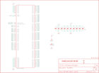

Contents
========

* [PRS9546 > XMega100 Breakout](#prs9546--xmega100-breakout)
	* [Schematic](#schematic)
	* [PCB](#pcb)
	* [Interactive BOM](#interactive-bom)
	* [Images](#images)
	* [Tags](#tags)
  
![][im]
# PRS9546 > XMega100 Breakout

- ID: PROJ-SPAR-9546-STAN-01
- Hex ID: PRS9546
- Name: Sparkfun
- Description: Sparkfun
- Long Link: [http://oom.lt/PROJ-SPAR-9546-STAN-01](http://oom.lt/PROJ-SPAR-9546-STAN-01)
- Short Link: [http://oom.lt/PRS9546](http://oom.lt/PRS9546)

## Schematic
  

## PCB
  

## Interactive BOM

- Interactive BOM page: [ibom.html](https://htmlpreview.github.io/?https://github.com/oomlout/oomlout_OOMP_projects/blob/main/PROJ-SPAR-9546-STAN-01/kicad/bom/ibom.html)

## Images
  
  

|bominteractivefront|bominteractiveback|kicadPcb3d|kicadPcb3dFront|kicadPcb3dBack|eagleImage|eagleSchemImage|pcbdraw|pcbdrawback|
| :---: | :---: | :---: | :---: | :---: | :---: | :---: | :---: | :---: |
||||||||||

## Tags

- hexID: PRS9546
- oompType: PROJ
- oompSize: SPAR
- oompColor: 9546
- oompDesc: STAN
- oompIndex: 01
- oompName: XMega100 Breakout
- sources: All source files from https://github.com/sparkfun/XMega100_Breakout (source licence details in srcLicense.md)
- linkBuyPage: https://www.sparkfun.com/products/9546
- oompID: PROJ-SPAR-9546-STAN-01
- rawParts: C3,0.1uF,CAP0402-CAP,0402-CAP,Capacitor,,
- rawParts: C4,0.1uF,CAP0402-CAP,0402-CAP,Capacitor,,
- rawParts: C5,0.1uF,CAP0402-CAP,0402-CAP,Capacitor,,
- rawParts: C6,0.1uF,CAP0402-CAP,0402-CAP,Capacitor,,
- rawParts: C7,0.1uF,CAP0402-CAP,0402-CAP,Capacitor,,
- rawParts: C8,0.1uF,CAP0402-CAP,0402-CAP,Capacitor,,
- rawParts: C9,0.1uF,CAP0402-CAP,0402-CAP,Capacitor,,
- rawParts: C10,0.1uF,CAP0402-CAP,0402-CAP,Capacitor,,
- rawParts: C11,0.1uF,CAP0402-CAP,0402-CAP,Capacitor,,
- rawParts: C13,0.1uF,CAP0402-CAP,0402-CAP,Capacitor,,
- rawParts: JP1,LOGO-SFENEW,LOGO-SFENEW,SFE-NEW-WEBLOGO,Spark Fun Electronics PCB Logo,,
- rawParts: JP2,STAND-OFF,STAND-OFF,STAND-OFF,Stand Off,,
- rawParts: JP3,STAND-OFF,STAND-OFF,STAND-OFF,Stand Off,,
- rawParts: JP4,STAND-OFF,STAND-OFF,STAND-OFF,Stand Off,,
- rawParts: JP5,STAND-OFF,STAND-OFF,STAND-OFF,Stand Off,,
- rawParts: JP6,Left Port B,M08,1X08,Header 8,,
- rawParts: JP7,Left Port C,M08,1X08,Header 8,,
- rawParts: JP8,Right Port H,M08,1X08,Header 8,,
- rawParts: JP9,Right Port J,M08,1X08,Header 8,,
- rawParts: JP10,TopEdge,M16PTH,1X16,,,
- rawParts: JP11,TopInside,M16PTH,1X16,,,
- rawParts: JP12,FIDUCIAL1X2,FIDUCIAL1X2,FIDUCIAL-1X2,Fiducial Alignment Points,,
- rawParts: JP13,FIDUCIAL1X2,FIDUCIAL1X2,FIDUCIAL-1X2,Fiducial Alignment Points,,
- rawParts: LED1,Red,LED0603,LED-0603,LEDs,,
- rawParts: R1,330,RESISTOR0402-RES,0402-RES,Resistor,,
- rawParts: U1,XMEGA-100SMD,XMEGA-100SMD,TQFP-100-14X14MM,,,
- rawParts: U5,BottonInside,M13,1X13,,,
- rawParts: U6,BottomEdge,M13,1X13,,,

[im]: kicadPcb3d_450.png
