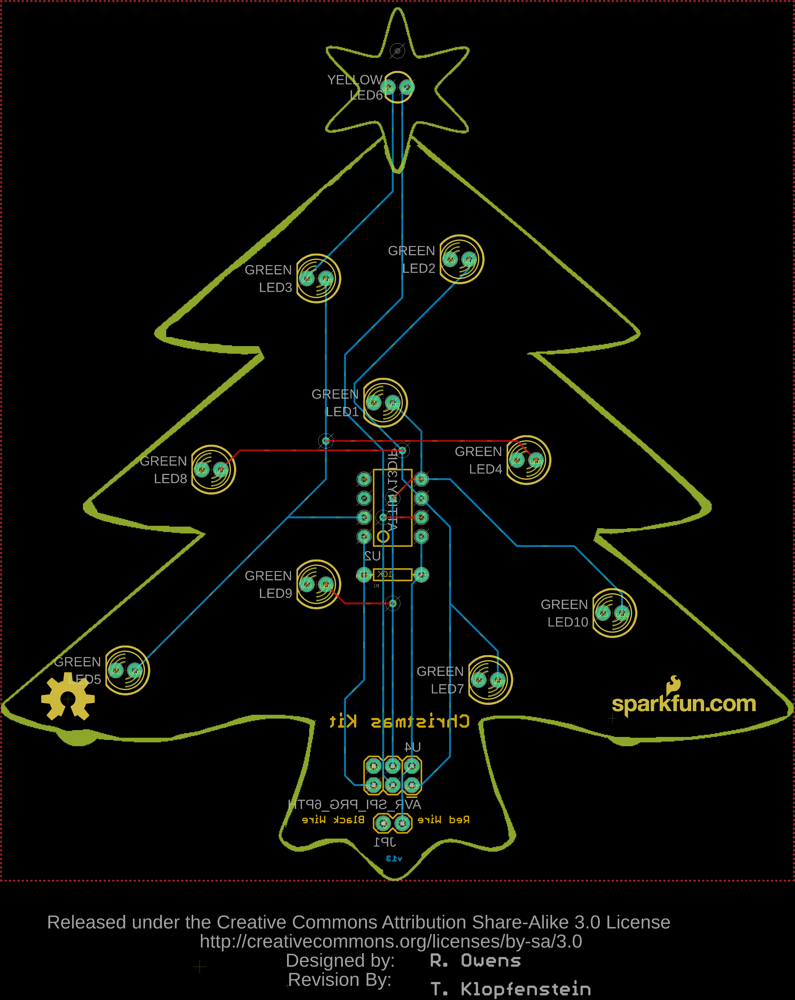
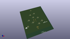
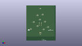
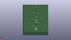
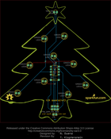
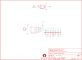

Contents
========

* [PRS9565 > Through-Hole Christmas Kit](#prs9565--through-hole-christmas-kit)
	* [Schematic](#schematic)
	* [PCB](#pcb)
	* [Images](#images)
	* [Tags](#tags)
  
![][im]
# PRS9565 > Through-Hole Christmas Kit

- ID: PROJ-SPAR-9565-STAN-01
- Hex ID: PRS9565
- Name: Sparkfun
- Description: Sparkfun
- Long Link: [http://oom.lt/PROJ-SPAR-9565-STAN-01](http://oom.lt/PROJ-SPAR-9565-STAN-01)
- Short Link: [http://oom.lt/PRS9565](http://oom.lt/PRS9565)

## Schematic
  

## PCB
  

## Images
  
  

|kicadPcb3d|kicadPcb3dFront|kicadPcb3dBack|eagleImage|eagleSchemImage|
| :---: | :---: | :---: | :---: | :---: |
||||||

## Tags

- hexID: PRS9565
- oompType: PROJ
- oompSize: SPAR
- oompColor: 9565
- oompDesc: STAN
- oompIndex: 01
- oompName: Through-Hole Christmas Kit
- sources: All source files from https://github.com/sparkfun/Through-Hole_Christmas_Kit (source licence details in srcLicense.md)
- linkBuyPage: https://www.sparkfun.com/products/9565
- oompID: PROJ-SPAR-9565-STAN-01

[im]: kicadPcb3d_450.png
