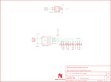

Contents
========

* [PRS9565 > Through-Hole Christmas Kit](#prs9565--through-hole-christmas-kit)
	* [Schematic](#schematic)
	* [PCB](#pcb)
	* [Images](#images)
	* [Tags](#tags)
  
![][im]
# PRS9565 > Through-Hole Christmas Kit

- ID: PROJ-SPAR-9565-STAN-01
- Hex ID: PRS9565
- Name: Sparkfun
- Description: Sparkfun
- Long Link: [http://oom.lt/PROJ-SPAR-9565-STAN-01](http://oom.lt/PROJ-SPAR-9565-STAN-01)
- Short Link: [http://oom.lt/PRS9565](http://oom.lt/PRS9565)

## Schematic
  

## PCB
  

## Images
  
  

|kicadPcb3d|kicadPcb3dFront|kicadPcb3dBack|eagleImage|eagleSchemImage|
| :---: | :---: | :---: | :---: | :---: |
||||||

## Tags

- hexID: PRS9565
- oompType: PROJ
- oompSize: SPAR
- oompColor: 9565
- oompDesc: STAN
- oompIndex: 01
- oompName: Through-Hole Christmas Kit
- sources: All source files from https://github.com/sparkfun/Through-Hole_Christmas_Kit (source licence details in srcLicense.md)
- linkBuyPage: https://www.sparkfun.com/products/9565
- oompID: PROJ-SPAR-9565-STAN-01
- rawParts: FRAME1,FRAME-LETTER,FRAME-LETTER,CREATIVE_COMMONS,Schematic Frame,,
- rawParts: JP1,,M02PTH,1X02,Header 2,,
- rawParts: JP2,LOGO-SFENEW,LOGO-SFENEW,SFE-NEW-WEBLOGO,Spark Fun Electronics PCB Logo,,
- rawParts: LED1,GREEN,LED5MM,LED5MM,LEDs,,
- rawParts: LED2,GREEN,LED5MM,LED5MM,LEDs,,
- rawParts: LED3,GREEN,LED5MM,LED5MM,LEDs,,
- rawParts: LED4,GREEN,LED5MM,LED5MM,LEDs,,
- rawParts: LED5,GREEN,LED5MM,LED5MM,LEDs,,
- rawParts: LED6,YELLOW,LED3MM,LED3MM,LEDs,,
- rawParts: LED7,GREEN,LED5MM,LED5MM,LEDs,,
- rawParts: LED8,GREEN,LED5MM,LED5MM,LEDs,,
- rawParts: LED9,GREEN,LED5MM,LED5MM,LEDs,,
- rawParts: LED10,GREEN,LED5MM,LED5MM,LEDs,,
- rawParts: LOGO1,OSHW-LOGOL,OSHW-LOGOL,OSHW-LOGO-L,Open Source Hardware Logo This logo indicates the piece of hardware it is found on incorporates a OSHW license and/or adheres to the definition of open source hardware found here: http://freedomdefined.org/OSHW,,
- rawParts: R1,10K,RESISTORPTH1,AXIAL-0.3,Resistor,,
- rawParts: U$1,REVISION,REVISION,REVISION,,,
- rawParts: U2,ATTINY13DIP,ATTINY13DIP,DIP08,,,
- rawParts: U4,AVR_SPI_PRG_6PTH,AVR_SPI_PRG_6PTH,2X3,AVR ISP 6 Pin,,

[im]: kicadPcb3d_450.png
