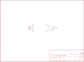

Contents
========

* [PRS9569 > Humidity Sensor Breakout-HIH-4030](#prs9569--humidity-sensor-breakout-hih-4030)
	* [Schematic](#schematic)
	* [PCB](#pcb)
	* [Interactive BOM](#interactive-bom)
	* [OOMP Parts](#oomp-parts)
	* [Images](#images)
	* [Tags](#tags)
  
![][im]
# PRS9569 > Humidity Sensor Breakout-HIH-4030

- ID: PROJ-SPAR-9569-STAN-01
- Hex ID: PRS9569
- Name: Sparkfun
- Description: Sparkfun
- Long Link: [http://oom.lt/PROJ-SPAR-9569-STAN-01](http://oom.lt/PROJ-SPAR-9569-STAN-01)
- Short Link: [http://oom.lt/PRS9569](http://oom.lt/PRS9569)

## Schematic
  

## PCB
  

## Interactive BOM

- Interactive BOM page: [ibom.html](https://htmlpreview.github.io/?https://github.com/oomlout/oomlout_OOMP_projects/blob/main/PROJ-SPAR-9569-STAN-01/kicad/bom/ibom.html)

## OOMP Parts
  

|OOMP ID|Name|Identifier|
| :---: | :---: | :---: |
|[HEAD-I01-X-PI03-01](https://github.com/oomlout/oomlout_OOMP_parts/tree/main/HEAD-I01-X-PI03-01/)|[2.54 mm 3 Pin Header](https://github.com/oomlout/oomlout_OOMP_parts/tree/main/HEAD-I01-X-PI03-01/)|[JP1](https://github.com/oomlout/oomlout_OOMP_parts/tree/main/HEAD-I01-X-PI03-01/)|
|UNMATCHED-UNMATCHED-X-UNMATCHED-01||U1|

## Images
  
  

|bominteractivefront|bominteractiveback|kicadPcb3d|kicadPcb3dFront|kicadPcb3dBack|eagleImage|eagleSchemImage|pcbdraw|pcbdrawback|
| :---: | :---: | :---: | :---: | :---: | :---: | :---: | :---: | :---: |
||||||||||

## Tags

- hexID: PRS9569
- oompType: PROJ
- oompSize: SPAR
- oompColor: 9569
- oompDesc: STAN
- oompIndex: 01
- oompName: Humidity Sensor Breakout-HIH-4030
- sources: All source files from https://github.com/sparkfun/Humidity_Sensor_Breakout-HIH-4030 (source licence details in srcLicense.md)
- linkBuyPage: https://www.sparkfun.com/products/9569
- oompID: PROJ-SPAR-9569-STAN-01
- oompParts: JP1,HEAD-I01-X-PI03-01
- oompParts: U1,UNMATCHED-UNMATCHED-X-UNMATCHED-01
- rawParts: FID1,FIDUCIALUFIDUCIAL,FIDUCIALUFIDUCIAL,MICRO-FIDUCIAL,Fiducial Alignment Points,,
- rawParts: FID2,FIDUCIALUFIDUCIAL,FIDUCIALUFIDUCIAL,MICRO-FIDUCIAL,Fiducial Alignment Points,,
- rawParts: JP1,,M03PTH,1X03,Header 3,,
- rawParts: JP2,LOGO-SFESK,LOGO-SFESK,SFE-LOGO-FLAME,Spark Fun Electronics PCB Logo,,
- rawParts: U1,HIH-4030SMD,HIH-4030SMD,HIH-4030,Humidity Sensor,,

[im]: kicadPcb3d_450.png
