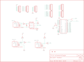

Contents
========

* [PRS9598 > MIDI Breakout](#prs9598--midi-breakout)
	* [Schematic](#schematic)
	* [PCB](#pcb)
	* [OOMP Parts](#oomp-parts)
	* [Images](#images)
	* [Tags](#tags)
  
![][im]
# PRS9598 > MIDI Breakout

- ID: PROJ-SPAR-9598-STAN-01
- Hex ID: PRS9598
- Name: Sparkfun
- Description: Sparkfun
- Long Link: [http://oom.lt/PROJ-SPAR-9598-STAN-01](http://oom.lt/PROJ-SPAR-9598-STAN-01)
- Short Link: [http://oom.lt/PRS9598](http://oom.lt/PRS9598)

## Schematic
  

## PCB
  

## OOMP Parts
  

|OOMP ID|Name|Identifier|
| :---: | :---: | :---: |
|DIOD-UNMATCHED-X-UNMATCHED-01||D1|
|[HEAD-I01-X-PI06-01](https://github.com/oomlout/oomlout_OOMP_parts/tree/main/HEAD-I01-X-PI06-01/)|[2.54 mm 6 Pin Header](https://github.com/oomlout/oomlout_OOMP_parts/tree/main/HEAD-I01-X-PI06-01/)|[JP4, JP5, JP6, JP7, JP8, JP9, JP10](https://github.com/oomlout/oomlout_OOMP_parts/tree/main/HEAD-I01-X-PI06-01/)|
|RESE-0402-X-O221-01||R1, R2, R3, R4, R5, R6|
|UNMATCHED-UNMATCHED-X-UNMATCHED-01||S3, S5, U$1, U$2, U$3, U$5, U$6|

## Images
  
  

|kicadPcb3d|kicadPcb3dFront|kicadPcb3dBack|eagleImage|eagleSchemImage|
| :---: | :---: | :---: | :---: | :---: |
||||||

## Tags

- hexID: PRS9598
- oompType: PROJ
- oompSize: SPAR
- oompColor: 9598
- oompDesc: STAN
- oompIndex: 01
- oompName: MIDI Breakout
- sources: All source files from https://github.com/sparkfun/MIDI_Breakout (source licence details in srcLicense.md)
- linkBuyPage: https://www.sparkfun.com/products/9598
- oompID: PROJ-SPAR-9598-STAN-01
- oompParts: D1,DIOD-UNMATCHED-X-UNMATCHED-01
- oompParts: JP4,HEAD-I01-X-PI06-01
- oompParts: JP5,HEAD-I01-X-PI06-01
- oompParts: JP6,HEAD-I01-X-PI06-01
- oompParts: JP7,HEAD-I01-X-PI06-01
- oompParts: JP8,HEAD-I01-X-PI06-01
- oompParts: JP9,HEAD-I01-X-PI06-01
- oompParts: JP10,HEAD-I01-X-PI06-01
- oompParts: R1,RESE-0402-X-O221-01
- oompParts: R2,RESE-0402-X-O221-01
- oompParts: R3,RESE-0402-X-O221-01
- oompParts: R4,RESE-0402-X-O221-01
- oompParts: R5,RESE-0402-X-O221-01
- oompParts: R6,RESE-0402-X-O221-01
- oompParts: S3,UNMATCHED-UNMATCHED-X-UNMATCHED-01
- oompParts: S5,UNMATCHED-UNMATCHED-X-UNMATCHED-01
- oompParts: U$1,UNMATCHED-UNMATCHED-X-UNMATCHED-01
- oompParts: U$2,UNMATCHED-UNMATCHED-X-UNMATCHED-01
- oompParts: U$3,UNMATCHED-UNMATCHED-X-UNMATCHED-01
- oompParts: U$5,UNMATCHED-UNMATCHED-X-UNMATCHED-01
- oompParts: U$6,UNMATCHED-UNMATCHED-X-UNMATCHED-01
- rawParts: D1,,DIODESMA,SMA-DIODE,Diode,,
- rawParts: JP1,FIDUCIAL1X2,FIDUCIAL1X2,FIDUCIAL-1X2,Fiducial Alignment Points,,
- rawParts: JP2,FIDUCIAL1X2,FIDUCIAL1X2,FIDUCIAL-1X2,Fiducial Alignment Points,,
- rawParts: JP3,LOGO-SFENEW,LOGO-SFENEW,SFE-NEW-WEBLOGO,Spark Fun Electronics PCB Logo,,
- rawParts: JP4,,M06SIP,1X06,Header 6,,
- rawParts: JP5,,M06SIP,1X06,Header 6,,
- rawParts: JP6,,M06SIP,1X06,Header 6,,
- rawParts: JP7,,M06SIP,1X06,Header 6,,
- rawParts: JP8,,M06SIP,1X06,Header 6,,
- rawParts: JP9,,M06SIP,1X06,Header 6,,
- rawParts: JP10,,M06SIP,1X06,Header 6,,
- rawParts: JP11,LOGO-SFENEW,LOGO-SFENEW,SFE-NEW-WEBLOGO,Spark Fun Electronics PCB Logo,,
- rawParts: R1,220,RESISTOR0402-RES,0402-RES,Resistor,,
- rawParts: R2,220,RESISTOR0402-RES,0402-RES,Resistor,,
- rawParts: R3,220,RESISTOR0402-RES,0402-RES,Resistor,,
- rawParts: R4,220,RESISTOR0402-RES,0402-RES,Resistor,,
- rawParts: R5,220,RESISTOR0402-RES,0402-RES,Resistor,,
- rawParts: R6,220,RESISTOR0402-RES,0402-RES,Resistor,,
- rawParts: S3,,TAC_SWITCHSMD,TACTILE_SWITCH_SMD,Momentary Switch,,
- rawParts: S5,,SWITCH-SPSTSMD,AYZ0202,SPST Switch,,
- rawParts: U$1,ARDUINO_VIAS_ONLY,ARDUINO_VIAS_ONLY,DUEMILANOVE_VIAS,,,
- rawParts: U$2,MIDI_CONN_FEMALE_SUPPORT,MIDI_CONN_FEMALE_SUPPORT,DIN_5_FEMALE_SUPPORT,,,
- rawParts: U$3,MIDI_CONN_FEMALE_SUPPORT,MIDI_CONN_FEMALE_SUPPORT,DIN_5_FEMALE_SUPPORT,,,
- rawParts: U$5,MIDI_CONN_FEMALE_SUPPORT,MIDI_CONN_FEMALE_SUPPORT,DIN_5_FEMALE_SUPPORT,,,
- rawParts: U$6,OPTO_DARL_6N138S,OPTO_DARL_6N138S,8-SMD,,,

[im]: kicadPcb3d_450.png
