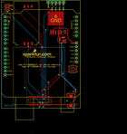

Contents
========

* [PROJ-SPAR-9607-STAN-01>SM5100B Cellular Shield](#proj-spar-9607-stan-01sm5100b-cellular-shield)
	* [Images](#images)
	* [OOMP Parts](#oomp-parts)
	* [Tags](#tags)
  
![][im]
# PROJ-SPAR-9607-STAN-01>SM5100B Cellular Shield

- ID: PROJ-SPAR-9607-STAN-01
- Hex ID: PRS9607
- Name: SM5100B Cellular Shield
- Description: 

## Images
  
  

|eagleImage|kicadPcb3dFront|kicadPcb3dBack|kicadPcb3d|
| :---: | :---: | :---: | :---: |
|||||

## OOMP Parts
  

|OOMP Parts|
| :---: |
|<table><tr><td></td><td> C3</td><td>[CAPC-0603-X-NF100-V50 SMD (0603) 100 nF Capacitor (Ceramic) 50v](https://github.com/oomlout/oomlout_OOMP_parts/tree/main/CAPC-0603-X-NF100-V50/)</td><td>[C6N100](https://github.com/oomlout/oomlout_OOMP_parts/tree/main/CAPC-0603-X-NF100-V50/)</td></tr></table>|
|CAPE-UNMATCHED-X-UNMATCHED-01, C5, 46.99, 5.08, 270,C5, 100uF, EIA7343, SparkFun, (1.85, 0.2), R270|
|HEAD-I01-X-PI2-01, JP2, 1.27, 72.39, 0,JP2, FIDUCIAL1X2, FIDUCIAL-1X2, SparkFun, (0.05, 2.85), R0|
|HEAD-I01-X-PI2-01, JP3, 50.8, 2.54, 0,JP3, FIDUCIAL1X2, FIDUCIAL-1X2, SparkFun, (2, 0.1), R0|
|<table><tr><td></td><td> JP5</td><td>[HEAD-I01-X-PI05-01 2.54 mm 5 Pin Header](https://github.com/oomlout/oomlout_OOMP_parts/tree/main/HEAD-I01-X-PI05-01/)</td><td>[H05](https://github.com/oomlout/oomlout_OOMP_parts/tree/main/HEAD-I01-X-PI05-01/)</td></tr></table>|
|UNMATCHED-0603-X-UNMATCHED-01, LED1, 41.91, 45.72, 0,LED1, Red, LED-0603, SparkFun, (1.65, 1.8), R0|
|<table><tr><td></td><td> R1</td><td>[RESE-0603-X-O223-01 SMD (0603) 22k Ohm Resistor](https://github.com/oomlout/oomlout_OOMP_parts/tree/main/RESE-0603-X-O223-01/)</td><td>[R6223](https://github.com/oomlout/oomlout_OOMP_parts/tree/main/RESE-0603-X-O223-01/)</td></tr></table>|
|<table><tr><td></td><td> R2</td><td>[RESE-0603-X-O103-01 SMD (0603) 10k Ohm Resistor](https://github.com/oomlout/oomlout_OOMP_parts/tree/main/RESE-0603-X-O103-01/)</td><td>[R6103](https://github.com/oomlout/oomlout_OOMP_parts/tree/main/RESE-0603-X-O103-01/)</td></tr></table>|
|<table><tr><td></td><td> R3</td><td>[RESE-0603-X-O103-01 SMD (0603) 10k Ohm Resistor](https://github.com/oomlout/oomlout_OOMP_parts/tree/main/RESE-0603-X-O103-01/)</td><td>[R6103](https://github.com/oomlout/oomlout_OOMP_parts/tree/main/RESE-0603-X-O103-01/)</td></tr></table>|
|<table><tr><td></td><td> R6</td><td>[RESE-0603-X-O331-01 SMD (0603) 330 Ohm Resistor](https://github.com/oomlout/oomlout_OOMP_parts/tree/main/RESE-0603-X-O331-01/)</td><td>[R6331](https://github.com/oomlout/oomlout_OOMP_parts/tree/main/RESE-0603-X-O331-01/)</td></tr></table>|
|UNMATCHED-UNMATCHED-X-UNMATCHED-01, S1, 48.26, 26.669999999999998, 0,S1, TACTILE_SWITCH_SMD, SparkFun, (1.9, 1.05), R0|
|UNMATCHED-UNMATCHED-X-UNMATCHED-01, U1, 0.0, 7.619999999999999, 0,U1, ARDUINO_SHIELDNOHOLES, DUEMILANOVE_SHIELD_NOHOLES, SparkFun, (0, 0.3), R0|
|UNMATCHED-UNMATCHED-X-UNMATCHED-01, U2, 36.83, 59.69, 0,U2, SPX29302, Q5-DD_SPX29300, SparkFun, (1.45, 2.35), R0|
|UNMATCHED-UNMATCHED-X-UNMATCHED-01, U3, 25.4, 5.08, 0,U3, SM5100B, SM5100B, SparkFun, (1, 0.2), R0|
|UNMATCHED-UNMATCHED-X-UNMATCHED-01, U4, 25.4, 43.18, 90,U4, SIMHOLDER3, SIMHOLDER3, SparkFun, (1, 1.7), R90|

## Tags

- hexID: PRS9607
- oompType: PROJ
- oompSize: SPAR
- oompColor: 9607
- oompDesc: STAN
- oompIndex: 01
- oompName: SM5100B Cellular Shield
- sources: All source files from https://github.com/sparkfun/SM5100B_Cellular_Shield (source licence details in srcLicense.md)
- linkBuyPage: https://www.sparkfun.com/products/9607
- oompPart: CAPC-0603-X-NF100-V50, C3, 41.91, 48.26, 0
- oompPart: CAPE-UNMATCHED-X-UNMATCHED-01, C5, 46.99, 5.08, 270
- oompPart: HEAD-I01-X-PI2-01, JP2, 1.27, 72.39, 0
- oompPart: HEAD-I01-X-PI2-01, JP3, 50.8, 2.54, 0
- oompPart: SKIP-UNMATCHED-X-UNMATCHED-01, JP4, 3.8099999999999996, 69.85, 180
- oompPart: HEAD-I01-X-PI05-01, JP5, 41.91, 72.39, 180
- oompPart: SKIP-UNMATCHED-X-UNMATCHED-01, JP6, 3.8099999999999996, 67.30999999999999, 0
- oompPart: UNMATCHED-0603-X-UNMATCHED-01, LED1, 41.91, 45.72, 0
- oompPart: RESE-0603-X-O223-01, R1, 39.37, 46.99, 90
- oompPart: RESE-0603-X-O103-01, R2, 43.18, 52.06999999999999, 90
- oompPart: RESE-0603-X-O103-01, R3, 49.529999999999994, 11.43, 0
- oompPart: RESE-0603-X-O331-01, R6, 43.18, 45.72, 90
- oompPart: UNMATCHED-UNMATCHED-X-UNMATCHED-01, S1, 48.26, 26.669999999999998, 0
- oompPart: UNMATCHED-UNMATCHED-X-UNMATCHED-01, U1, 0.0, 7.619999999999999, 0
- oompPart: UNMATCHED-UNMATCHED-X-UNMATCHED-01, U2, 36.83, 59.69, 0
- oompPart: UNMATCHED-UNMATCHED-X-UNMATCHED-01, U3, 25.4, 5.08, 0
- oompPart: UNMATCHED-UNMATCHED-X-UNMATCHED-01, U4, 25.4, 43.18, 90
- rawPart: C3, 0.1uF, 0603-CAP, SparkFun, (1.65, 1.9), R0
- rawPart: C5, 100uF, EIA7343, SparkFun, (1.85, 0.2), R270
- rawPart: JP2, FIDUCIAL1X2, FIDUCIAL-1X2, SparkFun, (0.05, 2.85), R0
- rawPart: JP3, FIDUCIAL1X2, FIDUCIAL-1X2, SparkFun, (2, 0.1), R0
- rawPart: JP4, JUMPER-31-2, SJ_3_PASTE1&2, SparkFun, (0.15, 2.75), R180
- rawPart: JP5, 1X05, SparkFun, (1.65, 2.85), R180
- rawPart: JP6, JUMPER-32-3, SJ_3_PASTE2&3, SparkFun, (0.15, 2.65), R0
- rawPart: LED1, Red, LED-0603, SparkFun, (1.65, 1.8), R0
- rawPart: R1, 22K, R0603, rcl, (1.55, 1.85), R90
- rawPart: R2, 10K, R0603, rcl, (1.7, 2.05), R90
- rawPart: R3, 10K, R0603, rcl, (1.95, 0.45), R0
- rawPart: R6, 330, R0603, rcl, (1.7, 1.8), R90
- rawPart: S1, TACTILE_SWITCH_SMD, SparkFun, (1.9, 1.05), R0
- rawPart: U1, ARDUINO_SHIELDNOHOLES, DUEMILANOVE_SHIELD_NOHOLES, SparkFun, (0, 0.3), R0
- rawPart: U2, SPX29302, Q5-DD_SPX29300, SparkFun, (1.45, 2.35), R0
- rawPart: U3, SM5100B, SM5100B, SparkFun, (1, 0.2), R0
- rawPart: U4, SIMHOLDER3, SIMHOLDER3, SparkFun, (1, 1.7), R90
- oompID: PROJ-SPAR-9607-STAN-01

[im]: kicadPcb3d_450.png
