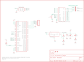

Contents
========

* [PRS9607 > SM5100B Cellular Shield](#prs9607--sm5100b-cellular-shield)
	* [Schematic](#schematic)
	* [PCB](#pcb)
	* [Images](#images)
	* [Tags](#tags)
  
![][im]
# PRS9607 > SM5100B Cellular Shield

- ID: PROJ-SPAR-9607-STAN-01
- Hex ID: PRS9607
- Name: Sparkfun
- Description: Sparkfun
- Long Link: [http://oom.lt/PROJ-SPAR-9607-STAN-01](http://oom.lt/PROJ-SPAR-9607-STAN-01)
- Short Link: [http://oom.lt/PRS9607](http://oom.lt/PRS9607)

## Schematic
  

## PCB
  

## Images
  
  

|kicadPcb3d|kicadPcb3dFront|kicadPcb3dBack|eagleImage|eagleSchemImage|
| :---: | :---: | :---: | :---: | :---: |
||||||

## Tags

- hexID: PRS9607
- oompType: PROJ
- oompSize: SPAR
- oompColor: 9607
- oompDesc: STAN
- oompIndex: 01
- oompName: SM5100B Cellular Shield
- sources: All source files from https://github.com/sparkfun/SM5100B_Cellular_Shield (source licence details in srcLicense.md)
- linkBuyPage: https://www.sparkfun.com/products/9607
- oompID: PROJ-SPAR-9607-STAN-01
- rawParts: C3,0.1uF,CAP0603-CAP,0603-CAP,Capacitor,,
- rawParts: C5,100uF,CAP_POL7343,EIA7343,Capacitor Polarized,,
- rawParts: JP1,LOGO-SFENEW,LOGO-SFENEW,SFE-NEW-WEBLOGO,Spark Fun Electronics PCB Logo,,
- rawParts: JP2,FIDUCIAL1X2,FIDUCIAL1X2,FIDUCIAL-1X2,Fiducial Alignment Points,,
- rawParts: JP3,FIDUCIAL1X2,FIDUCIAL1X2,FIDUCIAL-1X2,Fiducial Alignment Points,,
- rawParts: JP4,JUMPER-31-2,JUMPER-31-2,SJ_3_PASTE1&2,,,
- rawParts: JP5,,M05PTH,1X05,Header 5,,
- rawParts: JP6,JUMPER-32-3,JUMPER-32-3,SJ_3_PASTE2&3,,,
- rawParts: LED1,Red,LED0603,LED-0603,LEDs,,
- rawParts: R1,22K,R-US_R0603,R0603,RESISTOR, American symbol,,
- rawParts: R2,10K,R-US_R0603,R0603,RESISTOR, American symbol,,
- rawParts: R3,10K,R-US_R0603,R0603,RESISTOR, American symbol,,
- rawParts: R6,330,R-US_R0603,R0603,RESISTOR, American symbol,,
- rawParts: S1,,TAC_SWITCHSMD,TACTILE_SWITCH_SMD,Momentary Switch,,
- rawParts: U$1,CREATIVE_COMMONS,CREATIVE_COMMONS,CREATIVE_COMMONS,,,
- rawParts: U1,ARDUINO_SHIELDNOHOLES,ARDUINO_SHIELDNOHOLES,DUEMILANOVE_SHIELD_NOHOLES,,,
- rawParts: U2,SPX29302,SPX29302,Q5-DD_SPX29300,,,
- rawParts: U3,SM5100B,SM5100B,SM5100B,,,
- rawParts: U4,SIMHOLDER3,SIMHOLDER3,SIMHOLDER3,,,

[im]: kicadPcb3d_450.png
