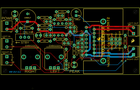

Contents
========

* [PROJ-SPAR-9612-STAN-01>Audio Amplifier Kit-STA540](#proj-spar-9612-stan-01audio-amplifier-kit-sta540)
	* [Images](#images)
	* [OOMP Parts](#oomp-parts)
	* [Tags](#tags)
  
![][im]
# PROJ-SPAR-9612-STAN-01>Audio Amplifier Kit-STA540

- ID: PROJ-SPAR-9612-STAN-01
- Hex ID: PRS9612
- Name: Audio Amplifier Kit-STA540
- Description: 

## Images
  
  

|eagleImage|kicadPcb3dFront|kicadPcb3dBack|kicadPcb3d|
| :---: | :---: | :---: | :---: |
|||||

## OOMP Parts
  

|OOMP Parts|
| :---: |
|CAPE-UNMATCHED-X-UNMATCHED-01, C1, 40.64, 20.32, 0,C1, 10pF, CAP-PTH-SMALL2, SparkFun, (1.6, 0.8), R0|
|CAPE-UNMATCHED-X-UNMATCHED-01, C2, 36.83, 38.099999999999994, 0,C2, 10pF, CAP-PTH-SMALL2, SparkFun, (1.45, 1.5), R0|
|CAPE-UNMATCHED-X-NF100-01, C3, 52.06999999999999, 15.239999999999998, 270,C3, 0.1uF, CAP-PTH-SMALL2, SparkFun, (2.05, 0.6), R270|
|CAPE-UNMATCHED-X-NF100-01, C4, 52.06999999999999, 22.86, 90,C4, 0.1uF, CAP-PTH-SMALL2, SparkFun, (2.05, 0.9), R90|
|CAPE-UNMATCHED-X-NF100-01, C5, 44.449999999999996, 30.479999999999997, 270,C5, 0.1uF, CAP-PTH-SMALL2, SparkFun, (1.75, 1.2), R270|
|CAPE-UNMATCHED-X-UF1000-01, C6, 17.018, 36.703, 270,C6, 1000uF, CPOL-RADIAL-1000UF-25V, SparkFun, (0.67, 1.445), R270|
|CAPE-UNMATCHED-X-UNMATCHED-01, C7, 29.209999999999997, 34.29, 0,C7, 1uF, CAP-PTH-SMALL2, SparkFun, (1.15, 1.35), R0|
|CAPE-UNMATCHED-X-UNMATCHED-01, C8, 31.75, 25.4, 180,C8, 1uF, CAP-PTH-SMALL2, SparkFun, (1.25, 1), R180|
|CAPE-UNMATCHED-X-NF470-01, C9, 44.449999999999996, 33.019999999999996, 90,C9, 0.47uF, CAP-PTH-SMALL2, SparkFun, (1.75, 1.3), R90|
|CAPE-UNMATCHED-X-NF470-01, C10, 41.91, 3.8099999999999996, 90,C10, 0.47uF, CAP-PTH-SMALL2, SparkFun, (1.65, 0.15), R90|
|CAPE-UNMATCHED-X-NF470-01, C11, 46.99, 30.479999999999997, 270,C11, 0.47uF, CAP-PTH-SMALL2, SparkFun, (1.85, 1.2), R270|
|CAPE-UNMATCHED-X-NF470-01, C12, 49.529999999999994, 17.779999999999998, 0,C12, 0.47uF, CAP-PTH-SMALL2, SparkFun, (1.95, 0.7), R0|
|CAPE-UNMATCHED-X-UNMATCHED-01, C13, 48.26, 39.37, 270,C13, 100uF, CPOL-RADIAL-100UF-25V, SparkFun, (1.9, 1.55), R270|
|CAPE-UNMATCHED-X-UNMATCHED-01, C14, 52.06999999999999, 20.32, 180,C14, 1uF, CAP-PTH-SMALL2, SparkFun, (2.05, 0.8), R180|
|UNMATCHED-UNMATCHED-X-UNMATCHED-01, JP1, 3.8099999999999996, 33.019999999999996, 270,JP1, SCREWTERMINAL-3.5MM-2_LOCK, SparkFun, (0.15, 1.3), R270|
|UNMATCHED-UNMATCHED-X-UNMATCHED-01, JP2, 3.8099999999999996, 21.59, 270,JP2, SCREWTERMINAL-3.5MM-2_LOCK, SparkFun, (0.15, 0.85), R270|
|UNMATCHED-UNMATCHED-X-UNMATCHED-01, JP3, 3.8099999999999996, 11.43, 270,JP3, SCREWTERMINAL-3.5MM-2_LOCK, SparkFun, (0.15, 0.45), R270|
|UNMATCHED-UNMATCHED-X-UNMATCHED-01, JP4, 85.09, 26.669999999999998, 90,JP4, SCREWTERMINAL-3.5MM-2_LOCK, SparkFun, (3.35, 1.05), R90|
|UNMATCHED-UNMATCHED-X-UNMATCHED-01, JP5, 85.09, 13.081, 90,JP5, SCREWTERMINAL-3.5MM-2_LOCK, SparkFun, (3.35, 0.515), R90|
|UNMATCHED-UNMATCHED-X-UNMATCHED-01, JP12, 76.19999999999999, 20.32, 180,JP12, 1X03, SparkFun, (3, 0.8), R180|
|UNMATCHED-UNMATCHED-X-UNMATCHED-01, JP13, 76.19999999999999, 22.86, 180,JP13, 1X03, SparkFun, (3, 0.9), R180|
|UNMATCHED-UNMATCHED-X-UNMATCHED-01, LED1, 46.99, 6.35, 90,LED1, LED3MM, SparkFun, (1.85, 0.25), R90|
|UNMATCHED-UNMATCHED-X-UNMATCHED-01, LED2, 8.889999999999999, 39.37, 90,LED2, GREEN, LED3MM, SparkFun, (0.35, 1.55), R90|
|UNMATCHED-UNMATCHED-X-UNMATCHED-01, LED3, 24.13, 25.4, 0,LED3, RED, LED3MM, SparkFun, (0.95, 1), R0|
|RESE-UNMATCHED-X-O104-01, R1, 38.099999999999994, 35.559999999999995, 0,R1, 100K, AXIAL-0.3, SparkFun, (1.5, 1.4), R0|
|RESE-UNMATCHED-X-O473-01, R2, 39.37, 40.64, 180,R2, 47K, AXIAL-0.3, SparkFun, (1.55, 1.6), R180|
|RESE-UNMATCHED-X-O104-01, R3, 38.099999999999994, 22.86, 0,R3, 100K, AXIAL-0.3, SparkFun, (1.5, 0.9), R0|
|RESE-UNMATCHED-X-O473-01, R4, 41.91, 12.7, 90,R4, 47K, AXIAL-0.3, SparkFun, (1.65, 0.5), R90|
|RESE-UNMATCHED-X-O103-01, R5, 27.94, 31.75, 180,R5, 10K, AXIAL-0.3, SparkFun, (1.1, 1.25), R180|
|RESE-UNMATCHED-X-O103-01, R6, 27.94, 36.83, 0,R6, 10K, AXIAL-0.3, SparkFun, (1.1, 1.45), R0|
|RESE-UNMATCHED-X-O103-01, R7, 27.94, 29.209999999999997, 0,R7, 10K, AXIAL-0.3, SparkFun, (1.1, 1.15), R0|
|RESE-UNMATCHED-X-O103-01, R8, 27.94, 21.59, 0,R8, 10K, AXIAL-0.3, SparkFun, (1.1, 0.85), R0|
|RESE-UNMATCHED-X-UNMATCHED-01, R9, 46.99, 15.239999999999998, 90,R9, 1K, AXIAL-0.3, SparkFun, (1.85, 0.6), R90|
|RESE-UNMATCHED-X-O103-01, R10, 79.756, 21.59, 270,R10, 10K, AXIAL-0.3, SparkFun, (3.14, 0.85), R270|
|RESE-UNMATCHED-X-UNMATCHED-01, R11, 16.383, 29.971999999999998, 180,R11, 1K, AXIAL-0.3, SparkFun, (0.645, 1.18), R180|
|RESE-UNMATCHED-X-UNMATCHED-01, R12, 10.16, 31.75, 270,R12, 1K, AXIAL-0.3, SparkFun, (0.4, 1.25), R270|
|UNMATCHED-UNMATCHED-X-UNMATCHED-01, S1, 15.239999999999998, 24.13, 90,S1, STBY, SWITCH-SPDT, SparkFun, (0.6, 0.95), R90|
|UNMATCHED-UNMATCHED-X-UNMATCHED-01, U1, 38.099999999999994, 29.209999999999997, 180,U1, LM358, DIP08, SparkFun, (1.5, 1.15), R180|
|UNMATCHED-UNMATCHED-X-UNMATCHED-01, U2, 57.15, 21.59, 270,U2, STA540, MULTIWATT15_6400BGHEATSINK_2, SparkFun, (2.25, 0.85), R270|
|UNMATCHED-UNMATCHED-X-UNMATCHED-01, VR1, 34.29, 11.43, 270,VR1, 10K, ALPS_POT, SparkFun, (1.35, 0.45), R270|
|UNMATCHED-UNMATCHED-X-UNMATCHED-01, VR2, 19.049999999999997, 11.43, 270,VR2, 10K, ALPS_POT, SparkFun, (0.75, 0.45), R270|

## Tags

- hexID: PRS9612
- oompType: PROJ
- oompSize: SPAR
- oompColor: 9612
- oompDesc: STAN
- oompIndex: 01
- oompName: Audio Amplifier Kit-STA540
- sources: All source files from https://github.com/sparkfun/Audio_Amplifier_Kit-STA540 (source licence details in srcLicense.md)
- linkBuyPage: https://www.sparkfun.com/products/9612
- oompPart: CAPE-UNMATCHED-X-UNMATCHED-01, C1, 40.64, 20.32, 0
- oompPart: CAPE-UNMATCHED-X-UNMATCHED-01, C2, 36.83, 38.099999999999994, 0
- oompPart: CAPE-UNMATCHED-X-NF100-01, C3, 52.06999999999999, 15.239999999999998, 270
- oompPart: CAPE-UNMATCHED-X-NF100-01, C4, 52.06999999999999, 22.86, 90
- oompPart: CAPE-UNMATCHED-X-NF100-01, C5, 44.449999999999996, 30.479999999999997, 270
- oompPart: CAPE-UNMATCHED-X-UF1000-01, C6, 17.018, 36.703, 270
- oompPart: CAPE-UNMATCHED-X-UNMATCHED-01, C7, 29.209999999999997, 34.29, 0
- oompPart: CAPE-UNMATCHED-X-UNMATCHED-01, C8, 31.75, 25.4, 180
- oompPart: CAPE-UNMATCHED-X-NF470-01, C9, 44.449999999999996, 33.019999999999996, 90
- oompPart: CAPE-UNMATCHED-X-NF470-01, C10, 41.91, 3.8099999999999996, 90
- oompPart: CAPE-UNMATCHED-X-NF470-01, C11, 46.99, 30.479999999999997, 270
- oompPart: CAPE-UNMATCHED-X-NF470-01, C12, 49.529999999999994, 17.779999999999998, 0
- oompPart: CAPE-UNMATCHED-X-UNMATCHED-01, C13, 48.26, 39.37, 270
- oompPart: CAPE-UNMATCHED-X-UNMATCHED-01, C14, 52.06999999999999, 20.32, 180
- oompPart: UNMATCHED-UNMATCHED-X-UNMATCHED-01, JP1, 3.8099999999999996, 33.019999999999996, 270
- oompPart: UNMATCHED-UNMATCHED-X-UNMATCHED-01, JP2, 3.8099999999999996, 21.59, 270
- oompPart: UNMATCHED-UNMATCHED-X-UNMATCHED-01, JP3, 3.8099999999999996, 11.43, 270
- oompPart: UNMATCHED-UNMATCHED-X-UNMATCHED-01, JP4, 85.09, 26.669999999999998, 90
- oompPart: UNMATCHED-UNMATCHED-X-UNMATCHED-01, JP5, 85.09, 13.081, 90
- oompPart: UNMATCHED-UNMATCHED-X-UNMATCHED-01, JP12, 76.19999999999999, 20.32, 180
- oompPart: UNMATCHED-UNMATCHED-X-UNMATCHED-01, JP13, 76.19999999999999, 22.86, 180
- oompPart: UNMATCHED-UNMATCHED-X-UNMATCHED-01, LED1, 46.99, 6.35, 90
- oompPart: UNMATCHED-UNMATCHED-X-UNMATCHED-01, LED2, 8.889999999999999, 39.37, 90
- oompPart: UNMATCHED-UNMATCHED-X-UNMATCHED-01, LED3, 24.13, 25.4, 0
- oompPart: RESE-UNMATCHED-X-O104-01, R1, 38.099999999999994, 35.559999999999995, 0
- oompPart: RESE-UNMATCHED-X-O473-01, R2, 39.37, 40.64, 180
- oompPart: RESE-UNMATCHED-X-O104-01, R3, 38.099999999999994, 22.86, 0
- oompPart: RESE-UNMATCHED-X-O473-01, R4, 41.91, 12.7, 90
- oompPart: RESE-UNMATCHED-X-O103-01, R5, 27.94, 31.75, 180
- oompPart: RESE-UNMATCHED-X-O103-01, R6, 27.94, 36.83, 0
- oompPart: RESE-UNMATCHED-X-O103-01, R7, 27.94, 29.209999999999997, 0
- oompPart: RESE-UNMATCHED-X-O103-01, R8, 27.94, 21.59, 0
- oompPart: RESE-UNMATCHED-X-UNMATCHED-01, R9, 46.99, 15.239999999999998, 90
- oompPart: RESE-UNMATCHED-X-O103-01, R10, 79.756, 21.59, 270
- oompPart: RESE-UNMATCHED-X-UNMATCHED-01, R11, 16.383, 29.971999999999998, 180
- oompPart: RESE-UNMATCHED-X-UNMATCHED-01, R12, 10.16, 31.75, 270
- oompPart: UNMATCHED-UNMATCHED-X-UNMATCHED-01, S1, 15.239999999999998, 24.13, 90
- oompPart: UNMATCHED-UNMATCHED-X-UNMATCHED-01, U1, 38.099999999999994, 29.209999999999997, 180
- oompPart: UNMATCHED-UNMATCHED-X-UNMATCHED-01, U2, 57.15, 21.59, 270
- oompPart: UNMATCHED-UNMATCHED-X-UNMATCHED-01, VR1, 34.29, 11.43, 270
- oompPart: UNMATCHED-UNMATCHED-X-UNMATCHED-01, VR2, 19.049999999999997, 11.43, 270
- rawPart: C1, 10pF, CAP-PTH-SMALL2, SparkFun, (1.6, 0.8), R0
- rawPart: C2, 10pF, CAP-PTH-SMALL2, SparkFun, (1.45, 1.5), R0
- rawPart: C3, 0.1uF, CAP-PTH-SMALL2, SparkFun, (2.05, 0.6), R270
- rawPart: C4, 0.1uF, CAP-PTH-SMALL2, SparkFun, (2.05, 0.9), R90
- rawPart: C5, 0.1uF, CAP-PTH-SMALL2, SparkFun, (1.75, 1.2), R270
- rawPart: C6, 1000uF, CPOL-RADIAL-1000UF-25V, SparkFun, (0.67, 1.445), R270
- rawPart: C7, 1uF, CAP-PTH-SMALL2, SparkFun, (1.15, 1.35), R0
- rawPart: C8, 1uF, CAP-PTH-SMALL2, SparkFun, (1.25, 1), R180
- rawPart: C9, 0.47uF, CAP-PTH-SMALL2, SparkFun, (1.75, 1.3), R90
- rawPart: C10, 0.47uF, CAP-PTH-SMALL2, SparkFun, (1.65, 0.15), R90
- rawPart: C11, 0.47uF, CAP-PTH-SMALL2, SparkFun, (1.85, 1.2), R270
- rawPart: C12, 0.47uF, CAP-PTH-SMALL2, SparkFun, (1.95, 0.7), R0
- rawPart: C13, 100uF, CPOL-RADIAL-100UF-25V, SparkFun, (1.9, 1.55), R270
- rawPart: C14, 1uF, CAP-PTH-SMALL2, SparkFun, (2.05, 0.8), R180
- rawPart: JP1, SCREWTERMINAL-3.5MM-2_LOCK, SparkFun, (0.15, 1.3), R270
- rawPart: JP2, SCREWTERMINAL-3.5MM-2_LOCK, SparkFun, (0.15, 0.85), R270
- rawPart: JP3, SCREWTERMINAL-3.5MM-2_LOCK, SparkFun, (0.15, 0.45), R270
- rawPart: JP4, SCREWTERMINAL-3.5MM-2_LOCK, SparkFun, (3.35, 1.05), R90
- rawPart: JP5, SCREWTERMINAL-3.5MM-2_LOCK, SparkFun, (3.35, 0.515), R90
- rawPart: JP12, 1X03, SparkFun, (3, 0.8), R180
- rawPart: JP13, 1X03, SparkFun, (3, 0.9), R180
- rawPart: LED1, LED3MM, SparkFun, (1.85, 0.25), R90
- rawPart: LED2, GREEN, LED3MM, SparkFun, (0.35, 1.55), R90
- rawPart: LED3, RED, LED3MM, SparkFun, (0.95, 1), R0
- rawPart: R1, 100K, AXIAL-0.3, SparkFun, (1.5, 1.4), R0
- rawPart: R2, 47K, AXIAL-0.3, SparkFun, (1.55, 1.6), R180
- rawPart: R3, 100K, AXIAL-0.3, SparkFun, (1.5, 0.9), R0
- rawPart: R4, 47K, AXIAL-0.3, SparkFun, (1.65, 0.5), R90
- rawPart: R5, 10K, AXIAL-0.3, SparkFun, (1.1, 1.25), R180
- rawPart: R6, 10K, AXIAL-0.3, SparkFun, (1.1, 1.45), R0
- rawPart: R7, 10K, AXIAL-0.3, SparkFun, (1.1, 1.15), R0
- rawPart: R8, 10K, AXIAL-0.3, SparkFun, (1.1, 0.85), R0
- rawPart: R9, 1K, AXIAL-0.3, SparkFun, (1.85, 0.6), R90
- rawPart: R10, 10K, AXIAL-0.3, SparkFun, (3.14, 0.85), R270
- rawPart: R11, 1K, AXIAL-0.3, SparkFun, (0.645, 1.18), R180
- rawPart: R12, 1K, AXIAL-0.3, SparkFun, (0.4, 1.25), R270
- rawPart: S1, STBY, SWITCH-SPDT, SparkFun, (0.6, 0.95), R90
- rawPart: U1, LM358, DIP08, SparkFun, (1.5, 1.15), R180
- rawPart: U2, STA540, MULTIWATT15_6400BGHEATSINK_2, SparkFun, (2.25, 0.85), R270
- rawPart: VR1, 10K, ALPS_POT, SparkFun, (1.35, 0.45), R270
- rawPart: VR2, 10K, ALPS_POT, SparkFun, (0.75, 0.45), R270

[im]: kicadPcb3d_450.png
