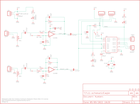

Contents
========

* [PRS9612 > Audio Amplifier Kit-STA540](#prs9612--audio-amplifier-kit-sta540)
	* [Schematic](#schematic)
	* [PCB](#pcb)
	* [OOMP Parts](#oomp-parts)
	* [Images](#images)
	* [Tags](#tags)
  
![][im]
# PRS9612 > Audio Amplifier Kit-STA540

- ID: PROJ-SPAR-9612-STAN-01
- Hex ID: PRS9612
- Name: Sparkfun 9612
- Description: Sparkfun 9612
- Long Link: [http://oom.lt/PROJ-SPAR-9612-STAN-01](http://oom.lt/PROJ-SPAR-9612-STAN-01)
- Short Link: [http://oom.lt/PRS9612](http://oom.lt/PRS9612)

## Schematic
  

## PCB
  

## OOMP Parts
  

|OOMP ID|Name|Identifier|
| :---: | :---: | :---: |
|CAPX-UNMATCHED-X-PF10-01||C1, C2|
|CAPX-UNMATCHED-X-NF100-01||C3, C4, C5|
|CAPX-UNMATCHED-X-UNMATCHED-01||C6|
|CAPX-UNMATCHED-X-UF1-01||C7, C8, C14|
|CAPX-UNMATCHED-X-UF47-01||C9, C10, C11, C12|
|CAPX-UNMATCHED-X-UF100-01||C13|
|[TERS-35D-L-PI02-01](https://github.com/oomlout/oomlout_OOMP_parts/tree/main/TERS-35D-L-PI02-01/)|[3.5 mm 2 Pin Blue Screw Terminal](https://github.com/oomlout/oomlout_OOMP_parts/tree/main/TERS-35D-L-PI02-01/)|[JP1, JP2, JP3, JP4, JP5](https://github.com/oomlout/oomlout_OOMP_parts/tree/main/TERS-35D-L-PI02-01/)|
|[HEAD-I01-X-PI03-01](https://github.com/oomlout/oomlout_OOMP_parts/tree/main/HEAD-I01-X-PI03-01/)|[2.54 mm 3 Pin Header](https://github.com/oomlout/oomlout_OOMP_parts/tree/main/HEAD-I01-X-PI03-01/)|[JP12, JP13](https://github.com/oomlout/oomlout_OOMP_parts/tree/main/HEAD-I01-X-PI03-01/)|
|LEDS-UNMATCHED-G-STAN-01||LED1, LED2|
|LEDS-UNMATCHED-R-STAN-01||LED3|
|RESE-UNMATCHED-X-O1003-01||R1, R3|
|RESE-UNMATCHED-X-O473-01||R2, R4|
|RESE-UNMATCHED-X-O103-01||R5, R6, R7, R8, R10|
|RESE-UNMATCHED-X-O102-01||R9, R11, R12|
|UNMATCHED-UNMATCHED-X-UNMATCHED-01||S1, U1, U2, VR1, VR2|

## Images
  
  

|kicadPcb3d|kicadPcb3dFront|kicadPcb3dBack|eagleImage|eagleSchemImage|
| :---: | :---: | :---: | :---: | :---: |
||||||

## Tags

- hexID: PRS9612
- oompType: PROJ
- oompSize: SPAR
- oompColor: 9612
- oompDesc: STAN
- oompIndex: 01
- oompName: Audio Amplifier Kit-STA540
- sources: All source files from https://github.com/sparkfun/Audio_Amplifier_Kit-STA540 (source licence details in srcLicense.md)
- linkBuyPage: https://www.sparkfun.com/products/9612
- oompID: PROJ-SPAR-9612-STAN-01
- oompParts: C1,CAPX-UNMATCHED-X-PF10-01
- oompParts: C2,CAPX-UNMATCHED-X-PF10-01
- oompParts: C3,CAPX-UNMATCHED-X-NF100-01
- oompParts: C4,CAPX-UNMATCHED-X-NF100-01
- oompParts: C5,CAPX-UNMATCHED-X-NF100-01
- oompParts: C6,CAPX-UNMATCHED-X-UNMATCHED-01
- oompParts: C7,CAPX-UNMATCHED-X-UF1-01
- oompParts: C8,CAPX-UNMATCHED-X-UF1-01
- oompParts: C9,CAPX-UNMATCHED-X-UF47-01
- oompParts: C10,CAPX-UNMATCHED-X-UF47-01
- oompParts: C11,CAPX-UNMATCHED-X-UF47-01
- oompParts: C12,CAPX-UNMATCHED-X-UF47-01
- oompParts: C13,CAPX-UNMATCHED-X-UF100-01
- oompParts: C14,CAPX-UNMATCHED-X-UF1-01
- oompParts: JP1,TERS-35D-L-PI02-01
- oompParts: JP2,TERS-35D-L-PI02-01
- oompParts: JP3,TERS-35D-L-PI02-01
- oompParts: JP4,TERS-35D-L-PI02-01
- oompParts: JP5,TERS-35D-L-PI02-01
- oompParts: JP12,HEAD-I01-X-PI03-01
- oompParts: JP13,HEAD-I01-X-PI03-01
- oompParts: LED1,LEDS-UNMATCHED-G-STAN-01
- oompParts: LED2,LEDS-UNMATCHED-G-STAN-01
- oompParts: LED3,LEDS-UNMATCHED-R-STAN-01
- oompParts: R1,RESE-UNMATCHED-X-O1003-01
- oompParts: R2,RESE-UNMATCHED-X-O473-01
- oompParts: R3,RESE-UNMATCHED-X-O1003-01
- oompParts: R4,RESE-UNMATCHED-X-O473-01
- oompParts: R5,RESE-UNMATCHED-X-O103-01
- oompParts: R6,RESE-UNMATCHED-X-O103-01
- oompParts: R7,RESE-UNMATCHED-X-O103-01
- oompParts: R8,RESE-UNMATCHED-X-O103-01
- oompParts: R9,RESE-UNMATCHED-X-O102-01
- oompParts: R10,RESE-UNMATCHED-X-O103-01
- oompParts: R11,RESE-UNMATCHED-X-O102-01
- oompParts: R12,RESE-UNMATCHED-X-O102-01
- oompParts: S1,UNMATCHED-UNMATCHED-X-UNMATCHED-01
- oompParts: U1,UNMATCHED-UNMATCHED-X-UNMATCHED-01
- oompParts: U2,UNMATCHED-UNMATCHED-X-UNMATCHED-01
- oompParts: VR1,UNMATCHED-UNMATCHED-X-UNMATCHED-01
- oompParts: VR2,UNMATCHED-UNMATCHED-X-UNMATCHED-01
- rawParts: C1,10pF,CAPPTH2,CAP-PTH-SMALL2,Capacitor,,
- rawParts: C2,10pF,CAPPTH2,CAP-PTH-SMALL2,Capacitor,,
- rawParts: C3,0.1uF,CAPPTH2,CAP-PTH-SMALL2,Capacitor,,
- rawParts: C4,0.1uF,CAPPTH2,CAP-PTH-SMALL2,Capacitor,,
- rawParts: C5,0.1uF,CAPPTH2,CAP-PTH-SMALL2,Capacitor,,
- rawParts: C6,1000uF,CAP_POLPTH4,CPOL-RADIAL-1000UF-25V,Capacitor Polarized,,
- rawParts: C7,1uF,CAPPTH2,CAP-PTH-SMALL2,Capacitor,,
- rawParts: C8,1uF,CAPPTH2,CAP-PTH-SMALL2,Capacitor,,
- rawParts: C9,0.47uF,CAPPTH2,CAP-PTH-SMALL2,Capacitor,,
- rawParts: C10,0.47uF,CAPPTH2,CAP-PTH-SMALL2,Capacitor,,
- rawParts: C11,0.47uF,CAPPTH2,CAP-PTH-SMALL2,Capacitor,,
- rawParts: C12,0.47uF,CAPPTH2,CAP-PTH-SMALL2,Capacitor,,
- rawParts: C13,100uF,CAP_POLPTH1,CPOL-RADIAL-100UF-25V,Capacitor Polarized,,
- rawParts: C14,1uF,CAPPTH2,CAP-PTH-SMALL2,Capacitor,,
- rawParts: JP1,,M023.5MM_LOCK,SCREWTERMINAL-3.5MM-2_LOCK,Header 2,,
- rawParts: JP2,,M023.5MM_LOCK,SCREWTERMINAL-3.5MM-2_LOCK,Header 2,,
- rawParts: JP3,,M023.5MM_LOCK,SCREWTERMINAL-3.5MM-2_LOCK,Header 2,,
- rawParts: JP4,,M023.5MM_LOCK,SCREWTERMINAL-3.5MM-2_LOCK,Header 2,,
- rawParts: JP5,,M023.5MM_LOCK,SCREWTERMINAL-3.5MM-2_LOCK,Header 2,,
- rawParts: JP6,LOGO-SFESK,LOGO-SFESK,SFE-LOGO-FLAME,Spark Fun Electronics PCB Logo,,
- rawParts: JP7,STAND-OFF,STAND-OFF,STAND-OFF,Stand Off,,
- rawParts: JP8,STAND-OFF,STAND-OFF,STAND-OFF,Stand Off,,
- rawParts: JP9,STAND-OFF,STAND-OFF,STAND-OFF,Stand Off,,
- rawParts: JP10,STAND-OFF,STAND-OFF,STAND-OFF,Stand Off,,
- rawParts: JP11,LOGO-SFENEW,LOGO-SFENEW,SFE-NEW-WEBLOGO,Spark Fun Electronics PCB Logo,,
- rawParts: JP12,,M03PTH,1X03,Header 3,,
- rawParts: JP13,,M03PTH,1X03,Header 3,,
- rawParts: LED1,,LED3MM,LED3MM,LEDs,,
- rawParts: LED2,GREEN,LED3MM,LED3MM,LEDs,,
- rawParts: LED3,RED,LED3MM,LED3MM,LEDs,,
- rawParts: R1,100K,RESISTORPTH1,AXIAL-0.3,Resistor,,
- rawParts: R2,47K,RESISTORPTH1,AXIAL-0.3,Resistor,,
- rawParts: R3,100K,RESISTORPTH1,AXIAL-0.3,Resistor,,
- rawParts: R4,47K,RESISTORPTH1,AXIAL-0.3,Resistor,,
- rawParts: R5,10K,RESISTORPTH1,AXIAL-0.3,Resistor,,
- rawParts: R6,10K,RESISTORPTH1,AXIAL-0.3,Resistor,,
- rawParts: R7,10K,RESISTORPTH1,AXIAL-0.3,Resistor,,
- rawParts: R8,10K,RESISTORPTH1,AXIAL-0.3,Resistor,,
- rawParts: R9,1K,RESISTORPTH1,AXIAL-0.3,Resistor,,
- rawParts: R10,10K,RESISTORPTH1,AXIAL-0.3,Resistor,,
- rawParts: R11,1K,RESISTORPTH1,AXIAL-0.3,Resistor,,
- rawParts: R12,1K,RESISTORPTH1,AXIAL-0.3,Resistor,,
- rawParts: S1,STBY,SWITCH-SPSTPTH,SWITCH-SPDT,SPST Switch,,
- rawParts: U$1,CREATIVE_COMMONS,CREATIVE_COMMONS,CREATIVE_COMMONS,,,
- rawParts: U1,LM358,LM358,DIP08,,,
- rawParts: U2,STA540,STA5406400BG_W/SOLDERPOSTS,MULTIWATT15_6400BGHEATSINK_2,,,
- rawParts: VR1,10K,POT,ALPS_POT,,,
- rawParts: VR2,10K,POT,ALPS_POT,,,

[im]: kicadPcb3d_450.png
