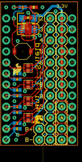
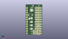
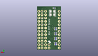
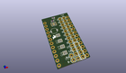

Contents
========

* [PROJ-SPAR-9627-STAN-01>Mini FET Shield](#proj-spar-9627-stan-01mini-fet-shield)
	* [Images](#images)
	* [Interactive BOM](#interactive-bom)
	* [OOMP Parts](#oomp-parts)
	* [Tags](#tags)
  
![][im]
# PROJ-SPAR-9627-STAN-01>Mini FET Shield

- ID: PROJ-SPAR-9627-STAN-01
- Hex ID: PRS9627
- Name: Mini FET Shield
- Description: 

## Images
  
  

|eagleImage|kicadPcb3dFront|kicadPcb3dBack|kicadPcb3d|
| :---: | :---: | :---: | :---: |
|||||

## Interactive BOM

- Interactive BOM page: [ibom.html](kicad/bom/ibom.html)

## OOMP Parts
  

|OOMP Parts|
| :---: |
|UNMATCHED-UNMATCHED-X-UNMATCHED-01, 2.2UH, 5.08, 21.59, 180,2.2UH, 2.2uH, VLF4012A, PEBBLE, (0.2, 0.85), R180|
|CAPE-0402-X-NF100-01, C1, 6.35, 29.337, 0,C1, 0.1uF, 0402-CAP, SparkFun, (0.25, 1.155), R0|
|CAPE-UNMATCHED-X-UNMATCHED-01, C2, 6.35, 29.209999999999997, M180,C2, 10uF, EIA3216, SparkFun, (0.25, 1.15), MR180|
|CAPE-UNMATCHED-X-UNMATCHED-01, C3, 6.35, 26.669999999999998, M180,C3, 10uF, EIA3216, SparkFun, (0.25, 1.05), MR180|
|UNMATCHED-UNMATCHED-X-UNMATCHED-01, JP2, 14.099999994, 1.29999994, 90,JP2, M12PTH, 1X12, SparkFun, (0.55511811, 0.0511811), R90|
|UNMATCHED-UNMATCHED-X-UNMATCHED-01, JP3, 11.43, 1.27, 90,JP3, M12PTH, 1X12, SparkFun, (0.45, 0.05), R90|
|UNMATCHED-UNMATCHED-X-UNMATCHED-01, JP4, 8.889999999999999, 3.8099999999999996, 270,JP4, 1X02, SparkFun, (0.35, 0.15), R270|
|UNMATCHED-UNMATCHED-X-UNMATCHED-01, Q1, 6.35, 17.779999999999998, 90,Q1, FDMA1024NZ, MICROFET_2X2, PEBBLE, (0.25, 0.7), R90|
|UNMATCHED-UNMATCHED-X-UNMATCHED-01, Q2, 6.35, 13.97, 90,Q2, FDMA1024NZ, MICROFET_2X2, PEBBLE, (0.25, 0.55), R90|
|UNMATCHED-UNMATCHED-X-UNMATCHED-01, Q3, 6.35, 10.16, 90,Q3, FDMA1024NZ, MICROFET_2X2, PEBBLE, (0.25, 0.4), R90|
|UNMATCHED-UNMATCHED-X-UNMATCHED-01, Q4, 6.35, 6.35, 90,Q4, FDMA1024NZ, MICROFET_2X2, PEBBLE, (0.25, 0.25), R90|
|RESE-0402-X-UNMATCHED-01, R1, 5.08, 31.75, M180,R1, 1M, 0402-RES, SparkFun, (0.2, 1.25), MR180|
|RESE-0402-X-UNMATCHED-01, R2, 3.8099999999999996, 3.8099999999999996, M0,R2, 1k, 0402-RES, SparkFun, (0.15, 0.15), MR0|
|RESE-0402-X-O184-01, R3, 7.619999999999999, 31.75, 180,R3, 180k, 0402-RES, SparkFun, (0.3, 1.25), R180|
|RESE-0402-X-UNMATCHED-01, R10, 3.8099999999999996, 16.509999999999998, M0,R10, 1k, 0402-RES, SparkFun, (0.15, 0.65), MR0|
|RESE-0402-X-UNMATCHED-01, R11, 3.8099999999999996, 15.239999999999998, M0,R11, 1k, 0402-RES, SparkFun, (0.15, 0.6), MR0|
|RESE-0402-X-UNMATCHED-01, R12, 3.8099999999999996, 12.7, M0,R12, 1k, 0402-RES, SparkFun, (0.15, 0.5), MR0|
|RESE-0402-X-UNMATCHED-01, R13, 3.8099999999999996, 11.43, M0,R13, 1k, 0402-RES, SparkFun, (0.15, 0.45), MR0|
|RESE-0402-X-UNMATCHED-01, R14, 3.8099999999999996, 8.889999999999999, M0,R14, 1k, 0402-RES, SparkFun, (0.15, 0.35), MR0|
|RESE-0402-X-UNMATCHED-01, R15, 3.8099999999999996, 7.619999999999999, M0,R15, 1k, 0402-RES, SparkFun, (0.15, 0.3), MR0|
|RESE-0402-X-UNMATCHED-01, R16, 3.8099999999999996, 5.08, M0,R16, 1k, 0402-RES, SparkFun, (0.15, 0.2), MR0|
|UNMATCHED-UNMATCHED-X-UNMATCHED-01, U1, 6.35, 26.669999999999998, 270,U1, TPS61200, DRC-S-PVSON-N10, texas, (0.25, 1.05), R270|
|UNMATCHED-UNMATCHED-X-UNMATCHED-01, U2, 8.889999999999999, 16.509999999999998, 0,U2, ARDUINO_MINI, ARDUINO_MINI, SparkFun, (0.35, 0.65), R0|

## Tags

- hexID: PRS9627
- oompType: PROJ
- oompSize: SPAR
- oompColor: 9627
- oompDesc: STAN
- oompIndex: 01
- oompName: Mini FET Shield
- sources: All source files from https://github.com/sparkfun/Mini_FET_Shield (source licence details in srcLicense.md)
- linkBuyPage: https://www.sparkfun.com/products/9627
- oompPart: UNMATCHED-UNMATCHED-X-UNMATCHED-01, 2.2UH, 5.08, 21.59, 180
- oompPart: CAPE-0402-X-NF100-01, C1, 6.35, 29.337, 0
- oompPart: CAPE-UNMATCHED-X-UNMATCHED-01, C2, 6.35, 29.209999999999997, M180
- oompPart: CAPE-UNMATCHED-X-UNMATCHED-01, C3, 6.35, 26.669999999999998, M180
- oompPart: UNMATCHED-UNMATCHED-X-UNMATCHED-01, JP2, 14.099999994, 1.29999994, 90
- oompPart: UNMATCHED-UNMATCHED-X-UNMATCHED-01, JP3, 11.43, 1.27, 90
- oompPart: UNMATCHED-UNMATCHED-X-UNMATCHED-01, JP4, 8.889999999999999, 3.8099999999999996, 270
- oompPart: UNMATCHED-UNMATCHED-X-UNMATCHED-01, Q1, 6.35, 17.779999999999998, 90
- oompPart: UNMATCHED-UNMATCHED-X-UNMATCHED-01, Q2, 6.35, 13.97, 90
- oompPart: UNMATCHED-UNMATCHED-X-UNMATCHED-01, Q3, 6.35, 10.16, 90
- oompPart: UNMATCHED-UNMATCHED-X-UNMATCHED-01, Q4, 6.35, 6.35, 90
- oompPart: RESE-0402-X-UNMATCHED-01, R1, 5.08, 31.75, M180
- oompPart: RESE-0402-X-UNMATCHED-01, R2, 3.8099999999999996, 3.8099999999999996, M0
- oompPart: RESE-0402-X-O184-01, R3, 7.619999999999999, 31.75, 180
- oompPart: RESE-0402-X-UNMATCHED-01, R10, 3.8099999999999996, 16.509999999999998, M0
- oompPart: RESE-0402-X-UNMATCHED-01, R11, 3.8099999999999996, 15.239999999999998, M0
- oompPart: RESE-0402-X-UNMATCHED-01, R12, 3.8099999999999996, 12.7, M0
- oompPart: RESE-0402-X-UNMATCHED-01, R13, 3.8099999999999996, 11.43, M0
- oompPart: RESE-0402-X-UNMATCHED-01, R14, 3.8099999999999996, 8.889999999999999, M0
- oompPart: RESE-0402-X-UNMATCHED-01, R15, 3.8099999999999996, 7.619999999999999, M0
- oompPart: RESE-0402-X-UNMATCHED-01, R16, 3.8099999999999996, 5.08, M0
- oompPart: UNMATCHED-UNMATCHED-X-UNMATCHED-01, U1, 6.35, 26.669999999999998, 270
- oompPart: UNMATCHED-UNMATCHED-X-UNMATCHED-01, U2, 8.889999999999999, 16.509999999999998, 0
- rawPart: 2.2UH, 2.2uH, VLF4012A, PEBBLE, (0.2, 0.85), R180
- rawPart: C1, 0.1uF, 0402-CAP, SparkFun, (0.25, 1.155), R0
- rawPart: C2, 10uF, EIA3216, SparkFun, (0.25, 1.15), MR180
- rawPart: C3, 10uF, EIA3216, SparkFun, (0.25, 1.05), MR180
- rawPart: JP2, M12PTH, 1X12, SparkFun, (0.55511811, 0.0511811), R90
- rawPart: JP3, M12PTH, 1X12, SparkFun, (0.45, 0.05), R90
- rawPart: JP4, 1X02, SparkFun, (0.35, 0.15), R270
- rawPart: Q1, FDMA1024NZ, MICROFET_2X2, PEBBLE, (0.25, 0.7), R90
- rawPart: Q2, FDMA1024NZ, MICROFET_2X2, PEBBLE, (0.25, 0.55), R90
- rawPart: Q3, FDMA1024NZ, MICROFET_2X2, PEBBLE, (0.25, 0.4), R90
- rawPart: Q4, FDMA1024NZ, MICROFET_2X2, PEBBLE, (0.25, 0.25), R90
- rawPart: R1, 1M, 0402-RES, SparkFun, (0.2, 1.25), MR180
- rawPart: R2, 1k, 0402-RES, SparkFun, (0.15, 0.15), MR0
- rawPart: R3, 180k, 0402-RES, SparkFun, (0.3, 1.25), R180
- rawPart: R10, 1k, 0402-RES, SparkFun, (0.15, 0.65), MR0
- rawPart: R11, 1k, 0402-RES, SparkFun, (0.15, 0.6), MR0
- rawPart: R12, 1k, 0402-RES, SparkFun, (0.15, 0.5), MR0
- rawPart: R13, 1k, 0402-RES, SparkFun, (0.15, 0.45), MR0
- rawPart: R14, 1k, 0402-RES, SparkFun, (0.15, 0.35), MR0
- rawPart: R15, 1k, 0402-RES, SparkFun, (0.15, 0.3), MR0
- rawPart: R16, 1k, 0402-RES, SparkFun, (0.15, 0.2), MR0
- rawPart: U1, TPS61200, DRC-S-PVSON-N10, texas, (0.25, 1.05), R270
- rawPart: U2, ARDUINO_MINI, ARDUINO_MINI, SparkFun, (0.35, 0.65), R0

[im]: kicadPcb3d_450.png
