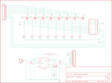

Contents
========

* [PRS9627 > Mini FET Shield](#prs9627--mini-fet-shield)
	* [Schematic](#schematic)
	* [PCB](#pcb)
	* [Interactive BOM](#interactive-bom)
	* [OOMP Parts](#oomp-parts)
	* [Images](#images)
	* [Tags](#tags)
  
![][im]
# PRS9627 > Mini FET Shield

- ID: PROJ-SPAR-9627-STAN-01
- Hex ID: PRS9627
- Name: Sparkfun 9627
- Description: Sparkfun 9627
- Long Link: [http://oom.lt/PROJ-SPAR-9627-STAN-01](http://oom.lt/PROJ-SPAR-9627-STAN-01)
- Short Link: [http://oom.lt/PRS9627](http://oom.lt/PRS9627)

## Schematic
  

## PCB
  

## Interactive BOM

- Interactive BOM page: [ibom.html](https://htmlpreview.github.io/?https://github.com/oomlout/oomlout_OOMP_projects/blob/main/PROJ-SPAR-9627-STAN-01/kicad/bom/ibom.html)

## OOMP Parts
  

|OOMP ID|Name|Identifier|
| :---: | :---: | :---: |
|UNMATCHED-UNMATCHED-X-UNMATCHED-01||2.2UH, Q1, Q2, Q3, Q4, U1, U2|
|[CAPC-0402-X-NF100-V10](https://github.com/oomlout/oomlout_OOMP_parts/tree/main/CAPC-0402-X-NF100-V10/)|[SMD (0402) 100 nF Capacitor (Ceramic) 10v](https://github.com/oomlout/oomlout_OOMP_parts/tree/main/CAPC-0402-X-NF100-V10/)|[C1](https://github.com/oomlout/oomlout_OOMP_parts/tree/main/CAPC-0402-X-NF100-V10/)|
|[CAPT-3216-X-UF10-V10](https://github.com/oomlout/oomlout_OOMP_parts/tree/main/CAPT-3216-X-UF10-V10/)|[SMD (3216) 10 uF Capacitor (Tantalum) 10v](https://github.com/oomlout/oomlout_OOMP_parts/tree/main/CAPT-3216-X-UF10-V10/)|[C2, C3](https://github.com/oomlout/oomlout_OOMP_parts/tree/main/CAPT-3216-X-UF10-V10/)|
|[HEAD-I01-X-PI12-01](https://github.com/oomlout/oomlout_OOMP_parts/tree/main/HEAD-I01-X-PI12-01/)|[2.54 mm 12 Pin Header](https://github.com/oomlout/oomlout_OOMP_parts/tree/main/HEAD-I01-X-PI12-01/)|[JP2, JP3](https://github.com/oomlout/oomlout_OOMP_parts/tree/main/HEAD-I01-X-PI12-01/)|
|[HEAD-I01-X-PI02-01](https://github.com/oomlout/oomlout_OOMP_parts/tree/main/HEAD-I01-X-PI02-01/)|[2.54 mm 2 Pin Header](https://github.com/oomlout/oomlout_OOMP_parts/tree/main/HEAD-I01-X-PI02-01/)|[JP4](https://github.com/oomlout/oomlout_OOMP_parts/tree/main/HEAD-I01-X-PI02-01/)|
|[RESE-0402-X-O105-01](https://github.com/oomlout/oomlout_OOMP_parts/tree/main/RESE-0402-X-O105-01/)|[SMD (0402) 1M Ohm Resistor](https://github.com/oomlout/oomlout_OOMP_parts/tree/main/RESE-0402-X-O105-01/)|[R1](https://github.com/oomlout/oomlout_OOMP_parts/tree/main/RESE-0402-X-O105-01/)|
|[RESE-0402-X-O102-01](https://github.com/oomlout/oomlout_OOMP_parts/tree/main/RESE-0402-X-O102-01/)|[SMD (0402) 1k Ohm Resistor](https://github.com/oomlout/oomlout_OOMP_parts/tree/main/RESE-0402-X-O102-01/)|[R2, R10, R11, R12, R13, R14, R15, R16](https://github.com/oomlout/oomlout_OOMP_parts/tree/main/RESE-0402-X-O102-01/)|
|RESE-0402-X-O1803-01||R3|

## Images
  
  

|bominteractivefront|bominteractiveback|kicadPcb3d|kicadPcb3dFront|kicadPcb3dBack|kicadSchem|eagleImage|eagleSchemImage|pcbdraw|pcbdrawback|
| :---: | :---: | :---: | :---: | :---: | :---: | :---: | :---: | :---: | :---: |
|||||||||||

## Tags

- hexID: PRS9627
- oompType: PROJ
- oompSize: SPAR
- oompColor: 9627
- oompDesc: STAN
- oompIndex: 01
- oompName: Mini FET Shield
- sources: All source files from https://github.com/sparkfun/Mini_FET_Shield (source licence details in srcLicense.md)
- linkBuyPage: https://www.sparkfun.com/products/9627
- oompID: PROJ-SPAR-9627-STAN-01
- oompParts: 2.2UH,UNMATCHED-UNMATCHED-X-UNMATCHED-01
- oompParts: C1,CAPC-0402-X-NF100-V10
- oompParts: C2,CAPT-3216-X-UF10-V10
- oompParts: C3,CAPT-3216-X-UF10-V10
- oompParts: JP2,HEAD-I01-X-PI12-01
- oompParts: JP3,HEAD-I01-X-PI12-01
- oompParts: JP4,HEAD-I01-X-PI02-01
- oompParts: Q1,UNMATCHED-UNMATCHED-X-UNMATCHED-01
- oompParts: Q2,UNMATCHED-UNMATCHED-X-UNMATCHED-01
- oompParts: Q3,UNMATCHED-UNMATCHED-X-UNMATCHED-01
- oompParts: Q4,UNMATCHED-UNMATCHED-X-UNMATCHED-01
- oompParts: R1,RESE-0402-X-O105-01
- oompParts: R2,RESE-0402-X-O102-01
- oompParts: R3,RESE-0402-X-O1803-01
- oompParts: R10,RESE-0402-X-O102-01
- oompParts: R11,RESE-0402-X-O102-01
- oompParts: R12,RESE-0402-X-O102-01
- oompParts: R13,RESE-0402-X-O102-01
- oompParts: R14,RESE-0402-X-O102-01
- oompParts: R15,RESE-0402-X-O102-01
- oompParts: R16,RESE-0402-X-O102-01
- oompParts: U1,UNMATCHED-UNMATCHED-X-UNMATCHED-01
- oompParts: U2,UNMATCHED-UNMATCHED-X-UNMATCHED-01
- rawParts: 2.2UH,2.2uH,VLF4012A,VLF4012A,,,
- rawParts: C1,0.1uF,CAP0402-CAP,0402-CAP,Capacitor,,
- rawParts: C2,10uF,CAP_POL1206,EIA3216,Capacitor Polarized,,
- rawParts: C3,10uF,CAP_POL1206,EIA3216,Capacitor Polarized,,
- rawParts: JP2,M12PTH,M12PTH,1X12,Header 12,,
- rawParts: JP3,M12PTH,M12PTH,1X12,Header 12,,
- rawParts: JP4,,M02PTH,1X02,Header 2,,
- rawParts: JP5,LOGO-SFESK,LOGO-SFESK,SFE-LOGO-FLAME,Spark Fun Electronics PCB Logo,,
- rawParts: Q1,FDMA1024NZ,FDMA1024NZ,MICROFET_2X2,Dual N-Channel 30-V (D-S) MOSFET,,
- rawParts: Q2,FDMA1024NZ,FDMA1024NZ,MICROFET_2X2,Dual N-Channel 30-V (D-S) MOSFET,,
- rawParts: Q3,FDMA1024NZ,FDMA1024NZ,MICROFET_2X2,Dual N-Channel 30-V (D-S) MOSFET,,
- rawParts: Q4,FDMA1024NZ,FDMA1024NZ,MICROFET_2X2,Dual N-Channel 30-V (D-S) MOSFET,,
- rawParts: R1,1M,RESISTOR0402-RES,0402-RES,Resistor,,
- rawParts: R2,1k,RESISTOR0402-RES,0402-RES,Resistor,,
- rawParts: R3,180k,RESISTOR0402-RES,0402-RES,Resistor,,
- rawParts: R10,1k,RESISTOR0402-RES,0402-RES,Resistor,,
- rawParts: R11,1k,RESISTOR0402-RES,0402-RES,Resistor,,
- rawParts: R12,1k,RESISTOR0402-RES,0402-RES,Resistor,,
- rawParts: R13,1k,RESISTOR0402-RES,0402-RES,Resistor,,
- rawParts: R14,1k,RESISTOR0402-RES,0402-RES,Resistor,,
- rawParts: R15,1k,RESISTOR0402-RES,0402-RES,Resistor,,
- rawParts: R16,1k,RESISTOR0402-RES,0402-RES,Resistor,,
- rawParts: U1,TPS61200,TPS61200,DRC-S-PVSON-N10,,,
- rawParts: U2,ARDUINO_MINI,ARDUINO_MINI,ARDUINO_MINI,,,

[im]: kicadPcb3d_450.png
