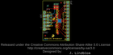
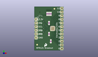
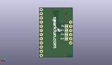
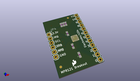

Contents
========

* [PROJ-SPAR-9695-STAN-01>MPR121 Capacitive Touch Breakout](#proj-spar-9695-stan-01mpr121-capacitive-touch-breakout)
	* [Images](#images)
	* [Interactive BOM](#interactive-bom)
	* [OOMP Parts](#oomp-parts)
	* [Tags](#tags)
  
![][im]
# PROJ-SPAR-9695-STAN-01>MPR121 Capacitive Touch Breakout

- ID: PROJ-SPAR-9695-STAN-01
- Hex ID: PRS9695
- Name: MPR121 Capacitive Touch Breakout
- Description: 

## Images
  
  

|eagleImage|kicadPcb3dFront|kicadPcb3dBack|kicadPcb3d|
| :---: | :---: | :---: | :---: |
|||||

## Interactive BOM

- Interactive BOM page: [ibom.html](kicad/bom/ibom.html)

## OOMP Parts
  

|OOMP Parts|
| :---: |
|<table><tr><td></td><td> C1</td><td>[CAPC-0603-X-NF100-V50 SMD (0603) 100 nF Capacitor (Ceramic) 50v](https://github.com/oomlout/oomlout_OOMP_parts/tree/main/CAPC-0603-X-NF100-V50/)</td><td>[C6N100](https://github.com/oomlout/oomlout_OOMP_parts/tree/main/CAPC-0603-X-NF100-V50/)</td></tr></table>|
|<table><tr><td></td><td> C2</td><td>[CAPC-0603-X-NF100-V50 SMD (0603) 100 nF Capacitor (Ceramic) 50v](https://github.com/oomlout/oomlout_OOMP_parts/tree/main/CAPC-0603-X-NF100-V50/)</td><td>[C6N100](https://github.com/oomlout/oomlout_OOMP_parts/tree/main/CAPC-0603-X-NF100-V50/)</td></tr></table>|
|UNMATCHED-UNMATCHED-X-UNMATCHED-01, IC1, 12.7, 15.239999999999998, 0,IC1, MPR121, QFN-20-0.4MM-V2, Testing, (0.5, 0.6), R0|
|HEAD-I01-X-PI01-01, JP1, 1.27, 11.43, 0,JP1, ADDR, 1X01, SparkFun, (0.05, 0.45), R0|
|<table><tr><td></td><td> JP2</td><td>[HEAD-I01-X-PI03-01 2.54 mm 3 Pin Header](https://github.com/oomlout/oomlout_OOMP_parts/tree/main/HEAD-I01-X-PI03-01/)</td><td>[H03](https://github.com/oomlout/oomlout_OOMP_parts/tree/main/HEAD-I01-X-PI03-01/)</td></tr></table>|
|<table><tr><td></td><td> JP3</td><td>[HEAD-I01-X-PI12-01 2.54 mm 12 Pin Header](https://github.com/oomlout/oomlout_OOMP_parts/tree/main/HEAD-I01-X-PI12-01/)</td><td>[H12](https://github.com/oomlout/oomlout_OOMP_parts/tree/main/HEAD-I01-X-PI12-01/)</td></tr></table>|
|HEAD-I01-X-PI01-01, JP4, 1.27, 21.59, 0,JP4, 3.3V, 1X01, SparkFun, (0.05, 0.85), R0|
|HEAD-I01-X-PI01-01, JP5, 1.27, 8.889999999999999, 0,JP5, GND, 1X01, SparkFun, (0.05, 0.35), R0|
|HEAD-I01-X-PI2-01, JP8, 13.8938, 28.955999999999996, 0,JP8, FIDUCIAL1X2, FIDUCIAL-1X2, SparkFun, (0.547, 1.14), R0|
|HEAD-I01-X-PI2-01, JP9, 1.9557999999999998, 3.9623999999999997, 0,JP9, FIDUCIAL1X2, FIDUCIAL-1X2, SparkFun, (0.077, 0.156), R0|
|RESE-0603-X-O753-01, R1, 11.43, 6.35, 90,R1, 75k, 0603-RES, SparkFun, (0.45, 0.25), R90|
|<table><tr><td></td><td> R2</td><td>[RESE-0603-X-O103-01 SMD (0603) 10k Ohm Resistor](https://github.com/oomlout/oomlout_OOMP_parts/tree/main/RESE-0603-X-O103-01/)</td><td>[R6103](https://github.com/oomlout/oomlout_OOMP_parts/tree/main/RESE-0603-X-O103-01/)</td></tr></table>|
|<table><tr><td></td><td> R3</td><td>[RESE-0603-X-O103-01 SMD (0603) 10k Ohm Resistor](https://github.com/oomlout/oomlout_OOMP_parts/tree/main/RESE-0603-X-O103-01/)</td><td>[R6103](https://github.com/oomlout/oomlout_OOMP_parts/tree/main/RESE-0603-X-O103-01/)</td></tr></table>|
|<table><tr><td></td><td> R4</td><td>[RESE-0603-X-O103-01 SMD (0603) 10k Ohm Resistor](https://github.com/oomlout/oomlout_OOMP_parts/tree/main/RESE-0603-X-O103-01/)</td><td>[R6103](https://github.com/oomlout/oomlout_OOMP_parts/tree/main/RESE-0603-X-O103-01/)</td></tr></table>|

## Tags

- hexID: PRS9695
- oompType: PROJ
- oompSize: SPAR
- oompColor: 9695
- oompDesc: STAN
- oompIndex: 01
- oompName: MPR121 Capacitive Touch Breakout
- sources: All source files from https://github.com/sparkfun/MPR121_Capacitive_Touch_Breakout (source licence details in srcLicense.md)
- linkBuyPage: https://www.sparkfun.com/products/9695
- oompPart: CAPC-0603-X-NF100-V50, C1, 10.16, 11.43, 270
- oompPart: CAPC-0603-X-NF100-V50, C2, 10.16, 19.049999999999997, 90
- oompPart: UNMATCHED-UNMATCHED-X-UNMATCHED-01, IC1, 12.7, 15.239999999999998, 0
- oompPart: HEAD-I01-X-PI01-01, JP1, 1.27, 11.43, 0
- oompPart: HEAD-I01-X-PI03-01, JP2, 1.27, 19.049999999999997, 270
- oompPart: HEAD-I01-X-PI12-01, JP3, 19.049999999999997, 29.209999999999997, 270
- oompPart: HEAD-I01-X-PI01-01, JP4, 1.27, 21.59, 0
- oompPart: HEAD-I01-X-PI01-01, JP5, 1.27, 8.889999999999999, 0
- oompPart: HEAD-I01-X-PI2-01, JP8, 13.8938, 28.955999999999996, 0
- oompPart: HEAD-I01-X-PI2-01, JP9, 1.9557999999999998, 3.9623999999999997, 0
- oompPart: RESE-0603-X-O753-01, R1, 11.43, 6.35, 90
- oompPart: RESE-0603-X-O103-01, R2, 11.43, 25.4, 270
- oompPart: RESE-0603-X-O103-01, R3, 10.16, 25.4, 270
- oompPart: RESE-0603-X-O103-01, R4, 8.889999999999999, 25.4, 270
- oompPart: SKIP-UNMATCHED-X-UNMATCHED-01, SJ1, 3.8099999999999996, 11.43, M0
- oompPart: SKIP-UNMATCHED-X-UNMATCHED-01, SJ2, 3.8099999999999996, 13.97, M180
- oompPart: SKIP-UNMATCHED-X-UNMATCHED-01, SJ3, 3.8099999999999996, 16.509999999999998, M180
- oompPart: SKIP-UNMATCHED-X-UNMATCHED-01, SJ4, 3.8099999999999996, 19.049999999999997, M180
- rawPart: C1, 0.1uF, 0603-CAP, SparkFun, (0.4, 0.45), R270
- rawPart: C2, 0.1uF, 0603-CAP, SparkFun, (0.4, 0.75), R90
- rawPart: IC1, MPR121, QFN-20-0.4MM-V2, Testing, (0.5, 0.6), R0
- rawPart: JP1, ADDR, 1X01, SparkFun, (0.05, 0.45), R0
- rawPart: JP2, I2C, 1X03, SparkFun, (0.05, 0.75), R270
- rawPart: JP3, Electrodes, 1X12, SparkFun, (0.75, 1.15), R270
- rawPart: JP4, 3.3V, 1X01, SparkFun, (0.05, 0.85), R0
- rawPart: JP5, GND, 1X01, SparkFun, (0.05, 0.35), R0
- rawPart: JP8, FIDUCIAL1X2, FIDUCIAL-1X2, SparkFun, (0.547, 1.14), R0
- rawPart: JP9, FIDUCIAL1X2, FIDUCIAL-1X2, SparkFun, (0.077, 0.156), R0
- rawPart: R1, 75k, 0603-RES, SparkFun, (0.45, 0.25), R90
- rawPart: R2, 10k, 0603-RES, SparkFun, (0.45, 1), R270
- rawPart: R3, 10k, 0603-RES, SparkFun, (0.4, 1), R270
- rawPart: R4, 10k, 0603-RES, SparkFun, (0.35, 1), R270
- rawPart: SJ1, SOLDERJUMPERTRACE, SJ_2S-TRACE, SparkFun, (0.15, 0.45), MR0
- rawPart: SJ2, SOLDERJUMPERTRACE, SJ_2S-TRACE, SparkFun, (0.15, 0.55), MR180
- rawPart: SJ3, SOLDERJUMPERTRACE, SJ_2S-TRACE, SparkFun, (0.15, 0.65), MR180
- rawPart: SJ4, SOLDERJUMPERTRACE, SJ_2S-TRACE, SparkFun, (0.15, 0.75), MR180
- oompID: PROJ-SPAR-9695-STAN-01

[im]: kicadPcb3d_450.png
