Contents
========

* [PRS9713 > UBW32](#prs9713--ubw32)
	* [Schematic](#schematic)
	* [PCB](#pcb)
	* [Interactive BOM](#interactive-bom)
	* [OOMP Parts](#oomp-parts)
	* [Images](#images)
	* [Tags](#tags)
  
![][im]
# PRS9713 > UBW32

- ID: PROJ-SPAR-9713-STAN-01
- Hex ID: PRS9713
- Name: Sparkfun 9713
- Description: Sparkfun 9713
- Long Link: [http://oom.lt/PROJ-SPAR-9713-STAN-01](http://oom.lt/PROJ-SPAR-9713-STAN-01)
- Short Link: [http://oom.lt/PRS9713](http://oom.lt/PRS9713)

## Schematic
  
[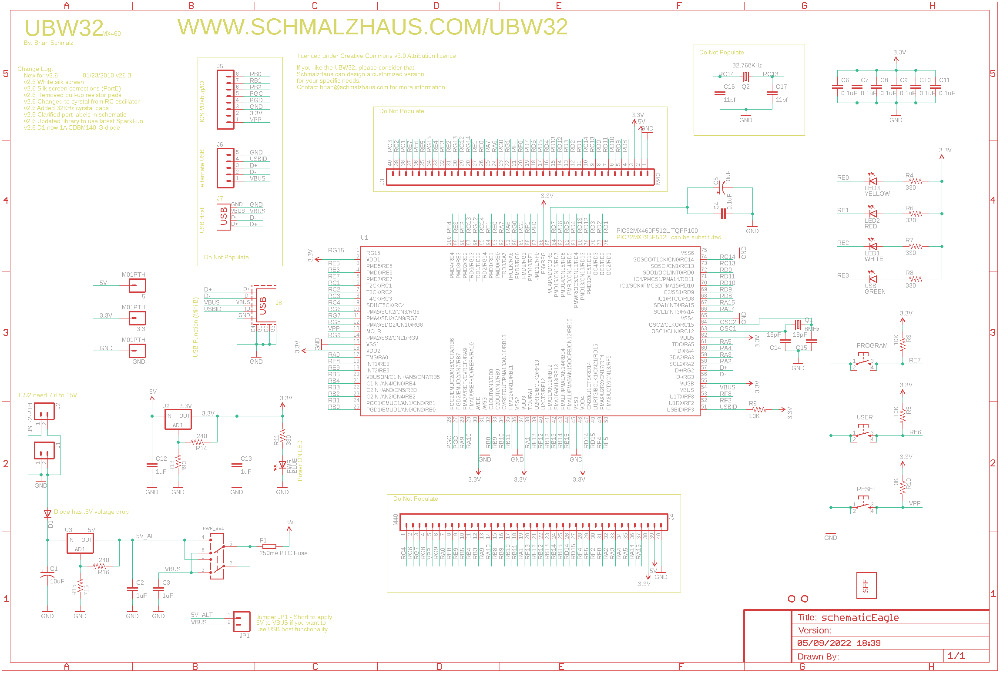](eagleSchemImage.png)
## PCB
  
[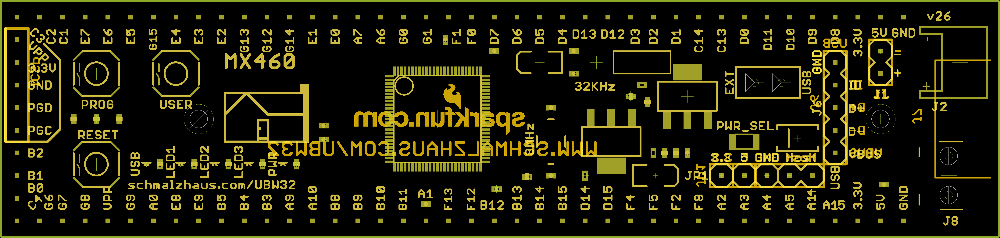](eagleImage.png)
## Interactive BOM

- Interactive BOM page: [ibom.html](https://htmlpreview.github.io/?https://github.com/oomlout/oomlout_OOMP_projects/blob/main/PROJ-SPAR-9713-STAN-01/kicad/bom/ibom.html)

## OOMP Parts
  

|OOMP ID|Name|Identifier|
| :---: | :---: | :---: |
|HEAD-I01-X-PI01-01||3.3, 5, GND|
|CAPX-3528-X-UF10-01||C1, C5|
|[CAPC-0402-X-UF1-V63D](https://github.com/oomlout/oomlout_OOMP_parts/tree/main/CAPC-0402-X-UF1-V63D/)|[SMD (0402) 1 uF Capacitor (Ceramic) 6.3v](https://github.com/oomlout/oomlout_OOMP_parts/tree/main/CAPC-0402-X-UF1-V63D/)|[C2, C3, C12, C13](https://github.com/oomlout/oomlout_OOMP_parts/tree/main/CAPC-0402-X-UF1-V63D/)|
|[CAPC-0402-X-NF100-V10](https://github.com/oomlout/oomlout_OOMP_parts/tree/main/CAPC-0402-X-NF100-V10/)|[SMD (0402) 100 nF Capacitor (Ceramic) 10v](https://github.com/oomlout/oomlout_OOMP_parts/tree/main/CAPC-0402-X-NF100-V10/)|[C4, C6, C7, C8, C9, C10, C11](https://github.com/oomlout/oomlout_OOMP_parts/tree/main/CAPC-0402-X-NF100-V10/)|
|[CAPC-0402-X-PF18-V50](https://github.com/oomlout/oomlout_OOMP_parts/tree/main/CAPC-0402-X-PF18-V50/)|[SMD (0402) 18 pF Capacitor (Ceramic) 50v](https://github.com/oomlout/oomlout_OOMP_parts/tree/main/CAPC-0402-X-PF18-V50/)|[C14, C15](https://github.com/oomlout/oomlout_OOMP_parts/tree/main/CAPC-0402-X-PF18-V50/)|
|CAPC-0402-X-PF11-01||C16, C17|
|DIOD-UNMATCHED-X-UNMATCHED-01||D1|
|UNMATCHED-1206-X-UNMATCHED-01||F1|
|[HEAD-I01-X-PI02-01](https://github.com/oomlout/oomlout_OOMP_parts/tree/main/HEAD-I01-X-PI02-01/)|[2.54 mm 2 Pin Header](https://github.com/oomlout/oomlout_OOMP_parts/tree/main/HEAD-I01-X-PI02-01/)|[J1, JP1](https://github.com/oomlout/oomlout_OOMP_parts/tree/main/HEAD-I01-X-PI02-01/)|
|HEAD-I01-X-UNMATCHED-01||J2|
|UNMATCHED-UNMATCHED-X-UNMATCHED-01||J3, J4, J7, J8, PROGRAM, PWR_SEL, Q1, Q2, RESET, U1, U2, U3, USER|
|[HEAD-I01-X-PI08-01](https://github.com/oomlout/oomlout_OOMP_parts/tree/main/HEAD-I01-X-PI08-01/)|[2.54 mm 8 Pin Header](https://github.com/oomlout/oomlout_OOMP_parts/tree/main/HEAD-I01-X-PI08-01/)|[J5](https://github.com/oomlout/oomlout_OOMP_parts/tree/main/HEAD-I01-X-PI08-01/)|
|[HEAD-I01-X-PI05-01](https://github.com/oomlout/oomlout_OOMP_parts/tree/main/HEAD-I01-X-PI05-01/)|[2.54 mm 5 Pin Header](https://github.com/oomlout/oomlout_OOMP_parts/tree/main/HEAD-I01-X-PI05-01/)|[J6](https://github.com/oomlout/oomlout_OOMP_parts/tree/main/HEAD-I01-X-PI05-01/)|
|[LEDS-0603-G-STAN-01](https://github.com/oomlout/oomlout_OOMP_parts/tree/main/LEDS-0603-G-STAN-01/)|[SMD (0603) Green LED](https://github.com/oomlout/oomlout_OOMP_parts/tree/main/LEDS-0603-G-STAN-01/)|[LED1, USB](https://github.com/oomlout/oomlout_OOMP_parts/tree/main/LEDS-0603-G-STAN-01/)|
|[LEDS-0603-R-STAN-01](https://github.com/oomlout/oomlout_OOMP_parts/tree/main/LEDS-0603-R-STAN-01/)|[SMD (0603) Red LED](https://github.com/oomlout/oomlout_OOMP_parts/tree/main/LEDS-0603-R-STAN-01/)|[LED2](https://github.com/oomlout/oomlout_OOMP_parts/tree/main/LEDS-0603-R-STAN-01/)|
|[LEDS-0603-Y-STAN-01](https://github.com/oomlout/oomlout_OOMP_parts/tree/main/LEDS-0603-Y-STAN-01/)|[SMD (0603) Yellow LED](https://github.com/oomlout/oomlout_OOMP_parts/tree/main/LEDS-0603-Y-STAN-01/)|[LED3](https://github.com/oomlout/oomlout_OOMP_parts/tree/main/LEDS-0603-Y-STAN-01/)|
|[LEDS-0603-L-STAN-01](https://github.com/oomlout/oomlout_OOMP_parts/tree/main/LEDS-0603-L-STAN-01/)|[SMD (0603) Blue LED](https://github.com/oomlout/oomlout_OOMP_parts/tree/main/LEDS-0603-L-STAN-01/)|[PWR](https://github.com/oomlout/oomlout_OOMP_parts/tree/main/LEDS-0603-L-STAN-01/)|
|[RESE-0402-X-O103-01](https://github.com/oomlout/oomlout_OOMP_parts/tree/main/RESE-0402-X-O103-01/)|[SMD (0402) 10k Ohm Resistor](https://github.com/oomlout/oomlout_OOMP_parts/tree/main/RESE-0402-X-O103-01/)|[R3, R5, R9, R10](https://github.com/oomlout/oomlout_OOMP_parts/tree/main/RESE-0402-X-O103-01/)|
|[RESE-0402-X-O331-01](https://github.com/oomlout/oomlout_OOMP_parts/tree/main/RESE-0402-X-O331-01/)|[SMD (0402) 330 Ohm Resistor](https://github.com/oomlout/oomlout_OOMP_parts/tree/main/RESE-0402-X-O331-01/)|[R4, R6, R7, R8, R11](https://github.com/oomlout/oomlout_OOMP_parts/tree/main/RESE-0402-X-O331-01/)|
|RESE-0402-X-O391-01||R13|
|RESE-0402-X-O241-01||R14, R16|
|RESE-0402-X-O711-01||R15|

## Images
  
  

|bominteractivefront|bominteractiveback|kicadPcb3d|kicadPcb3dFront|kicadPcb3dBack|kicadSchem|eagleImage|eagleSchemImage|pcbdraw|pcbdrawback|
| :---: | :---: | :---: | :---: | :---: | :---: | :---: | :---: | :---: | :---: |
|[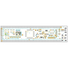](bomFront.png)|[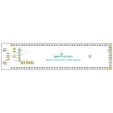](bomBack.png)|[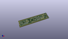](kicadPcb3d.png)|[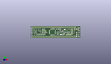](kicadPcb3dFront.png)|[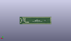](kicadPcb3dBack.png)|[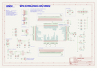](kicadSchem.png)|[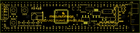](eagleImage.png)||[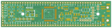](pcbdraw.png)|[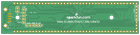](pcbdrawBack.png)|

## Tags

- hexID: PRS9713
- oompType: PROJ
- oompSize: SPAR
- oompColor: 9713
- oompDesc: STAN
- oompIndex: 01
- oompName: UBW32
- sources: All source files from https://github.com/sparkfun/UBW32 (source licence details in srcLicense.md)
- linkBuyPage: https://www.sparkfun.com/products/9713
- oompID: PROJ-SPAR-9713-STAN-01
- oompParts: 3.3,HEAD-I01-X-PI01-01
- oompParts: 5,HEAD-I01-X-PI01-01
- oompParts: C1,CAPX-3528-X-UF10-01
- oompParts: C2,CAPC-0402-X-UF1-V63D
- oompParts: C3,CAPC-0402-X-UF1-V63D
- oompParts: C4,CAPC-0402-X-NF100-V10
- oompParts: C5,CAPX-3528-X-UF10-01
- oompParts: C6,CAPC-0402-X-NF100-V10
- oompParts: C7,CAPC-0402-X-NF100-V10
- oompParts: C8,CAPC-0402-X-NF100-V10
- oompParts: C9,CAPC-0402-X-NF100-V10
- oompParts: C10,CAPC-0402-X-NF100-V10
- oompParts: C11,CAPC-0402-X-NF100-V10
- oompParts: C12,CAPC-0402-X-UF1-V63D
- oompParts: C13,CAPC-0402-X-UF1-V63D
- oompParts: C14,CAPC-0402-X-PF18-V50
- oompParts: C15,CAPC-0402-X-PF18-V50
- oompParts: C16,CAPC-0402-X-PF11-01
- oompParts: C17,CAPC-0402-X-PF11-01
- oompParts: D1,DIOD-UNMATCHED-X-UNMATCHED-01
- oompParts: F1,UNMATCHED-1206-X-UNMATCHED-01
- oompParts: GND,HEAD-I01-X-PI01-01
- oompParts: J1,HEAD-I01-X-PI02-01
- oompParts: J2,HEAD-I01-X-UNMATCHED-01
- oompParts: J3,UNMATCHED-UNMATCHED-X-UNMATCHED-01
- oompParts: J4,UNMATCHED-UNMATCHED-X-UNMATCHED-01
- oompParts: J5,HEAD-I01-X-PI08-01
- oompParts: J6,HEAD-I01-X-PI05-01
- oompParts: J7,UNMATCHED-UNMATCHED-X-UNMATCHED-01
- oompParts: J8,UNMATCHED-UNMATCHED-X-UNMATCHED-01
- oompParts: JP1,HEAD-I01-X-PI02-01
- oompParts: LED1,LEDS-0603-G-STAN-01
- oompParts: LED2,LEDS-0603-R-STAN-01
- oompParts: LED3,LEDS-0603-Y-STAN-01
- oompParts: PROGRAM,UNMATCHED-UNMATCHED-X-UNMATCHED-01
- oompParts: PWR,LEDS-0603-L-STAN-01
- oompParts: PWR_SEL,UNMATCHED-UNMATCHED-X-UNMATCHED-01
- oompParts: Q1,UNMATCHED-UNMATCHED-X-UNMATCHED-01
- oompParts: Q2,UNMATCHED-UNMATCHED-X-UNMATCHED-01
- oompParts: R3,RESE-0402-X-O103-01
- oompParts: R4,RESE-0402-X-O331-01
- oompParts: R5,RESE-0402-X-O103-01
- oompParts: R6,RESE-0402-X-O331-01
- oompParts: R7,RESE-0402-X-O331-01
- oompParts: R8,RESE-0402-X-O331-01
- oompParts: R9,RESE-0402-X-O103-01
- oompParts: R10,RESE-0402-X-O103-01
- oompParts: R11,RESE-0402-X-O331-01
- oompParts: R13,RESE-0402-X-O391-01
- oompParts: R14,RESE-0402-X-O241-01
- oompParts: R15,RESE-0402-X-O711-01
- oompParts: R16,RESE-0402-X-O241-01
- oompParts: RESET,UNMATCHED-UNMATCHED-X-UNMATCHED-01
- oompParts: U1,UNMATCHED-UNMATCHED-X-UNMATCHED-01
- oompParts: U2,UNMATCHED-UNMATCHED-X-UNMATCHED-01
- oompParts: U3,UNMATCHED-UNMATCHED-X-UNMATCHED-01
- oompParts: USB,LEDS-0603-G-STAN-01
- oompParts: USER,UNMATCHED-UNMATCHED-X-UNMATCHED-01
- rawParts: 3.3,M01PTH,M01PTH,1X01,Header 1,,
- rawParts: 5,M01PTH,M01PTH,1X01,Header 1,,
- rawParts: C1,10uF,CAP_POL3528,EIA3528,Capacitor Polarized,,
- rawParts: C2,1uF,CAP0402-CAP,0402-CAP,Capacitor,,
- rawParts: C3,1uF,CAP0402-CAP,0402-CAP,Capacitor,,
- rawParts: C4,0.1uF,CAP0402-CAP,0402-CAP,Capacitor,,
- rawParts: C5,10uF,CAP_POL3528,EIA3528,Capacitor Polarized,,
- rawParts: C6,0.1uF,CAP0402-CAP,0402-CAP,Capacitor,,
- rawParts: C7,0.1uF,CAP0402-CAP,0402-CAP,Capacitor,,
- rawParts: C8,0.1uF,CAP0402-CAP,0402-CAP,Capacitor,,
- rawParts: C9,0.1uF,CAP0402-CAP,0402-CAP,Capacitor,,
- rawParts: C10,0.1uF,CAP0402,C0402,Capacitor,,
- rawParts: C11,0.1uF,CAP0402-CAP,0402-CAP,Capacitor,,
- rawParts: C12,1uF,CAP0402,C0402,Capacitor,,
- rawParts: C13,1uF,CAP0402,C0402,Capacitor,,
- rawParts: C14,18pF,CAP0402-CAP,0402-CAP,Capacitor,,
- rawParts: C15,18pF,CAP0402-CAP,0402-CAP,Capacitor,,
- rawParts: C16,11pf,CAP0402-CAP,0402-CAP,Capacitor,,
- rawParts: C17,11pf,CAP0402-CAP,0402-CAP,Capacitor,,
- rawParts: D1,,DIODESMA,SMA-DIODE,Diode,,
- rawParts: F1,250mA PTC Fuse,R-EU_R1206,R1206,RESISTOR, European symbol,,
- rawParts: GND,M01PTH,M01PTH,1X01,Header 1,,
- rawParts: J1,,M02PTH,1X02,Header 2,,
- rawParts: J2,JST-2-PTH,M02-JST-2MM-SMT,S2B-PH,Header 2,,
- rawParts: J3,M40,M40,1X40,,,
- rawParts: J4,M40,M40,1X40,,,
- rawParts: J5,,M08,1X08,Header 8,,
- rawParts: J6,,M05PTH,1X05,Header 5,,
- rawParts: J7,USB-A-S,USB-A-S,USB-A-S,USB Connectors,,
- rawParts: J8,USB-MINIB,USB_5PIN,USB-MINIB,,,
- rawParts: JP1,,M02PTH,1X02,Header 2,,
- rawParts: LED1,WHITE,LED0603,LED-0603,LEDs,,
- rawParts: LED2,RED,LED0603,LED-0603,LEDs,,
- rawParts: LED3,YELLOW,LED0603,LED-0603,LEDs,,
- rawParts: PROGRAM,,TAC_SWITCHSND,TACTILE_SWITCH_SMD,Momentary Switch,,
- rawParts: PWR,BLUE,LED0603,LED-0603,LEDs,,
- rawParts: PWR_SEL,AYZ0202,AYZ0202,AYZ0202,SPDT Slide Switch,,
- rawParts: Q1,8MHz,CRYSTAL5X3,CRYSTAL-SMD-5X3,Crystals,,
- rawParts: Q2,32.768KHz,CRYSTAL32-SMD,CRYSTAL-32KHZ-SMD,Crystals,,
- rawParts: R3,10K,RESISTOR0402-RES,0402-RES,Resistor,,
- rawParts: R4,330,RESISTOR0402-RES,0402-RES,Resistor,,
- rawParts: R5,10K,RESISTOR0402-RES,0402-RES,Resistor,,
- rawParts: R6,330,RESISTOR0402-RES,0402-RES,Resistor,,
- rawParts: R7,330,RESISTOR0402-RES,0402-RES,Resistor,,
- rawParts: R8,330,RESISTOR0402-RES,0402-RES,Resistor,,
- rawParts: R9,10K,RESISTOR0402-RES,0402-RES,Resistor,,
- rawParts: R10,10K,RESISTOR0402-RES,0402-RES,Resistor,,
- rawParts: R11,330,RESISTOR0402-RES,0402-RES,Resistor,,
- rawParts: R13,390,RESISTOR0402-RES,0402-RES,Resistor,,
- rawParts: R14,240,RESISTOR0402-RES,0402-RES,Resistor,,
- rawParts: R15,715,RESISTOR0402-RES,0402-RES,Resistor,,
- rawParts: R16,240,RESISTOR0402-RES,0402-RES,Resistor,,
- rawParts: RESET,,TAC_SWITCHSND,TACTILE_SWITCH_SMD,Momentary Switch,,
- rawParts: U$4,LOGO-SFENEW,LOGO-SFENEW,SFE-NEW-WEBLOGO,Spark Fun Electronics PCB Logo,,
- rawParts: U$6,STAND-OFF,STAND-OFF,STAND-OFF,Stand Off,,
- rawParts: U$7,STAND-OFF,STAND-OFF,STAND-OFF,Stand Off,,
- rawParts: U1,PIC32MX460F512L TQFP100,PIC32MX4XXLTQFP100,TQFP100,,,
- rawParts: U2,3.3V,V_REG_317SMD,SOT223,Voltage Regulator,,
- rawParts: U3,5V,V_REG_317SMD,SOT223,Voltage Regulator,,
- rawParts: USB,GREEN,LED0603,LED-0603,LEDs,,
- rawParts: USER,,TAC_SWITCHSND,TACTILE_SWITCH_SMD,Momentary Switch,,

[im]: kicadPcb3d_450.png
