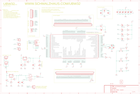

Contents
========

* [PRS9713 > UBW32](#prs9713--ubw32)
	* [Schematic](#schematic)
	* [PCB](#pcb)
	* [Interactive BOM](#interactive-bom)
	* [Images](#images)
	* [Tags](#tags)
  
![][im]
# PRS9713 > UBW32

- ID: PROJ-SPAR-9713-STAN-01
- Hex ID: PRS9713
- Name: Sparkfun
- Description: Sparkfun
- Long Link: [http://oom.lt/PROJ-SPAR-9713-STAN-01](http://oom.lt/PROJ-SPAR-9713-STAN-01)
- Short Link: [http://oom.lt/PRS9713](http://oom.lt/PRS9713)

## Schematic
  

## PCB
  

## Interactive BOM

- Interactive BOM page: [ibom.html](https://htmlpreview.github.io/?https://github.com/oomlout/oomlout_OOMP_projects/blob/main/PROJ-SPAR-9713-STAN-01/kicad/bom/ibom.html)

## Images
  
  

|bominteractivefront|bominteractiveback|kicadPcb3d|kicadPcb3dFront|kicadPcb3dBack|eagleImage|eagleSchemImage|pcbdraw|pcbdrawback|
| :---: | :---: | :---: | :---: | :---: | :---: | :---: | :---: | :---: |
||||||||||

## Tags

- hexID: PRS9713
- oompType: PROJ
- oompSize: SPAR
- oompColor: 9713
- oompDesc: STAN
- oompIndex: 01
- oompName: UBW32
- sources: All source files from https://github.com/sparkfun/UBW32 (source licence details in srcLicense.md)
- linkBuyPage: https://www.sparkfun.com/products/9713
- oompID: PROJ-SPAR-9713-STAN-01
- rawParts: 3.3,M01PTH,M01PTH,1X01,Header 1,,
- rawParts: 5,M01PTH,M01PTH,1X01,Header 1,,
- rawParts: C1,10uF,CAP_POL3528,EIA3528,Capacitor Polarized,,
- rawParts: C2,1uF,CAP0402-CAP,0402-CAP,Capacitor,,
- rawParts: C3,1uF,CAP0402-CAP,0402-CAP,Capacitor,,
- rawParts: C4,0.1uF,CAP0402-CAP,0402-CAP,Capacitor,,
- rawParts: C5,10uF,CAP_POL3528,EIA3528,Capacitor Polarized,,
- rawParts: C6,0.1uF,CAP0402-CAP,0402-CAP,Capacitor,,
- rawParts: C7,0.1uF,CAP0402-CAP,0402-CAP,Capacitor,,
- rawParts: C8,0.1uF,CAP0402-CAP,0402-CAP,Capacitor,,
- rawParts: C9,0.1uF,CAP0402-CAP,0402-CAP,Capacitor,,
- rawParts: C10,0.1uF,CAP0402,C0402,Capacitor,,
- rawParts: C11,0.1uF,CAP0402-CAP,0402-CAP,Capacitor,,
- rawParts: C12,1uF,CAP0402,C0402,Capacitor,,
- rawParts: C13,1uF,CAP0402,C0402,Capacitor,,
- rawParts: C14,18pF,CAP0402-CAP,0402-CAP,Capacitor,,
- rawParts: C15,18pF,CAP0402-CAP,0402-CAP,Capacitor,,
- rawParts: C16,11pf,CAP0402-CAP,0402-CAP,Capacitor,,
- rawParts: C17,11pf,CAP0402-CAP,0402-CAP,Capacitor,,
- rawParts: D1,,DIODESMA,SMA-DIODE,Diode,,
- rawParts: F1,250mA PTC Fuse,R-EU_R1206,R1206,RESISTOR, European symbol,,
- rawParts: GND,M01PTH,M01PTH,1X01,Header 1,,
- rawParts: J1,,M02PTH,1X02,Header 2,,
- rawParts: J2,JST-2-PTH,M02-JST-2MM-SMT,S2B-PH,Header 2,,
- rawParts: J3,M40,M40,1X40,,,
- rawParts: J4,M40,M40,1X40,,,
- rawParts: J5,,M08,1X08,Header 8,,
- rawParts: J6,,M05PTH,1X05,Header 5,,
- rawParts: J7,USB-A-S,USB-A-S,USB-A-S,USB Connectors,,
- rawParts: J8,USB-MINIB,USB_5PIN,USB-MINIB,,,
- rawParts: JP1,,M02PTH,1X02,Header 2,,
- rawParts: LED1,WHITE,LED0603,LED-0603,LEDs,,
- rawParts: LED2,RED,LED0603,LED-0603,LEDs,,
- rawParts: LED3,YELLOW,LED0603,LED-0603,LEDs,,
- rawParts: PROGRAM,,TAC_SWITCHSND,TACTILE_SWITCH_SMD,Momentary Switch,,
- rawParts: PWR,BLUE,LED0603,LED-0603,LEDs,,
- rawParts: PWR_SEL,AYZ0202,AYZ0202,AYZ0202,SPDT Slide Switch,,
- rawParts: Q1,8MHz,CRYSTAL5X3,CRYSTAL-SMD-5X3,Crystals,,
- rawParts: Q2,32.768KHz,CRYSTAL32-SMD,CRYSTAL-32KHZ-SMD,Crystals,,
- rawParts: R3,10K,RESISTOR0402-RES,0402-RES,Resistor,,
- rawParts: R4,330,RESISTOR0402-RES,0402-RES,Resistor,,
- rawParts: R5,10K,RESISTOR0402-RES,0402-RES,Resistor,,
- rawParts: R6,330,RESISTOR0402-RES,0402-RES,Resistor,,
- rawParts: R7,330,RESISTOR0402-RES,0402-RES,Resistor,,
- rawParts: R8,330,RESISTOR0402-RES,0402-RES,Resistor,,
- rawParts: R9,10K,RESISTOR0402-RES,0402-RES,Resistor,,
- rawParts: R10,10K,RESISTOR0402-RES,0402-RES,Resistor,,
- rawParts: R11,330,RESISTOR0402-RES,0402-RES,Resistor,,
- rawParts: R13,390,RESISTOR0402-RES,0402-RES,Resistor,,
- rawParts: R14,240,RESISTOR0402-RES,0402-RES,Resistor,,
- rawParts: R15,715,RESISTOR0402-RES,0402-RES,Resistor,,
- rawParts: R16,240,RESISTOR0402-RES,0402-RES,Resistor,,
- rawParts: RESET,,TAC_SWITCHSND,TACTILE_SWITCH_SMD,Momentary Switch,,
- rawParts: U$4,LOGO-SFENEW,LOGO-SFENEW,SFE-NEW-WEBLOGO,Spark Fun Electronics PCB Logo,,
- rawParts: U$6,STAND-OFF,STAND-OFF,STAND-OFF,Stand Off,,
- rawParts: U$7,STAND-OFF,STAND-OFF,STAND-OFF,Stand Off,,
- rawParts: U1,PIC32MX460F512L TQFP100,PIC32MX4XXLTQFP100,TQFP100,,,
- rawParts: U2,3.3V,V_REG_317SMD,SOT223,Voltage Regulator,,
- rawParts: U3,5V,V_REG_317SMD,SOT223,Voltage Regulator,,
- rawParts: USB,GREEN,LED0603,LED-0603,LEDs,,
- rawParts: USER,,TAC_SWITCHSND,TACTILE_SWITCH_SMD,Momentary Switch,,

[im]: kicadPcb3d_450.png
