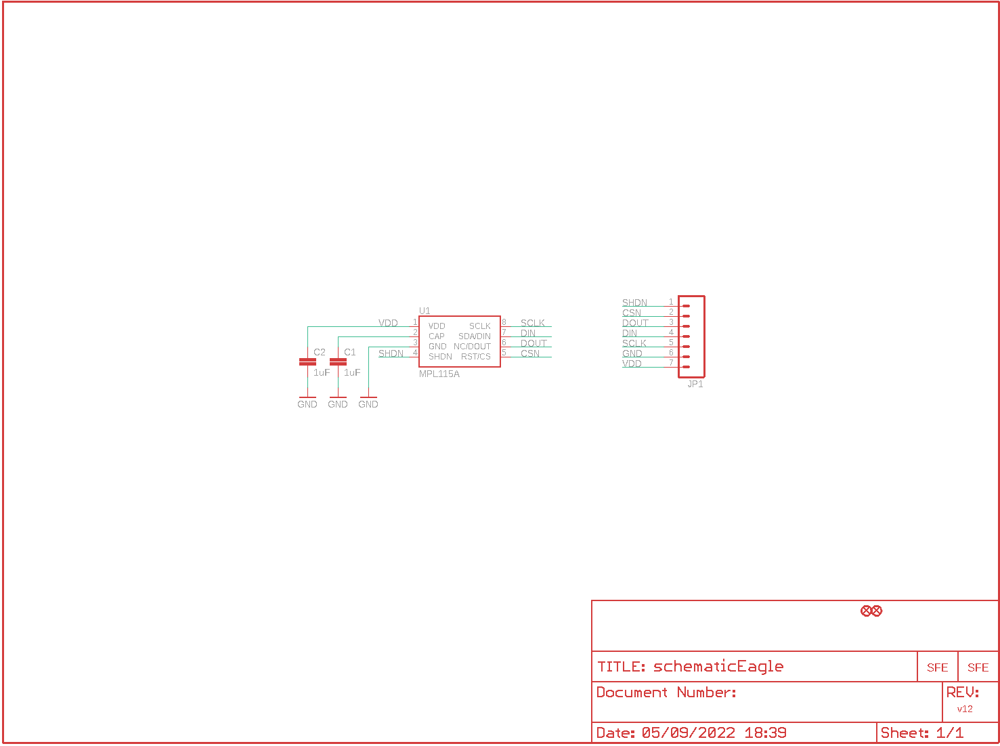
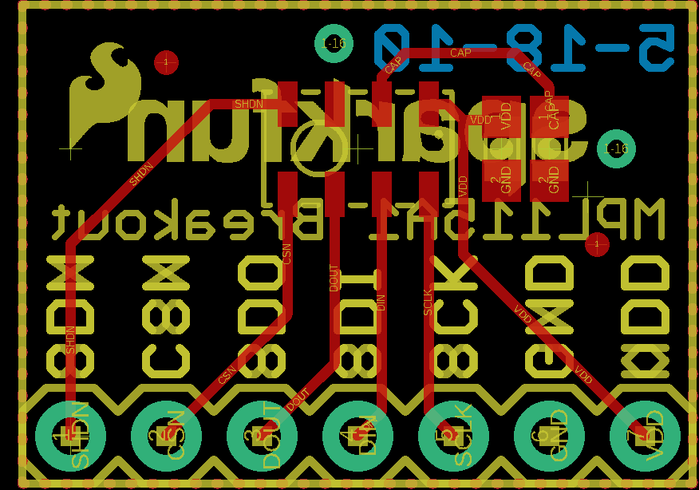
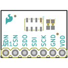
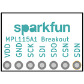
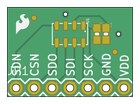
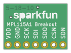

Contents
========

* [PRS9721 > Barometric Pressure Sensor Breakout-MPL115A1](#prs9721--barometric-pressure-sensor-breakout-mpl115a1)
	* [Schematic](#schematic)
	* [PCB](#pcb)
	* [Interactive BOM](#interactive-bom)
	* [Images](#images)
	* [Tags](#tags)
  
![][im]
# PRS9721 > Barometric Pressure Sensor Breakout-MPL115A1

- ID: PROJ-SPAR-9721-STAN-01
- Hex ID: PRS9721
- Name: Sparkfun
- Description: Sparkfun
- Long Link: [http://oom.lt/PROJ-SPAR-9721-STAN-01](http://oom.lt/PROJ-SPAR-9721-STAN-01)
- Short Link: [http://oom.lt/PRS9721](http://oom.lt/PRS9721)

## Schematic
  

## PCB
  

## Interactive BOM

- Interactive BOM page: [ibom.html](https://htmlpreview.github.io/?https://github.com/oomlout/oomlout_OOMP_projects/blob/main/PROJ-SPAR-9721-STAN-01/kicad/bom/ibom.html)

## Images
  
  

|bominteractivefront|bominteractiveback|kicadPcb3d|kicadPcb3dFront|kicadPcb3dBack|eagleImage|eagleSchemImage|pcbdraw|pcbdrawback|
| :---: | :---: | :---: | :---: | :---: | :---: | :---: | :---: | :---: |
||||||||||

## Tags

- hexID: PRS9721
- oompType: PROJ
- oompSize: SPAR
- oompColor: 9721
- oompDesc: STAN
- oompIndex: 01
- oompName: Barometric Pressure Sensor Breakout-MPL115A1
- sources: All source files from https://github.com/sparkfun/Barometric_Pressure_Sensor_Breakout-MPL115A1 (source licence details in srcLicense.md)
- linkBuyPage: https://www.sparkfun.com/products/9721
- oompID: PROJ-SPAR-9721-STAN-01
- rawParts: C1,1uF,CAP0603-CAP,0603-CAP,Capacitor,,
- rawParts: C2,1uF,CAP0603-CAP,0603-CAP,Capacitor,,
- rawParts: FID1,FIDUCIALUFIDUCIAL,FIDUCIALUFIDUCIAL,MICRO-FIDUCIAL,Fiducial Alignment Points,,
- rawParts: FID2,FIDUCIALUFIDUCIAL,FIDUCIALUFIDUCIAL,MICRO-FIDUCIAL,Fiducial Alignment Points,,
- rawParts: JP1,,M07,1X07,Header 7,,
- rawParts: JP2,LOGO-SFESK,LOGO-SFESK,SFE-LOGO-FLAME,Spark Fun Electronics PCB Logo,,
- rawParts: JP3,LOGO-SFENW2,LOGO-SFENW2,SFE-NEW-WEB,Spark Fun Electronics PCB Logo,,
- rawParts: U1,MPL115A,MPL115A,LGA8,MPL115A1 (SPI) and MPL115A2 (I2C),,

[im]: kicadPcb3d_450.png
