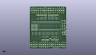
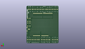
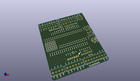

Contents
========

* [PROJ-SPAR-9729-STAN-01>ProtoScrewShield](#proj-spar-9729-stan-01protoscrewshield)
	* [Images](#images)
	* [Interactive BOM](#interactive-bom)
	* [OOMP Parts](#oomp-parts)
	* [Tags](#tags)
  
![][im]
# PROJ-SPAR-9729-STAN-01>ProtoScrewShield

- ID: PROJ-SPAR-9729-STAN-01
- Hex ID: PRS9729
- Name: ProtoScrewShield
- Description: 

## Images
  
  

|eagleImage|kicadPcb3dFront|kicadPcb3dBack|kicadPcb3d|
| :---: | :---: | :---: | :---: |
|||||

## Interactive BOM

- Interactive BOM page: [ibom.html](kicad/bom/ibom.html)

## OOMP Parts
  

|OOMP Parts|
| :---: |
|UNMATCHED-UNMATCHED-X-UNMATCHED-01, JP1, 43.18, 7.619999999999999, 0,JP1, SCREWTERMINAL-3.5MM-8, SparkFun, (1.7, 0.3), R0|
|UNMATCHED-UNMATCHED-X-UNMATCHED-01, JP2, 20.32, 7.619999999999999, 0,JP2, SCREWTERMINAL-3.5MM-6, SparkFun, (0.8, 0.3), R0|
|UNMATCHED-UNMATCHED-X-UNMATCHED-01, JP3, 3.8099999999999996, 7.619999999999999, 0,JP3, SCREWTERMINAL-3.5MM-4, SparkFun, (0.15, 0.3), R0|
|UNMATCHED-UNMATCHED-X-UNMATCHED-01, JP4, 57.15, 73.66, 180,JP4, SCREWTERMINAL-3.5MM-8, SparkFun, (2.25, 2.9), R180|
|UNMATCHED-UNMATCHED-X-UNMATCHED-01, JP5, 27.94, 73.66, 180,JP5, SCREWTERMINAL-3.5MM-8, SparkFun, (1.1, 2.9), R180|
|UNMATCHED-UNMATCHED-X-UNMATCHED-01, JP6, 64.77, 73.66, 180,JP6, SCREWTERMINAL-3.5MM-2, SparkFun, (2.55, 2.9), R180|
|UNMATCHED-UNMATCHED-X-UNMATCHED-01, LED1, 64.77, 30.479999999999997, 0,LED1, LED5MM, SparkFun, (2.55, 1.2), R0|
|RESE-UNMATCHED-X-O331-01, R1, 68.58, 30.479999999999997, 90,R1, 330, AXIAL-0.3, SparkFun, (2.7, 1.2), R90|
|UNMATCHED-UNMATCHED-X-UNMATCHED-01, S1, 64.77, 40.64, 270,S1, Reset, TACTILE-PTH, SparkFun, (2.55, 1.6), R270|
|UNMATCHED-UNMATCHED-X-UNMATCHED-01, S2, 64.77, 50.8, 270,S2, General, TACTILE-PTH, SparkFun, (2.55, 2), R270|
|UNMATCHED-UNMATCHED-X-UNMATCHED-01, U1, 0.0, 67.30999999999999, 270,U1, ARDUINO_SHIELD, DUEMILANOVE_SHIELD_NOHOLES, SparkFun, (0, 2.65), R270|

## Tags

- hexID: PRS9729
- oompType: PROJ
- oompSize: SPAR
- oompColor: 9729
- oompDesc: STAN
- oompIndex: 01
- oompName: ProtoScrewShield
- sources: All source files from https://github.com/sparkfun/ProtoScrewShield (source licence details in srcLicense.md)
- linkBuyPage: https://www.sparkfun.com/products/9729
- oompPart: UNMATCHED-UNMATCHED-X-UNMATCHED-01, JP1, 43.18, 7.619999999999999, 0
- oompPart: UNMATCHED-UNMATCHED-X-UNMATCHED-01, JP2, 20.32, 7.619999999999999, 0
- oompPart: UNMATCHED-UNMATCHED-X-UNMATCHED-01, JP3, 3.8099999999999996, 7.619999999999999, 0
- oompPart: UNMATCHED-UNMATCHED-X-UNMATCHED-01, JP4, 57.15, 73.66, 180
- oompPart: UNMATCHED-UNMATCHED-X-UNMATCHED-01, JP5, 27.94, 73.66, 180
- oompPart: UNMATCHED-UNMATCHED-X-UNMATCHED-01, JP6, 64.77, 73.66, 180
- oompPart: UNMATCHED-UNMATCHED-X-UNMATCHED-01, LED1, 64.77, 30.479999999999997, 0
- oompPart: RESE-UNMATCHED-X-O331-01, R1, 68.58, 30.479999999999997, 90
- oompPart: UNMATCHED-UNMATCHED-X-UNMATCHED-01, S1, 64.77, 40.64, 270
- oompPart: UNMATCHED-UNMATCHED-X-UNMATCHED-01, S2, 64.77, 50.8, 270
- oompPart: UNMATCHED-UNMATCHED-X-UNMATCHED-01, U1, 0.0, 67.30999999999999, 270
- rawPart: JP1, SCREWTERMINAL-3.5MM-8, SparkFun, (1.7, 0.3), R0
- rawPart: JP2, SCREWTERMINAL-3.5MM-6, SparkFun, (0.8, 0.3), R0
- rawPart: JP3, SCREWTERMINAL-3.5MM-4, SparkFun, (0.15, 0.3), R0
- rawPart: JP4, SCREWTERMINAL-3.5MM-8, SparkFun, (2.25, 2.9), R180
- rawPart: JP5, SCREWTERMINAL-3.5MM-8, SparkFun, (1.1, 2.9), R180
- rawPart: JP6, SCREWTERMINAL-3.5MM-2, SparkFun, (2.55, 2.9), R180
- rawPart: LED1, LED5MM, SparkFun, (2.55, 1.2), R0
- rawPart: R1, 330, AXIAL-0.3, SparkFun, (2.7, 1.2), R90
- rawPart: S1, Reset, TACTILE-PTH, SparkFun, (2.55, 1.6), R270
- rawPart: S2, General, TACTILE-PTH, SparkFun, (2.55, 2), R270
- rawPart: U1, ARDUINO_SHIELD, DUEMILANOVE_SHIELD_NOHOLES, SparkFun, (0, 2.65), R270
- oompID: PROJ-SPAR-9729-STAN-01

[im]: kicadPcb3d_450.png
