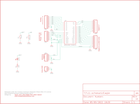

Contents
========

* [PRS9729 > ProtoScrewShield](#prs9729--protoscrewshield)
	* [Schematic](#schematic)
	* [PCB](#pcb)
	* [Interactive BOM](#interactive-bom)
	* [OOMP Parts](#oomp-parts)
	* [Images](#images)
	* [Tags](#tags)
  
![][im]
# PRS9729 > ProtoScrewShield

- ID: PROJ-SPAR-9729-STAN-01
- Hex ID: PRS9729
- Name: Sparkfun
- Description: Sparkfun
- Long Link: [http://oom.lt/PROJ-SPAR-9729-STAN-01](http://oom.lt/PROJ-SPAR-9729-STAN-01)
- Short Link: [http://oom.lt/PRS9729](http://oom.lt/PRS9729)

## Schematic
  

## PCB
  

## Interactive BOM

- Interactive BOM page: [ibom.html](https://htmlpreview.github.io/?https://github.com/oomlout/oomlout_OOMP_projects/blob/main/PROJ-SPAR-9729-STAN-01/kicad/bom/ibom.html)

## OOMP Parts
  

|OOMP ID|Name|Identifier|
| :---: | :---: | :---: |
|[TERS-35D-L-PI08-01](https://github.com/oomlout/oomlout_OOMP_parts/tree/main/TERS-35D-L-PI08-01/)|[3.5 mm 8 Pin Blue Screw Terminal](https://github.com/oomlout/oomlout_OOMP_parts/tree/main/TERS-35D-L-PI08-01/)|[JP1, JP4, JP5](https://github.com/oomlout/oomlout_OOMP_parts/tree/main/TERS-35D-L-PI08-01/)|
|TERS-35D-L-UNMATCHED-01||JP2|
|[TERS-35D-L-PI04-01](https://github.com/oomlout/oomlout_OOMP_parts/tree/main/TERS-35D-L-PI04-01/)|[3.5 mm 4 Pin Blue Screw Terminal](https://github.com/oomlout/oomlout_OOMP_parts/tree/main/TERS-35D-L-PI04-01/)|[JP3](https://github.com/oomlout/oomlout_OOMP_parts/tree/main/TERS-35D-L-PI04-01/)|
|[TERS-35D-L-PI02-01](https://github.com/oomlout/oomlout_OOMP_parts/tree/main/TERS-35D-L-PI02-01/)|[3.5 mm 2 Pin Blue Screw Terminal](https://github.com/oomlout/oomlout_OOMP_parts/tree/main/TERS-35D-L-PI02-01/)|[JP6](https://github.com/oomlout/oomlout_OOMP_parts/tree/main/TERS-35D-L-PI02-01/)|
|LEDS-UNMATCHED-G-STAN-01||LED1|
|RESE-UNMATCHED-X-O331-01||R1|
|UNMATCHED-UNMATCHED-X-UNMATCHED-01||S1, S2, U1|

## Images
  
  

|bominteractivefront|bominteractiveback|kicadPcb3d|kicadPcb3dFront|kicadPcb3dBack|eagleImage|eagleSchemImage|pcbdraw|pcbdrawback|
| :---: | :---: | :---: | :---: | :---: | :---: | :---: | :---: | :---: |
||||||||||

## Tags

- hexID: PRS9729
- oompType: PROJ
- oompSize: SPAR
- oompColor: 9729
- oompDesc: STAN
- oompIndex: 01
- oompName: ProtoScrewShield
- sources: All source files from https://github.com/sparkfun/ProtoScrewShield (source licence details in srcLicense.md)
- linkBuyPage: https://www.sparkfun.com/products/9729
- oompID: PROJ-SPAR-9729-STAN-01
- oompParts: JP1,TERS-35D-L-PI08-01
- oompParts: JP2,TERS-35D-L-UNMATCHED-01
- oompParts: JP3,TERS-35D-L-PI04-01
- oompParts: JP4,TERS-35D-L-PI08-01
- oompParts: JP5,TERS-35D-L-PI08-01
- oompParts: JP6,TERS-35D-L-PI02-01
- oompParts: LED1,LEDS-UNMATCHED-G-STAN-01
- oompParts: R1,RESE-UNMATCHED-X-O331-01
- oompParts: S1,UNMATCHED-UNMATCHED-X-UNMATCHED-01
- oompParts: S2,UNMATCHED-UNMATCHED-X-UNMATCHED-01
- oompParts: U1,UNMATCHED-UNMATCHED-X-UNMATCHED-01
- rawParts: JP1,,M083.5MM-8,SCREWTERMINAL-3.5MM-8,Header 8,,
- rawParts: JP2,,M063.5MM-6,SCREWTERMINAL-3.5MM-6,Header 6,,
- rawParts: JP3,,M04SCREW,SCREWTERMINAL-3.5MM-4,Header 4,,
- rawParts: JP4,,M083.5MM-8,SCREWTERMINAL-3.5MM-8,Header 8,,
- rawParts: JP5,,M083.5MM-8,SCREWTERMINAL-3.5MM-8,Header 8,,
- rawParts: JP6,,M023.5MM,SCREWTERMINAL-3.5MM-2,Header 2,,
- rawParts: JP7,LOGO-SFENEW,LOGO-SFENEW,SFE-NEW-WEBLOGO,Spark Fun Electronics PCB Logo,,
- rawParts: JP8,LOGO-SFESK,LOGO-SFESK,SFE-LOGO-FLAME,Spark Fun Electronics PCB Logo,,
- rawParts: LED1,,LED5MM,LED5MM,LEDs,,
- rawParts: R1,330,RESISTORPTH1,AXIAL-0.3,Resistor,,
- rawParts: S1,Reset,SWITCH-MOMENTARY-2PTH,TACTILE-PTH,,,
- rawParts: S2,General,SWITCH-MOMENTARY-2PTH,TACTILE-PTH,,,
- rawParts: U$1,CREATIVE_COMMONS,CREATIVE_COMMONS,CREATIVE_COMMONS,,,
- rawParts: U1,ARDUINO_SHIELD,ARDUINO_SHIELDNOHOLES,DUEMILANOVE_SHIELD_NOHOLES,,,

[im]: kicadPcb3d_450.png
