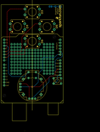
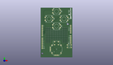
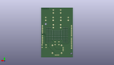
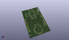

Contents
========

* [PROJ-SPAR-9760-STAN-01>Joystick Shield Kit](#proj-spar-9760-stan-01joystick-shield-kit)
	* [Images](#images)
	* [Interactive BOM](#interactive-bom)
	* [OOMP Parts](#oomp-parts)
	* [Tags](#tags)
  
![][im]
# PROJ-SPAR-9760-STAN-01>Joystick Shield Kit

- ID: PROJ-SPAR-9760-STAN-01
- Hex ID: PRS9760
- Name: Joystick Shield Kit
- Description: 

## Images
  
  

|eagleImage|kicadPcb3dFront|kicadPcb3dBack|kicadPcb3d|
| :---: | :---: | :---: | :---: |
|||||

## Interactive BOM

- Interactive BOM page: [ibom.html](kicad/bom/ibom.html)

## OOMP Parts
  

|OOMP Parts|
| :---: |
|UNMATCHED-UNMATCHED-X-UNMATCHED-01, S1, 27.94, 78.74, 180,S1, TACTILE-PTH-12MM, SparkFun, (1.1, 3.1), R180|
|UNMATCHED-UNMATCHED-X-UNMATCHED-01, S2, 15.239999999999998, 66.03999999999999, 180,S2, TACTILE-PTH-12MM, SparkFun, (0.6, 2.6), R180|
|UNMATCHED-UNMATCHED-X-UNMATCHED-01, S3, 40.64, 66.03999999999999, 180,S3, TACTILE-PTH-12MM, SparkFun, (1.6, 2.6), R180|
|UNMATCHED-UNMATCHED-X-UNMATCHED-01, S4, 27.94, 53.339999999999996, 180,S4, TACTILE-PTH-12MM, SparkFun, (1.1, 2.1), R180|
|UNMATCHED-UNMATCHED-X-UNMATCHED-01, S6, 49.529999999999994, 19.049999999999997, 0,S6, Reset, TACTILE-PTH, SparkFun, (1.95, 0.75), R0|
|UNMATCHED-UNMATCHED-X-UNMATCHED-01, U1, 1.27, 0.0, 0,U1, ARDUINO_SHIELD, DUEMILANOVE_SHIELD, SparkFun, (0.05, 0), R0|
|UNMATCHED-UNMATCHED-X-UNMATCHED-01, U2, 27.94, 13.97, 0,U2, JOYSTICK, JOYSTICK, SparkFun, (1.1, 0.55), R0|

## Tags

- hexID: PRS9760
- oompType: PROJ
- oompSize: SPAR
- oompColor: 9760
- oompDesc: STAN
- oompIndex: 01
- oompName: Joystick Shield Kit
- sources: All source files from https://github.com/sparkfun/Joystick_Shield_Kit (source licence details in srcLicense.md)
- linkBuyPage: https://www.sparkfun.com/products/9760
- oompID: PROJ-SPAR-9760-STAN-01
- oompPart: UNMATCHED-UNMATCHED-X-UNMATCHED-01, S1, 27.94, 78.74, 180
- oompPart: UNMATCHED-UNMATCHED-X-UNMATCHED-01, S2, 15.239999999999998, 66.03999999999999, 180
- oompPart: UNMATCHED-UNMATCHED-X-UNMATCHED-01, S3, 40.64, 66.03999999999999, 180
- oompPart: UNMATCHED-UNMATCHED-X-UNMATCHED-01, S4, 27.94, 53.339999999999996, 180
- oompPart: UNMATCHED-UNMATCHED-X-UNMATCHED-01, S6, 49.529999999999994, 19.049999999999997, 0
- oompPart: UNMATCHED-UNMATCHED-X-UNMATCHED-01, U1, 1.27, 0.0, 0
- oompPart: UNMATCHED-UNMATCHED-X-UNMATCHED-01, U2, 27.94, 13.97, 0
- rawPart: S1, TACTILE-PTH-12MM, SparkFun, (1.1, 3.1), R180
- rawPart: S2, TACTILE-PTH-12MM, SparkFun, (0.6, 2.6), R180
- rawPart: S3, TACTILE-PTH-12MM, SparkFun, (1.6, 2.6), R180
- rawPart: S4, TACTILE-PTH-12MM, SparkFun, (1.1, 2.1), R180
- rawPart: S6, Reset, TACTILE-PTH, SparkFun, (1.95, 0.75), R0
- rawPart: U1, ARDUINO_SHIELD, DUEMILANOVE_SHIELD, SparkFun, (0.05, 0), R0
- rawPart: U2, JOYSTICK, JOYSTICK, SparkFun, (1.1, 0.55), R0

[im]: kicadPcb3d_450.png
