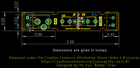
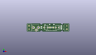
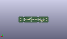
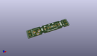

Contents
========

* [PROJ-SPAR-9773-STAN-01>SparkFun-Fuse-Breakout-Board](#proj-spar-9773-stan-01sparkfun-fuse-breakout-board)
	* [Images](#images)
	* [Interactive BOM](#interactive-bom)
	* [OOMP Parts](#oomp-parts)
	* [Tags](#tags)
  
![][im]
# PROJ-SPAR-9773-STAN-01>SparkFun-Fuse-Breakout-Board

- ID: PROJ-SPAR-9773-STAN-01
- Hex ID: PRS9773
- Name: SparkFun-Fuse-Breakout-Board
- Description: 

## Images
  
  

|eagleImage|kicadPcb3dFront|kicadPcb3dBack|kicadPcb3d|
| :---: | :---: | :---: | :---: |
|||||

## Interactive BOM

- Interactive BOM page: [ibom.html](kicad/bom/ibom.html)

## OOMP Parts
  

|OOMP Parts|
| :---: |
|UNMATCHED-UNMATCHED-X-UNMATCHED-01, F1, 38.099999999999994, 6.35, 270,F1, FUSEX20MM, FUSE_5MM, SparkFun, (1.5, 0.25), R270|
|UNMATCHED-UNMATCHED-X-UNMATCHED-01, F2, 38.099999999999994, 6.35, 0,F2, 72V/0.25A, PTH, SparkFun-Fuses, (1.5, 0.25), R0|
|UNMATCHED-UNMATCHED-X-UNMATCHED-01, J1, 3.8099999999999996, 8.889999999999999, 270,J1, SCREWTERMINAL-5MM-2, SparkFun-Connectors, (0.15, 0.35), R270|
|UNMATCHED-UNMATCHED-X-UNMATCHED-01, J2, 3.937, 6.223, 270,J2, POWER_JACKPTH_LOCK, POWER_JACK_PTH_LOCK, SparkFun-Connectors, (0.155, 0.245), R270|
|UNMATCHED-UNMATCHED-X-UNMATCHED-01, J3, 60.959999999999994, 3.8099999999999996, 90,J3, SCREWTERMINAL-5MM-2, SparkFun-Connectors, (2.4, 0.15), R90|

## Tags

- hexID: PRS9773
- oompType: PROJ
- oompSize: SPAR
- oompColor: 9773
- oompDesc: STAN
- oompIndex: 01
- oompName: SparkFun-Fuse-Breakout-Board
- sources: All source files from https://github.com/sparkfun/SparkFun-Fuse-Breakout-Board (source licence details in srcLicense.md)
- linkBuyPage: https://www.sparkfun.com/products/9773
- oompID: PROJ-SPAR-9773-STAN-01
- oompPart: UNMATCHED-UNMATCHED-X-UNMATCHED-01, F1, 38.099999999999994, 6.35, 270
- oompPart: UNMATCHED-UNMATCHED-X-UNMATCHED-01, F2, 38.099999999999994, 6.35, 0
- oompPart: UNMATCHED-UNMATCHED-X-UNMATCHED-01, J1, 3.8099999999999996, 8.889999999999999, 270
- oompPart: UNMATCHED-UNMATCHED-X-UNMATCHED-01, J2, 3.937, 6.223, 270
- oompPart: UNMATCHED-UNMATCHED-X-UNMATCHED-01, J3, 60.959999999999994, 3.8099999999999996, 90
- rawPart: F1, FUSEX20MM, FUSE_5MM, SparkFun, (1.5, 0.25), R270
- rawPart: F2, 72V/0.25A, PTH, SparkFun-Fuses, (1.5, 0.25), R0
- rawPart: J1, SCREWTERMINAL-5MM-2, SparkFun-Connectors, (0.15, 0.35), R270
- rawPart: J2, POWER_JACKPTH_LOCK, POWER_JACK_PTH_LOCK, SparkFun-Connectors, (0.155, 0.245), R270
- rawPart: J3, SCREWTERMINAL-5MM-2, SparkFun-Connectors, (2.4, 0.15), R90

[im]: kicadPcb3d_450.png
