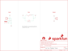

Contents
========

* [PRS9773 > SparkFun-Fuse-Breakout-Board](#prs9773--sparkfun-fuse-breakout-board)
	* [Schematic](#schematic)
	* [PCB](#pcb)
	* [Interactive BOM](#interactive-bom)
	* [OOMP Parts](#oomp-parts)
	* [Images](#images)
	* [Tags](#tags)
  
![][im]
# PRS9773 > SparkFun-Fuse-Breakout-Board

- ID: PROJ-SPAR-9773-STAN-01
- Hex ID: PRS9773
- Name: Sparkfun 9773
- Description: Sparkfun 9773
- Long Link: [http://oom.lt/PROJ-SPAR-9773-STAN-01](http://oom.lt/PROJ-SPAR-9773-STAN-01)
- Short Link: [http://oom.lt/PRS9773](http://oom.lt/PRS9773)

## Schematic
  

## PCB
  

## Interactive BOM

- Interactive BOM page: [ibom.html](https://htmlpreview.github.io/?https://github.com/oomlout/oomlout_OOMP_projects/blob/main/PROJ-SPAR-9773-STAN-01/kicad/bom/ibom.html)

## OOMP Parts
  

|OOMP ID|Name|Identifier|
| :---: | :---: | :---: |
|UNMATCHED-UNMATCHED-X-UNMATCHED-01||F1, F2|
|TERS-UNMATCHED-X-UNMATCHED-01||J1, J3|
|[DCJP-21D-X-STAN-01](https://github.com/oomlout/oomlout_OOMP_parts/tree/main/DCJP-21D-X-STAN-01/)|[2.1 mm DC Jack](https://github.com/oomlout/oomlout_OOMP_parts/tree/main/DCJP-21D-X-STAN-01/)|[J2](https://github.com/oomlout/oomlout_OOMP_parts/tree/main/DCJP-21D-X-STAN-01/)|

## Images
  
  

|bominteractivefront|bominteractiveback|kicadPcb3d|kicadPcb3dFront|kicadPcb3dBack|kicadSchem|eagleImage|eagleSchemImage|pcbdraw|pcbdrawback|
| :---: | :---: | :---: | :---: | :---: | :---: | :---: | :---: | :---: | :---: |
|||||||||||

## Tags

- hexID: PRS9773
- oompType: PROJ
- oompSize: SPAR
- oompColor: 9773
- oompDesc: STAN
- oompIndex: 01
- oompName: SparkFun-Fuse-Breakout-Board
- sources: All source files from https://github.com/sparkfun/SparkFun-Fuse-Breakout-Board (source licence details in srcLicense.md)
- linkBuyPage: https://www.sparkfun.com/products/9773
- oompID: PROJ-SPAR-9773-STAN-01
- oompParts: F1,UNMATCHED-UNMATCHED-X-UNMATCHED-01
- oompParts: F2,UNMATCHED-UNMATCHED-X-UNMATCHED-01
- oompParts: J1,TERS-UNMATCHED-X-UNMATCHED-01
- oompParts: J2,DCJP-21D-X-STAN-01
- oompParts: J3,TERS-UNMATCHED-X-UNMATCHED-01
- rawParts: F1,FUSEX20MM,FUSEX20MM,FUSE_5MM,,,,,,,,
- rawParts: F2,72V/0.25A,PPTC_PTH,PTH,Resettable Fuse PPTC,,RES-08490,,,,72V/0.25A,
- rawParts: FRAME1,FRAME-LETTER,FRAME-LETTER,CREATIVE_COMMONS,Schematic Frame - Letter,,,,,,,
- rawParts: J1,,CONN_025MM,SCREWTERMINAL-5MM-2,Multi connection point. Often used as Generic Header-pin footprint for 0.1 inch spaced/style header connections,,,,,PRT-08432,,
- rawParts: J2,POWER_JACKPTH_LOCK,POWER_JACKPTH_LOCK,POWER_JACK_PTH_LOCK,Power Jack Connector,,CONN-08197,,PRT-00119,,,
- rawParts: J3,,CONN_025MM,SCREWTERMINAL-5MM-2,Multi connection point. Often used as Generic Header-pin footprint for 0.1 inch spaced/style header connections,,,,,PRT-08432,,
- rawParts: LOGO1,SFE_LOGO_NAME_FLAME.1_INCH,SFE_LOGO_NAME_FLAME.1_INCH,SFE_LOGO_NAME_FLAME_.1,SparkFun Font Logo w/ Flame,,,,,,,
- rawParts: LOGO2,SFE_LOGO_FLAME.1_INCH,SFE_LOGO_FLAME.1_INCH,SFE_LOGO_FLAME_.1,SparkFun Flame Logo,,,,,,,
- rawParts: LOGO3,OSHW-LOGOMINI,OSHW-LOGOMINI,OSHW-LOGO-MINI,Open-Source Hardware (OSHW) Logo,,,,,,,

[im]: kicadPcb3d_450.png
