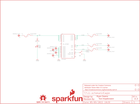

Contents
========

* [PRS9774 > Benchtop Power Board Kit](#prs9774--benchtop-power-board-kit)
	* [Schematic](#schematic)
	* [PCB](#pcb)
	* [Interactive BOM](#interactive-bom)
	* [OOMP Parts](#oomp-parts)
	* [Images](#images)
	* [Tags](#tags)
  
![][im]
# PRS9774 > Benchtop Power Board Kit

- ID: PROJ-SPAR-9774-STAN-01
- Hex ID: PRS9774
- Name: Sparkfun
- Description: Sparkfun
- Long Link: [http://oom.lt/PROJ-SPAR-9774-STAN-01](http://oom.lt/PROJ-SPAR-9774-STAN-01)
- Short Link: [http://oom.lt/PRS9774](http://oom.lt/PRS9774)

## Schematic
  

## PCB
  

## Interactive BOM

- Interactive BOM page: [ibom.html](https://htmlpreview.github.io/?https://github.com/oomlout/oomlout_OOMP_projects/blob/main/PROJ-SPAR-9774-STAN-01/kicad/bom/ibom.html)

## OOMP Parts
  

|OOMP ID|Name|Identifier|
| :---: | :---: | :---: |
|UNMATCHED-UNMATCHED-X-UNMATCHED-01||F1, F2, F3, F4, J1, S1, S2, S3, S4, S5, S6, S7, S8, S9|
|LEDS-UNMATCHED-R-STAN-01||LED1|
|RESE-UNMATCHED-X-O102-01||R1|

## Images
  
  

|bominteractivefront|bominteractiveback|kicadPcb3d|kicadPcb3dFront|kicadPcb3dBack|eagleImage|eagleSchemImage|pcbdraw|pcbdrawback|
| :---: | :---: | :---: | :---: | :---: | :---: | :---: | :---: | :---: |
||||||||||

## Tags

- hexID: PRS9774
- oompType: PROJ
- oompSize: SPAR
- oompColor: 9774
- oompDesc: STAN
- oompIndex: 01
- oompName: Benchtop Power Board Kit
- sources: All source files from https://github.com/sparkfun/Benchtop_Power_Board_Kit (source licence details in srcLicense.md)
- linkBuyPage: https://www.sparkfun.com/products/9774
- oompID: PROJ-SPAR-9774-STAN-01
- oompParts: F1,UNMATCHED-UNMATCHED-X-UNMATCHED-01
- oompParts: F2,UNMATCHED-UNMATCHED-X-UNMATCHED-01
- oompParts: F3,UNMATCHED-UNMATCHED-X-UNMATCHED-01
- oompParts: F4,UNMATCHED-UNMATCHED-X-UNMATCHED-01
- oompParts: J1,UNMATCHED-UNMATCHED-X-UNMATCHED-01
- oompParts: LED1,LEDS-UNMATCHED-R-STAN-01
- oompParts: R1,RESE-UNMATCHED-X-O102-01
- oompParts: S1,UNMATCHED-UNMATCHED-X-UNMATCHED-01
- oompParts: S2,UNMATCHED-UNMATCHED-X-UNMATCHED-01
- oompParts: S3,UNMATCHED-UNMATCHED-X-UNMATCHED-01
- oompParts: S4,UNMATCHED-UNMATCHED-X-UNMATCHED-01
- oompParts: S5,UNMATCHED-UNMATCHED-X-UNMATCHED-01
- oompParts: S6,UNMATCHED-UNMATCHED-X-UNMATCHED-01
- oompParts: S7,UNMATCHED-UNMATCHED-X-UNMATCHED-01
- oompParts: S8,UNMATCHED-UNMATCHED-X-UNMATCHED-01
- oompParts: S9,UNMATCHED-UNMATCHED-X-UNMATCHED-01
- rawParts: F1,FUSEX20MM,FUSEX20MM,FUSE_5MM,,,
- rawParts: F2,FUSEX20MM,FUSEX20MM,FUSE_5MM,,,
- rawParts: F3,FUSEX20MM,FUSEX20MM,FUSE_5MM,,,
- rawParts: F4,FUSEX20MM,FUSEX20MM,FUSE_5MM,,,
- rawParts: FRAME1,FRAME-LETTER,FRAME-LETTER,CREATIVE_COMMONS,Schematic Frame,,
- rawParts: J1,ATX24RH,ATX24RH,ATX24_RIGHT_ANGLE,ATX24 Pin Power Supply Connector This is a good connector for connecting a computer power supply to a PCB. Its massive, but provides many amps of power at 5V and 12V. SKU: PRT-09498,,
- rawParts: JP1,SFE_LOGO_NAME_FLAME.3_INCH,SFE_LOGO_NAME_FLAME.3_INCH,SFE_LOGO_NAME_FLAME_.3,SFE Logo, name and flame,,
- rawParts: JP2,STAND-OFF,STAND-OFF,STAND-OFF,#4 Stand Off,,
- rawParts: JP3,STAND-OFF,STAND-OFF,STAND-OFF,#4 Stand Off,,
- rawParts: JP4,STAND-OFF,STAND-OFF,STAND-OFF,#4 Stand Off,,
- rawParts: JP5,STAND-OFF,STAND-OFF,STAND-OFF,#4 Stand Off,,
- rawParts: LED1,RED,LED5MM,LED5MM,LEDs,,
- rawParts: LOGO1,OSHW-LOGOL,OSHW-LOGOL,OSHW-LOGO-L,Open Source Hardware Logo This logo indicates the piece of hardware it is found on incorporates a OSHW license and/or adheres to the definition of open source hardware found here: http://freedomdefined.org/OSHW,,
- rawParts: R1,1K,RESISTORPTH1,AXIAL-0.3,Resistor,,
- rawParts: S1,BINDING_POST,BINDING_POST,BINDING_POST,Single Banana jack.,,
- rawParts: S2,BINDING_POST,BINDING_POST,BINDING_POST,Single Banana jack.,,
- rawParts: S3,BINDING_POST,BINDING_POST,BINDING_POST,Single Banana jack.,,
- rawParts: S4,BINDING_POST,BINDING_POST,BINDING_POST,Single Banana jack.,,
- rawParts: S5,BINDING_POST,BINDING_POST,BINDING_POST,Single Banana jack.,,
- rawParts: S6,BINDING_POST,BINDING_POST,BINDING_POST,Single Banana jack.,,
- rawParts: S7,BINDING_POST,BINDING_POST,BINDING_POST,Single Banana jack.,,
- rawParts: S8,BINDING_POST,BINDING_POST,BINDING_POST,Single Banana jack.,,
- rawParts: S9,,SWITCH-SPDTKIT,SWITCH-SPDT_KIT,SPDT Switch,SWCH-08261,
- rawParts: U$1,REVISION,REVISION,REVISION,,,

[im]: kicadPcb3d_450.png
