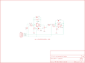

Contents
========

* [PRS9816 > OpAmp Breakout-LMV358](#prs9816--opamp-breakout-lmv358)
	* [Schematic](#schematic)
	* [PCB](#pcb)
	* [Interactive BOM](#interactive-bom)
	* [OOMP Parts](#oomp-parts)
	* [Images](#images)
	* [Tags](#tags)
  
![][im]
# PRS9816 > OpAmp Breakout-LMV358

- ID: PROJ-SPAR-9816-STAN-01
- Hex ID: PRS9816
- Name: Sparkfun
- Description: Sparkfun
- Long Link: [http://oom.lt/PROJ-SPAR-9816-STAN-01](http://oom.lt/PROJ-SPAR-9816-STAN-01)
- Short Link: [http://oom.lt/PRS9816](http://oom.lt/PRS9816)

## Schematic
  

## PCB
  

## Interactive BOM

- Interactive BOM page: [ibom.html](https://htmlpreview.github.io/?https://github.com/oomlout/oomlout_OOMP_projects/blob/main/PROJ-SPAR-9816-STAN-01/kicad/bom/ibom.html)

## OOMP Parts
  

|OOMP ID|Name|Identifier|
| :---: | :---: | :---: |
|[CAPC-0402-X-PF100-V50](https://github.com/oomlout/oomlout_OOMP_parts/tree/main/CAPC-0402-X-PF100-V50/)|[SMD (0402) 100 pF Capacitor (Ceramic) 50v](https://github.com/oomlout/oomlout_OOMP_parts/tree/main/CAPC-0402-X-PF100-V50/)|[C1, C3](https://github.com/oomlout/oomlout_OOMP_parts/tree/main/CAPC-0402-X-PF100-V50/)|
|[CAPC-0402-X-NF100-V10](https://github.com/oomlout/oomlout_OOMP_parts/tree/main/CAPC-0402-X-NF100-V10/)|[SMD (0402) 100 nF Capacitor (Ceramic) 10v](https://github.com/oomlout/oomlout_OOMP_parts/tree/main/CAPC-0402-X-NF100-V10/)|[C2](https://github.com/oomlout/oomlout_OOMP_parts/tree/main/CAPC-0402-X-NF100-V10/)|
|[CAPC-0402-X-UF1-V63D](https://github.com/oomlout/oomlout_OOMP_parts/tree/main/CAPC-0402-X-UF1-V63D/)|[SMD (0402) 1 uF Capacitor (Ceramic) 6.3v](https://github.com/oomlout/oomlout_OOMP_parts/tree/main/CAPC-0402-X-UF1-V63D/)|[C5, C6](https://github.com/oomlout/oomlout_OOMP_parts/tree/main/CAPC-0402-X-UF1-V63D/)|
|UNMATCHED-UNMATCHED-X-UNMATCHED-01||IC1|
|[HEAD-I01-X-PI04-01](https://github.com/oomlout/oomlout_OOMP_parts/tree/main/HEAD-I01-X-PI04-01/)|[2.54 mm 4 Pin Header](https://github.com/oomlout/oomlout_OOMP_parts/tree/main/HEAD-I01-X-PI04-01/)|[JP1](https://github.com/oomlout/oomlout_OOMP_parts/tree/main/HEAD-I01-X-PI04-01/)|
|RESE-0402-X-O1003-01||R1, R4|
|[RESE-0402-X-O103-01](https://github.com/oomlout/oomlout_OOMP_parts/tree/main/RESE-0402-X-O103-01/)|[SMD (0402) 10k Ohm Resistor](https://github.com/oomlout/oomlout_OOMP_parts/tree/main/RESE-0402-X-O103-01/)|[R2, R3, R5, R6, R8, R9](https://github.com/oomlout/oomlout_OOMP_parts/tree/main/RESE-0402-X-O103-01/)|
|RESE-UNMATCHED-X-O1003-01||R7|

## Images
  
  

|bominteractivefront|bominteractiveback|kicadPcb3d|kicadPcb3dFront|kicadPcb3dBack|eagleImage|eagleSchemImage|pcbdraw|pcbdrawback|
| :---: | :---: | :---: | :---: | :---: | :---: | :---: | :---: | :---: |
||||||||||

## Tags

- hexID: PRS9816
- oompType: PROJ
- oompSize: SPAR
- oompColor: 9816
- oompDesc: STAN
- oompIndex: 01
- oompName: OpAmp Breakout-LMV358
- sources: All source files from https://github.com/sparkfun/OpAmp_Breakout-LMV358 (source licence details in srcLicense.md)
- linkBuyPage: https://www.sparkfun.com/products/9816
- oompID: PROJ-SPAR-9816-STAN-01
- oompParts: C1,CAPC-0402-X-PF100-V50
- oompParts: C2,CAPC-0402-X-NF100-V10
- oompParts: C3,CAPC-0402-X-PF100-V50
- oompParts: C5,CAPC-0402-X-UF1-V63D
- oompParts: C6,CAPC-0402-X-UF1-V63D
- oompParts: IC1,UNMATCHED-UNMATCHED-X-UNMATCHED-01
- oompParts: JP1,HEAD-I01-X-PI04-01
- oompParts: R1,RESE-0402-X-O1003-01
- oompParts: R2,RESE-0402-X-O103-01
- oompParts: R3,RESE-0402-X-O103-01
- oompParts: R4,RESE-0402-X-O1003-01
- oompParts: R5,RESE-0402-X-O103-01
- oompParts: R6,RESE-0402-X-O103-01
- oompParts: R7,RESE-UNMATCHED-X-O1003-01
- oompParts: R8,RESE-0402-X-O103-01
- oompParts: R9,RESE-0402-X-O103-01
- rawParts: C1,100pF,CAP0402-CAP,0402-CAP,Capacitor,,
- rawParts: C2,0.1uF,CAP0402-CAP,0402-CAP,Capacitor,,
- rawParts: C3,100pF,CAP0402-CAP,0402-CAP,Capacitor,,
- rawParts: C5,1uF,CAP0402-CAP,0402-CAP,Capacitor,,
- rawParts: C6,1uF,CAP0402-CAP,0402-CAP,Capacitor,,
- rawParts: IC1,LMV358,OPAMP-DUALU,SO08,Operational Amplifier,,
- rawParts: JP1,,M04PTH,1X04,Header 4,,
- rawParts: R1,100K,RESISTOR0402-RES,0402-RES,Resistor,,
- rawParts: R2,10K,RESISTOR0402-RES,0402-RES,Resistor,,
- rawParts: R3,10K,RESISTOR0402-RES,0402-RES,Resistor,,
- rawParts: R4,100K,RESISTOR0402-RES,0402-RES,Resistor,,
- rawParts: R5,10K,RESISTOR0402-RES,0402-RES,Resistor,,
- rawParts: R6,10K,RESISTOR0402-RES,0402-RES,Resistor,,
- rawParts: R7,100K,TRIMPOTSMD,TRIMPOT-3MM,,,
- rawParts: R8,10K,RESISTOR0402,C0402,Resistor,,
- rawParts: R9,10K,RESISTOR0402,C0402,Resistor,,
- rawParts: U$3,LOGO-SFENEW,LOGO-SFENEW,SFE-NEW-WEBLOGO,Spark Fun Electronics PCB Logo,,

[im]: kicadPcb3d_450.png
