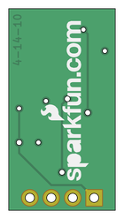

Contents
========

* [PRS9816 > OpAmp Breakout-LMV358](#prs9816--opamp-breakout-lmv358)
	* [Schematic](#schematic)
	* [PCB](#pcb)
	* [Interactive BOM](#interactive-bom)
	* [Images](#images)
	* [Tags](#tags)
  
![][im]
# PRS9816 > OpAmp Breakout-LMV358

- ID: PROJ-SPAR-9816-STAN-01
- Hex ID: PRS9816
- Name: Sparkfun
- Description: Sparkfun
- Long Link: [http://oom.lt/PROJ-SPAR-9816-STAN-01](http://oom.lt/PROJ-SPAR-9816-STAN-01)
- Short Link: [http://oom.lt/PRS9816](http://oom.lt/PRS9816)

## Schematic
  

## PCB
  

## Interactive BOM

- Interactive BOM page: [ibom.html](https://htmlpreview.github.io/?https://github.com/oomlout/oomlout_OOMP_projects/blob/main/PROJ-SPAR-9816-STAN-01/kicad/bom/ibom.html)

## Images
  
  

|bominteractivefront|bominteractiveback|kicadPcb3d|kicadPcb3dFront|kicadPcb3dBack|eagleImage|eagleSchemImage|pcbdraw|pcbdrawback|
| :---: | :---: | :---: | :---: | :---: | :---: | :---: | :---: | :---: |
||||||||||

## Tags

- hexID: PRS9816
- oompType: PROJ
- oompSize: SPAR
- oompColor: 9816
- oompDesc: STAN
- oompIndex: 01
- oompName: OpAmp Breakout-LMV358
- sources: All source files from https://github.com/sparkfun/OpAmp_Breakout-LMV358 (source licence details in srcLicense.md)
- linkBuyPage: https://www.sparkfun.com/products/9816
- oompID: PROJ-SPAR-9816-STAN-01
- rawParts: C1,100pF,CAP0402-CAP,0402-CAP,Capacitor,,
- rawParts: C2,0.1uF,CAP0402-CAP,0402-CAP,Capacitor,,
- rawParts: C3,100pF,CAP0402-CAP,0402-CAP,Capacitor,,
- rawParts: C5,1uF,CAP0402-CAP,0402-CAP,Capacitor,,
- rawParts: C6,1uF,CAP0402-CAP,0402-CAP,Capacitor,,
- rawParts: IC1,LMV358,OPAMP-DUALU,SO08,Operational Amplifier,,
- rawParts: JP1,,M04PTH,1X04,Header 4,,
- rawParts: R1,100K,RESISTOR0402-RES,0402-RES,Resistor,,
- rawParts: R2,10K,RESISTOR0402-RES,0402-RES,Resistor,,
- rawParts: R3,10K,RESISTOR0402-RES,0402-RES,Resistor,,
- rawParts: R4,100K,RESISTOR0402-RES,0402-RES,Resistor,,
- rawParts: R5,10K,RESISTOR0402-RES,0402-RES,Resistor,,
- rawParts: R6,10K,RESISTOR0402-RES,0402-RES,Resistor,,
- rawParts: R7,100K,TRIMPOTSMD,TRIMPOT-3MM,,,
- rawParts: R8,10K,RESISTOR0402,C0402,Resistor,,
- rawParts: R9,10K,RESISTOR0402,C0402,Resistor,,
- rawParts: U$3,LOGO-SFENEW,LOGO-SFENEW,SFE-NEW-WEBLOGO,Spark Fun Electronics PCB Logo,,

[im]: kicadPcb3d_450.png
