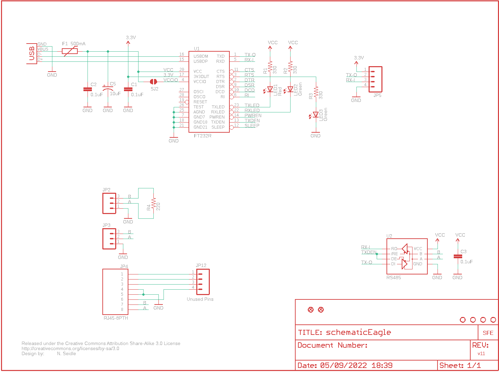
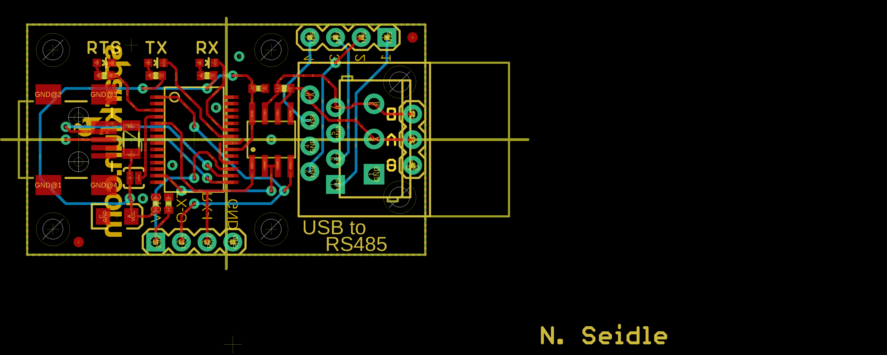
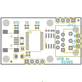
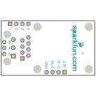
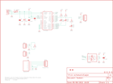
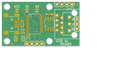
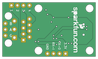

Contents
========

* [PRS9822 > USB RS-485 Converter](#prs9822--usb-rs-485-converter)
	* [Schematic](#schematic)
	* [PCB](#pcb)
	* [Interactive BOM](#interactive-bom)
	* [Images](#images)
	* [Tags](#tags)
  
![][im]
# PRS9822 > USB RS-485 Converter

- ID: PROJ-SPAR-9822-STAN-01
- Hex ID: PRS9822
- Name: Sparkfun
- Description: Sparkfun
- Long Link: [http://oom.lt/PROJ-SPAR-9822-STAN-01](http://oom.lt/PROJ-SPAR-9822-STAN-01)
- Short Link: [http://oom.lt/PRS9822](http://oom.lt/PRS9822)

## Schematic
  

## PCB
  

## Interactive BOM

- Interactive BOM page: [ibom.html](https://htmlpreview.github.io/?https://github.com/oomlout/oomlout_OOMP_projects/blob/main/PROJ-SPAR-9822-STAN-01/kicad/bom/ibom.html)

## Images
  
  

|bominteractivefront|bominteractiveback|kicadPcb3d|kicadPcb3dFront|kicadPcb3dBack|eagleImage|eagleSchemImage|pcbdraw|pcbdrawback|
| :---: | :---: | :---: | :---: | :---: | :---: | :---: | :---: | :---: |
||||||||||

## Tags

- hexID: PRS9822
- oompType: PROJ
- oompSize: SPAR
- oompColor: 9822
- oompDesc: STAN
- oompIndex: 01
- oompName: USB RS-485 Converter
- sources: All source files from https://github.com/sparkfun/USB_RS-485_Converter (source licence details in srcLicense.md)
- linkBuyPage: https://www.sparkfun.com/products/9822
- oompID: PROJ-SPAR-9822-STAN-01
- rawParts: C1,0.1uF,CAP0402-CAP,0402-CAP,Capacitor,,
- rawParts: C2,0.1uF,CAP0402-CAP,0402-CAP,Capacitor,,
- rawParts: C3,0.1uF,CAP0402-CAP,0402-CAP,Capacitor,,
- rawParts: C5,10uF,CAP_POL1206,EIA3216,Capacitor Polarized,,
- rawParts: F1,500mA,PTCSMD,PTC-1206,Resettable Fuse PTC,,
- rawParts: JP1,STAND-OFF,STAND-OFF,STAND-OFF,Stand Off,,
- rawParts: JP2,,M03SCREW,SCREWTERMINAL-3.5MM-3,Header 3,,
- rawParts: JP3,,M03PTH,1X03,Header 3,,
- rawParts: JP4,RJ45-8PTH,RJ45-8PTH,RJ45-8,RJ45 Jack,,
- rawParts: JP5,,M04PTH,1X04,Header 4,,
- rawParts: JP6,STAND-OFF,STAND-OFF,STAND-OFF,Stand Off,,
- rawParts: JP7,STAND-OFF,STAND-OFF,STAND-OFF,Stand Off,,
- rawParts: JP8,STAND-OFF,STAND-OFF,STAND-OFF,Stand Off,,
- rawParts: JP9,FIDUCIAL1X2,FIDUCIAL1X2,FIDUCIAL-1X2,Fiducial Alignment Points,,
- rawParts: JP10,FIDUCIAL1X2,FIDUCIAL1X2,FIDUCIAL-1X2,Fiducial Alignment Points,,
- rawParts: JP12,Unused Pins,M04PTH,1X04,Header 4,,
- rawParts: LED1,Red,LED0603,LED-0603,LEDs,,
- rawParts: LED2,Green,LED0603,LED-0603,LEDs,,
- rawParts: LED3,Green,LED0603,LED-0603,LEDs,,
- rawParts: R1,330,RESISTOR0402-RES,0402-RES,Resistor,,
- rawParts: R2,330,RESISTOR0402-RES,0402-RES,Resistor,,
- rawParts: R3,330,RESISTOR0402-RES,0402-RES,Resistor,,
- rawParts: R4,220,RESISTOR0402-RES,0402-RES,Resistor,,
- rawParts: SJ2,SOLDERJUMPERNC2,SOLDERJUMPERNC2,SJ_2S-NOTRACE,Solder Jumper,,
- rawParts: U$1,CREATIVE_COMMONS,CREATIVE_COMMONS,CREATIVE_COMMONS,,,
- rawParts: U$2,LOGO-SFENEW,LOGO-SFENEW,SFE-NEW-WEBLOGO,Spark Fun Electronics PCB Logo,,
- rawParts: U1,FT232R,FT232RLSSOP,SSOP28DB,USB UART,,
- rawParts: U2,RS485,RS485SOIC,SO08,,,
- rawParts: X2,USBSMD,USBSMD,USB-MINIB,USB Connectors,,

[im]: kicadPcb3d_450.png
