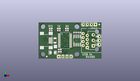
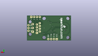
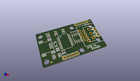

Contents
========

* [PROJ-SPAR-9822-STAN-01>USB RS-485 Converter](#proj-spar-9822-stan-01usb-rs-485-converter)
	* [Images](#images)
	* [Interactive BOM](#interactive-bom)
	* [OOMP Parts](#oomp-parts)
	* [Tags](#tags)
  
![][im]
# PROJ-SPAR-9822-STAN-01>USB RS-485 Converter

- ID: PROJ-SPAR-9822-STAN-01
- Hex ID: PRS9822
- Name: USB RS-485 Converter
- Description: 

## Images
  
  

|eagleImage|kicadPcb3dFront|kicadPcb3dBack|kicadPcb3d|
| :---: | :---: | :---: | :---: |
|||||

## Interactive BOM

- Interactive BOM page: [ibom.html](kicad/bom/ibom.html)

## OOMP Parts
  

|OOMP Parts|
| :---: |
|CAPE-0402-X-NF100-01, C1, 13.97, 5.08, 90,C1, 0.1uF, 0402-CAP, SparkFun, (0.55, 0.2), R90|
|CAPE-0402-X-NF100-01, C2, 12.7, 5.08, 90,C2, 0.1uF, 0402-CAP, SparkFun, (0.5, 0.2), R90|
|CAPE-0402-X-NF100-01, C3, 22.86, 16.509999999999998, 0,C3, 0.1uF, 0402-CAP, SparkFun, (0.9, 0.65), R0|
|CAPE-UNMATCHED-X-UNMATCHED-01, C5, 8.889999999999999, 3.8099999999999996, 0,C5, 10uF, EIA3216, SparkFun, (0.35, 0.15), R0|
|UNMATCHED-UNMATCHED-X-UNMATCHED-01, F1, 10.287, 11.43, 270,F1, 500mA, PTC-1206, SparkFun, (0.405, 0.45), R270|
|UNMATCHED-UNMATCHED-X-UNMATCHED-01, JP2, 34.29, 8.001, 90,JP2, SCREWTERMINAL-3.5MM-3, SparkFun, (1.35, 0.315), R90|
|UNMATCHED-UNMATCHED-X-UNMATCHED-01, JP3, 38.099999999999994, 8.889999999999999, 90,JP3, 1X03, SparkFun, (1.5, 0.35), R90|
|UNMATCHED-UNMATCHED-X-UNMATCHED-01, JP4, 36.83, 11.43, 90,JP4, RJ45-8PTH, RJ45-8, SparkFun, (1.45, 0.45), R90|
|UNMATCHED-UNMATCHED-X-UNMATCHED-01, JP5, 12.7, 1.27, 0,JP5, 1X04, SparkFun, (0.5, 0.05), R0|
|UNMATCHED-UNMATCHED-X-UNMATCHED-01, JP9, 5.08, 1.27, 0,JP9, FIDUCIAL1X2, FIDUCIAL-1X2, SparkFun, (0.2, 0.05), R0|
|UNMATCHED-UNMATCHED-X-UNMATCHED-01, JP10, 38.099999999999994, 21.59, 0,JP10, FIDUCIAL1X2, FIDUCIAL-1X2, SparkFun, (1.5, 0.85), R0|
|ERROR, JP12 Unused Pins, 0, 0, 0,JP12, Unused, Pins, 1X04, SparkFun, (1.4, 0.85), R180|
|UNMATCHED-0603-X-UNMATCHED-01, LED1, 17.779999999999998, 19.049999999999997, 270,LED1, Red, LED-0603, SparkFun, (0.7, 0.75), R270|
|UNMATCHED-0603-X-UNMATCHED-01, LED2, 12.7, 19.049999999999997, 270,LED2, Green, LED-0603, SparkFun, (0.5, 0.75), R270|
|UNMATCHED-0603-X-UNMATCHED-01, LED3, 7.619999999999999, 19.049999999999997, 270,LED3, Green, LED-0603, SparkFun, (0.3, 0.75), R270|
|RESE-0402-X-O331-01, R1, 17.779999999999998, 17.779999999999998, 0,R1, 330, 0402-RES, SparkFun, (0.7, 0.7), R0|
|RESE-0402-X-O331-01, R2, 12.7, 17.779999999999998, 0,R2, 330, 0402-RES, SparkFun, (0.5, 0.7), R0|
|RESE-0402-X-O331-01, R3, 7.619999999999999, 17.779999999999998, 0,R3, 330, 0402-RES, SparkFun, (0.3, 0.7), R0|
|RESE-0402-X-O221-01, R4, 25.4, 16.509999999999998, 180,R4, 220, 0402-RES, SparkFun, (1, 0.65), R180|
|UNMATCHED-UNMATCHED-X-UNMATCHED-01, SJ2, 10.540999999999999, 7.619999999999999, 180,SJ2, SOLDERJUMPERNC2, SJ_2S-NOTRACE, SparkFun, (0.415, 0.3), R180|
|UNMATCHED-UNMATCHED-X-UNMATCHED-01, U1, 16.509999999999998, 11.43, 270,U1, FT232R, SSOP28DB, SparkFun, (0.65, 0.45), R270|
|UNMATCHED-UNMATCHED-X-UNMATCHED-01, U2, 24.13, 11.43, 0,U2, RS485, SO08, SparkFun, (0.95, 0.45), R0|
|UNMATCHED-UNMATCHED-X-UNMATCHED-01, X2, 5.08, 11.43, 0,X2, USBSMD, USB-MINIB, SparkFun, (0.2, 0.45), R0|

## Tags

- hexID: PRS9822
- oompType: PROJ
- oompSize: SPAR
- oompColor: 9822
- oompDesc: STAN
- oompIndex: 01
- oompName: USB RS-485 Converter
- sources: All source files from https://github.com/sparkfun/USB_RS-485_Converter (source licence details in srcLicense.md)
- linkBuyPage: https://www.sparkfun.com/products/9822
- oompPart: CAPE-0402-X-NF100-01, C1, 13.97, 5.08, 90
- oompPart: CAPE-0402-X-NF100-01, C2, 12.7, 5.08, 90
- oompPart: CAPE-0402-X-NF100-01, C3, 22.86, 16.509999999999998, 0
- oompPart: CAPE-UNMATCHED-X-UNMATCHED-01, C5, 8.889999999999999, 3.8099999999999996, 0
- oompPart: UNMATCHED-UNMATCHED-X-UNMATCHED-01, F1, 10.287, 11.43, 270
- oompPart: UNMATCHED-UNMATCHED-X-UNMATCHED-01, JP2, 34.29, 8.001, 90
- oompPart: UNMATCHED-UNMATCHED-X-UNMATCHED-01, JP3, 38.099999999999994, 8.889999999999999, 90
- oompPart: UNMATCHED-UNMATCHED-X-UNMATCHED-01, JP4, 36.83, 11.43, 90
- oompPart: UNMATCHED-UNMATCHED-X-UNMATCHED-01, JP5, 12.7, 1.27, 0
- oompPart: UNMATCHED-UNMATCHED-X-UNMATCHED-01, JP9, 5.08, 1.27, 0
- oompPart: UNMATCHED-UNMATCHED-X-UNMATCHED-01, JP10, 38.099999999999994, 21.59, 0
- oompPart: ERROR, JP12 Unused Pins, 0, 0, 0
- oompPart: UNMATCHED-0603-X-UNMATCHED-01, LED1, 17.779999999999998, 19.049999999999997, 270
- oompPart: UNMATCHED-0603-X-UNMATCHED-01, LED2, 12.7, 19.049999999999997, 270
- oompPart: UNMATCHED-0603-X-UNMATCHED-01, LED3, 7.619999999999999, 19.049999999999997, 270
- oompPart: RESE-0402-X-O331-01, R1, 17.779999999999998, 17.779999999999998, 0
- oompPart: RESE-0402-X-O331-01, R2, 12.7, 17.779999999999998, 0
- oompPart: RESE-0402-X-O331-01, R3, 7.619999999999999, 17.779999999999998, 0
- oompPart: RESE-0402-X-O221-01, R4, 25.4, 16.509999999999998, 180
- oompPart: UNMATCHED-UNMATCHED-X-UNMATCHED-01, SJ2, 10.540999999999999, 7.619999999999999, 180
- oompPart: UNMATCHED-UNMATCHED-X-UNMATCHED-01, U1, 16.509999999999998, 11.43, 270
- oompPart: UNMATCHED-UNMATCHED-X-UNMATCHED-01, U2, 24.13, 11.43, 0
- oompPart: UNMATCHED-UNMATCHED-X-UNMATCHED-01, X2, 5.08, 11.43, 0
- rawPart: C1, 0.1uF, 0402-CAP, SparkFun, (0.55, 0.2), R90
- rawPart: C2, 0.1uF, 0402-CAP, SparkFun, (0.5, 0.2), R90
- rawPart: C3, 0.1uF, 0402-CAP, SparkFun, (0.9, 0.65), R0
- rawPart: C5, 10uF, EIA3216, SparkFun, (0.35, 0.15), R0
- rawPart: F1, 500mA, PTC-1206, SparkFun, (0.405, 0.45), R270
- rawPart: JP2, SCREWTERMINAL-3.5MM-3, SparkFun, (1.35, 0.315), R90
- rawPart: JP3, 1X03, SparkFun, (1.5, 0.35), R90
- rawPart: JP4, RJ45-8PTH, RJ45-8, SparkFun, (1.45, 0.45), R90
- rawPart: JP5, 1X04, SparkFun, (0.5, 0.05), R0
- rawPart: JP9, FIDUCIAL1X2, FIDUCIAL-1X2, SparkFun, (0.2, 0.05), R0
- rawPart: JP10, FIDUCIAL1X2, FIDUCIAL-1X2, SparkFun, (1.5, 0.85), R0
- rawPart: JP12, Unused, Pins, 1X04, SparkFun, (1.4, 0.85), R180
- rawPart: LED1, Red, LED-0603, SparkFun, (0.7, 0.75), R270
- rawPart: LED2, Green, LED-0603, SparkFun, (0.5, 0.75), R270
- rawPart: LED3, Green, LED-0603, SparkFun, (0.3, 0.75), R270
- rawPart: R1, 330, 0402-RES, SparkFun, (0.7, 0.7), R0
- rawPart: R2, 330, 0402-RES, SparkFun, (0.5, 0.7), R0
- rawPart: R3, 330, 0402-RES, SparkFun, (0.3, 0.7), R0
- rawPart: R4, 220, 0402-RES, SparkFun, (1, 0.65), R180
- rawPart: SJ2, SOLDERJUMPERNC2, SJ_2S-NOTRACE, SparkFun, (0.415, 0.3), R180
- rawPart: U1, FT232R, SSOP28DB, SparkFun, (0.65, 0.45), R270
- rawPart: U2, RS485, SO08, SparkFun, (0.95, 0.45), R0
- rawPart: X2, USBSMD, USB-MINIB, SparkFun, (0.2, 0.45), R0

[im]: kicadPcb3d_450.png
