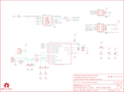

Contents
========

* [PRS9825 > Pocket AVR Programmer](#prs9825--pocket-avr-programmer)
	* [Schematic](#schematic)
	* [PCB](#pcb)
	* [Interactive BOM](#interactive-bom)
	* [Images](#images)
	* [Tags](#tags)
  
![][im]
# PRS9825 > Pocket AVR Programmer

- ID: PROJ-SPAR-9825-STAN-01
- Hex ID: PRS9825
- Name: Sparkfun
- Description: Sparkfun
- Long Link: [http://oom.lt/PROJ-SPAR-9825-STAN-01](http://oom.lt/PROJ-SPAR-9825-STAN-01)
- Short Link: [http://oom.lt/PRS9825](http://oom.lt/PRS9825)

## Schematic
  

## PCB
  

## Interactive BOM

- Interactive BOM page: [ibom.html](https://htmlpreview.github.io/?https://github.com/oomlout/oomlout_OOMP_projects/blob/main/PROJ-SPAR-9825-STAN-01/kicad/bom/ibom.html)

## Images
  
  

|bominteractivefront|bominteractiveback|kicadPcb3d|kicadPcb3dFront|kicadPcb3dBack|eagleImage|eagleSchemImage|pcbdraw|pcbdrawback|
| :---: | :---: | :---: | :---: | :---: | :---: | :---: | :---: | :---: |
||||||||||

## Tags

- hexID: PRS9825
- oompType: PROJ
- oompSize: SPAR
- oompColor: 9825
- oompDesc: STAN
- oompIndex: 01
- oompName: Pocket AVR Programmer
- sources: All source files from https://github.com/sparkfun/Pocket_AVR_Programmer (source licence details in srcLicense.md)
- linkBuyPage: https://www.sparkfun.com/products/9825
- oompID: PROJ-SPAR-9825-STAN-01
- rawParts: C1,10uF,CAP_POL1206,EIA3216,Capacitor Polarized,,
- rawParts: C2,0.1uF,CAP0603-CAP,0603-CAP,Capacitor,,
- rawParts: C3,22pF,CAP0603-CAP,0603-CAP,Capacitor,,
- rawParts: C4,22pF,CAP0603-CAP,0603-CAP,Capacitor,,
- rawParts: D1,Blue,LED0603,LED-0603,LEDs,,
- rawParts: D2,Red,LED0603,LED-0603,LEDs,,
- rawParts: D3,Blue,LED0603,LED-0603,LEDs,,
- rawParts: F1,500mA,PTCSMD-W,PTC-1206-WIDE,Resettable Fuse PTC,,
- rawParts: FRAME1,FRAME-LETTER,FRAME-LETTER,CREATIVE_COMMONS,Schematic Frame,,
- rawParts: JP1,Power Select,M02PTH,1X02,Header 2,,
- rawParts: JP2,AVR_SPI_PRG_6PTH,AVR_SPI_PRG_6PTH,2X3,AVR ISP 6 Pin,,
- rawParts: JP3,AVR_SPI_PROG2SHROUDED_SMD,AVR_SPI_PROG2SHROUDED_SMD,2X5-SHROUDED_SMD,AVR ICSP Header,,
- rawParts: LED1,Blue,LED0603,LED-0603,LEDs,,
- rawParts: LED2,Blue,LED0603,LED-0603,LEDs,,
- rawParts: LOGO1,OSHW-LOGOM,OSHW-LOGOM,OSHW-LOGO-M,Open Source Hardware Logo This logo indicates the piece of hardware it is found on incorporates a OSHW license and/or adheres to the definition of open source hardware found here: http://freedomdefined.org/OSHW,,
- rawParts: Q1,12 MHz,CRYSTAL5X3,CRYSTAL-SMD-5X3,Crystals,,
- rawParts: R1,27,RESISTOR0603-RES,0603-RES,Resistor,,
- rawParts: R2,27,RESISTOR0603-RES,0603-RES,Resistor,,
- rawParts: R3,1.5K,RESISTOR0603-RES,0603-RES,Resistor,,
- rawParts: R4,1K,RESISTOR0603-RES,0603-RES,Resistor,,
- rawParts: R5,1K,RESISTOR0603-RES,0603-RES,Resistor,,
- rawParts: R6,1K,RESISTOR0603-RES,0603-RES,Resistor,,
- rawParts: R7,100,RESISTOR0603-RES,0603-RES,Resistor,,
- rawParts: R8,100,RESISTOR0603-RES,0603-RES,Resistor,,
- rawParts: R9,1K,RESISTOR0603-RES,0603-RES,Resistor,,
- rawParts: R10,22K,RESISTOR0603-RES,0603-RES,Resistor,,
- rawParts: S1,Power Select,SWITCH-SPSTSMD,AYZ0202,SPST Switch,,
- rawParts: U$1,STAND-OFF,STAND-OFF,STAND-OFF,Stand Off,,
- rawParts: U$2,LOGO-SFESK,LOGO-SFESK,SFE-LOGO-FLAME,Spark Fun Electronics PCB Logo,,
- rawParts: U$3,STAND-OFF,STAND-OFF,STAND-OFF,Stand Off,,
- rawParts: U$4,STAND-OFF,STAND-OFF,STAND-OFF,Stand Off,,
- rawParts: U$5,STAND-OFF,STAND-OFF,STAND-OFF,Stand Off,,
- rawParts: U$6,FIDUCIAL1X2,FIDUCIAL1X2,FIDUCIAL-1X2,Fiducial Alignment Points,,
- rawParts: U$7,FIDUCIAL1X2,FIDUCIAL1X2,FIDUCIAL-1X2,Fiducial Alignment Points,,
- rawParts: U$8,LOGO-SFENEW,LOGO-SFENEW,SFE-NEW-WEBLOGO,Spark Fun Electronics PCB Logo,,
- rawParts: U1,ATTINY2313-20S,ATTINY2313-20S,SO20L,MICROCONTROLLER,,
- rawParts: U2,74ACT125D,74ACT125D,SO014,Quad Buffer with 3-State Outputs-,,
- rawParts: X2,USBSMD,USBSMD,USB-MINIB,USB Connectors,,

[im]: kicadPcb3d_450.png
