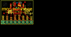
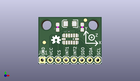
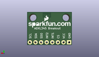
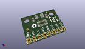

Contents
========

* [PROJ-SPAR-9836-STAN-01>ADXL345 Breakout](#proj-spar-9836-stan-01adxl345-breakout)
	* [Images](#images)
	* [Interactive BOM](#interactive-bom)
	* [OOMP Parts](#oomp-parts)
	* [Tags](#tags)
  
![][im]
# PROJ-SPAR-9836-STAN-01>ADXL345 Breakout

- ID: PROJ-SPAR-9836-STAN-01
- Hex ID: PRS9836
- Name: ADXL345 Breakout
- Description: 

## Images
  
  

|eagleImage|kicadPcb3dFront|kicadPcb3dBack|kicadPcb3d|
| :---: | :---: | :---: | :---: |
|||||

## Interactive BOM

- Interactive BOM page: [ibom.html](kicad/bom/ibom.html)

## OOMP Parts
  

|OOMP Parts|
| :---: |
|<table><tr><td></td><td> C1</td><td>[CAPC-0603-X-NF100-V50 SMD (0603) 100 nF Capacitor (Ceramic) 50v](https://github.com/oomlout/oomlout_OOMP_parts/tree/main/CAPC-0603-X-NF100-V50/)</td><td>[C6N100](https://github.com/oomlout/oomlout_OOMP_parts/tree/main/CAPC-0603-X-NF100-V50/)</td></tr></table>|
|CAPC-UNMATCHED-X-UNMATCHED-01, C2, 10.16, 13.081, 180,C2, 10uF, EIA3216, SparkFun, (0.4, 0.515), R180|
|UNMATCHED-0603-X-NF100-01, CIO, 14.097000000000001, 11.937999999999999, 90,CIO, 0.1uF, 0603-CAP, SparkFun, (0.555, 0.47), R90|
|<table><tr><td></td><td> JP1</td><td>[HEAD-I01-X-PI08-01 2.54 mm 8 Pin Header](https://github.com/oomlout/oomlout_OOMP_parts/tree/main/HEAD-I01-X-PI08-01/)</td><td>[H08](https://github.com/oomlout/oomlout_OOMP_parts/tree/main/HEAD-I01-X-PI08-01/)</td></tr></table>|
|HEAD-I01-X-PI2-01, JP4, 1.9049999999999998, 6.985, 0,JP4, FIDUCIAL1X2, FIDUCIAL-1X2, SparkFun-Aesthetics, (0.075, 0.275), R0|
|HEAD-I01-X-PI2-01, JP5, 15.112999999999998, 14.224, 0,JP5, FIDUCIAL1X2, FIDUCIAL-1X2, SparkFun-Aesthetics, (0.595, 0.56), R0|
|UNMATCHED-UNMATCHED-X-UNMATCHED-01, U2, 10.2616, 8.102599999999999, 0,U2, ADXL345PATRICK, LGA14_1:1_PATRICK, Testing, (0.404, 0.319), R0|

## Tags

- hexID: PRS9836
- oompType: PROJ
- oompSize: SPAR
- oompColor: 9836
- oompDesc: STAN
- oompIndex: 01
- oompName: ADXL345 Breakout
- sources: All source files from https://github.com/sparkfun/ADXL345_Breakout (source licence details in srcLicense.md)
- linkBuyPage: https://www.sparkfun.com/products/9836
- oompPart: CAPC-0603-X-NF100-V50, C1, 6.1975999999999996, 11.937999999999999, 90
- oompPart: CAPC-UNMATCHED-X-UNMATCHED-01, C2, 10.16, 13.081, 180
- oompPart: UNMATCHED-0603-X-NF100-01, CIO, 14.097000000000001, 11.937999999999999, 90
- oompPart: HEAD-I01-X-PI08-01, JP1, 1.27, 1.27, 0
- oompPart: HEAD-I01-X-PI2-01, JP4, 1.9049999999999998, 6.985, 0
- oompPart: HEAD-I01-X-PI2-01, JP5, 15.112999999999998, 14.224, 0
- oompPart: UNMATCHED-UNMATCHED-X-UNMATCHED-01, U2, 10.2616, 8.102599999999999, 0
- rawPart: C1, 0.1uF, 0603-CAP, SparkFun, (0.244, 0.47), R90
- rawPart: C2, 10uF, EIA3216, SparkFun, (0.4, 0.515), R180
- rawPart: CIO, 0.1uF, 0603-CAP, SparkFun, (0.555, 0.47), R90
- rawPart: JP1, 1X08, SparkFun, (0.05, 0.05), R0
- rawPart: JP4, FIDUCIAL1X2, FIDUCIAL-1X2, SparkFun-Aesthetics, (0.075, 0.275), R0
- rawPart: JP5, FIDUCIAL1X2, FIDUCIAL-1X2, SparkFun-Aesthetics, (0.595, 0.56), R0
- rawPart: U2, ADXL345PATRICK, LGA14_1:1_PATRICK, Testing, (0.404, 0.319), R0
- oompID: PROJ-SPAR-9836-STAN-01

[im]: kicadPcb3d_450.png
