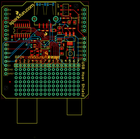
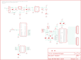

Contents
========

* [PRS9947 > USB Host Shield](#prs9947--usb-host-shield)
	* [Schematic](#schematic)
	* [PCB](#pcb)
	* [OOMP Parts](#oomp-parts)
	* [Images](#images)
	* [Tags](#tags)
  
![][im]
# PRS9947 > USB Host Shield

- ID: PROJ-SPAR-9947-STAN-01
- Hex ID: PRS9947
- Name: Sparkfun
- Description: Sparkfun
- Long Link: [http://oom.lt/PROJ-SPAR-9947-STAN-01](http://oom.lt/PROJ-SPAR-9947-STAN-01)
- Short Link: [http://oom.lt/PRS9947](http://oom.lt/PRS9947)

## Schematic
  

## PCB
  

## OOMP Parts
  

|OOMP ID|Name|Identifier|
| :---: | :---: | :---: |
|[CAPC-0402-X-NF100-V10](https://github.com/oomlout/oomlout_OOMP_parts/tree/main/CAPC-0402-X-NF100-V10/)|[SMD (0402) 100 nF Capacitor (Ceramic) 10v](https://github.com/oomlout/oomlout_OOMP_parts/tree/main/CAPC-0402-X-NF100-V10/)|[C1, C2, C3, C8, C9, C11](https://github.com/oomlout/oomlout_OOMP_parts/tree/main/CAPC-0402-X-NF100-V10/)|
|CAPT-3216-X-UF10-01||C4, C7, C10|
|[CAPC-0402-X-PF18-V50](https://github.com/oomlout/oomlout_OOMP_parts/tree/main/CAPC-0402-X-PF18-V50/)|[SMD (0402) 18 pF Capacitor (Ceramic) 50v](https://github.com/oomlout/oomlout_OOMP_parts/tree/main/CAPC-0402-X-PF18-V50/)|[C5, C6](https://github.com/oomlout/oomlout_OOMP_parts/tree/main/CAPC-0402-X-PF18-V50/)|
|REFU-1206-X-UNMATCHED-01||F1|
|UNMATCHED-UNMATCHED-X-UNMATCHED-01||IC1, Q2, S1, S2, U1, U2, U4, X2|
|[HEAD-I01-X-PI08-01](https://github.com/oomlout/oomlout_OOMP_parts/tree/main/HEAD-I01-X-PI08-01/)|[2.54 mm 8 Pin Header](https://github.com/oomlout/oomlout_OOMP_parts/tree/main/HEAD-I01-X-PI08-01/)|[JP2, JP3](https://github.com/oomlout/oomlout_OOMP_parts/tree/main/HEAD-I01-X-PI08-01/)|
|[LEDS-0603-R-STAN-01](https://github.com/oomlout/oomlout_OOMP_parts/tree/main/LEDS-0603-R-STAN-01/)|[SMD (0603) Red LED](https://github.com/oomlout/oomlout_OOMP_parts/tree/main/LEDS-0603-R-STAN-01/)|[LED1](https://github.com/oomlout/oomlout_OOMP_parts/tree/main/LEDS-0603-R-STAN-01/)|
|RESE-0402-X-O330-01||R1, R2|
|[RESE-0402-X-O222-01](https://github.com/oomlout/oomlout_OOMP_parts/tree/main/RESE-0402-X-O222-01/)|[SMD (0402) 2.2k Ohm Resistor](https://github.com/oomlout/oomlout_OOMP_parts/tree/main/RESE-0402-X-O222-01/)|[R7](https://github.com/oomlout/oomlout_OOMP_parts/tree/main/RESE-0402-X-O222-01/)|
|RESE-0402-X-O241-01||R8|
|RESE-0402-X-O711-01||R9|
|RESE-0402-X-O331-01||R14|
|UNMATCHED-SO235-X-UNMATCHED-01||U3|

## Images
  
  

|kicadPcb3d|kicadPcb3dFront|kicadPcb3dBack|eagleImage|eagleSchemImage|
| :---: | :---: | :---: | :---: | :---: |
||||||

## Tags

- hexID: PRS9947
- oompType: PROJ
- oompSize: SPAR
- oompColor: 9947
- oompDesc: STAN
- oompIndex: 01
- oompName: USB Host Shield
- sources: All source files from https://github.com/sparkfun/USB_Host_Shield (source licence details in srcLicense.md)
- linkBuyPage: https://www.sparkfun.com/products/9947
- oompID: PROJ-SPAR-9947-STAN-01
- oompParts: C1,CAPC-0402-X-NF100-V10
- oompParts: C2,CAPC-0402-X-NF100-V10
- oompParts: C3,CAPC-0402-X-NF100-V10
- oompParts: C4,CAPT-3216-X-UF10-01
- oompParts: C5,CAPC-0402-X-PF18-V50
- oompParts: C6,CAPC-0402-X-PF18-V50
- oompParts: C7,CAPT-3216-X-UF10-01
- oompParts: C8,CAPC-0402-X-NF100-V10
- oompParts: C9,CAPC-0402-X-NF100-V10
- oompParts: C10,CAPT-3216-X-UF10-01
- oompParts: C11,CAPC-0402-X-NF100-V10
- oompParts: F1,REFU-1206-X-UNMATCHED-01
- oompParts: IC1,UNMATCHED-UNMATCHED-X-UNMATCHED-01
- oompParts: JP2,HEAD-I01-X-PI08-01
- oompParts: JP3,HEAD-I01-X-PI08-01
- oompParts: LED1,LEDS-0603-R-STAN-01
- oompParts: Q2,UNMATCHED-UNMATCHED-X-UNMATCHED-01
- oompParts: R1,RESE-0402-X-O330-01
- oompParts: R2,RESE-0402-X-O330-01
- oompParts: R7,RESE-0402-X-O222-01
- oompParts: R8,RESE-0402-X-O241-01
- oompParts: R9,RESE-0402-X-O711-01
- oompParts: R14,RESE-0402-X-O331-01
- oompParts: S1,UNMATCHED-UNMATCHED-X-UNMATCHED-01
- oompParts: S2,UNMATCHED-UNMATCHED-X-UNMATCHED-01
- oompParts: U1,UNMATCHED-UNMATCHED-X-UNMATCHED-01
- oompParts: U2,UNMATCHED-UNMATCHED-X-UNMATCHED-01
- oompParts: U3,UNMATCHED-SO235-X-UNMATCHED-01
- oompParts: U4,UNMATCHED-UNMATCHED-X-UNMATCHED-01
- oompParts: X2,UNMATCHED-UNMATCHED-X-UNMATCHED-01
- rawParts: C1,0.1uF,CAP0402-CAP,0402-CAP,Capacitor,,
- rawParts: C2,0.1uF,CAP0402-CAP,0402-CAP,Capacitor,,
- rawParts: C3,0.1uF,CAP0402-CAP,0402-CAP,Capacitor,,
- rawParts: C4,10uF,CAP_POL1206,EIA3216,Capacitor Polarized,,
- rawParts: C5,18pF,CAP0402-CAP,0402-CAP,Capacitor,,
- rawParts: C6,18pF,CAP0402-CAP,0402-CAP,Capacitor,,
- rawParts: C7,10uF,CAP_POL1206,EIA3216,Capacitor Polarized,,
- rawParts: C8,0.1uF,CAP0402-CAP,0402-CAP,Capacitor,,
- rawParts: C9,0.1uF,CAP0402-CAP,0402-CAP,Capacitor,,
- rawParts: C10,10uF,CAP_POL1206,EIA3216,Capacitor Polarized,,
- rawParts: C11,0.1uF,CAP0402-CAP,0402-CAP,Capacitor,,
- rawParts: F1,PTCSMD,PTCSMD,PTC-1206,Resettable Fuse PTC,,
- rawParts: IC1,lm1117,V_REG_LM1117SOT223,SOT223,Voltage Regulator LM1117,,
- rawParts: JP2,GPIN,M08,1X08,Header 8,,
- rawParts: JP3,GPOUT,M08,1X08,Header 8,,
- rawParts: JP4,LOGO-SFESK,LOGO-SFESK,SFE-LOGO-FLAME,Spark Fun Electronics PCB Logo,,
- rawParts: JP5,LOGO-SFENEW,LOGO-SFENEW,SFE-NEW-WEBLOGO,Spark Fun Electronics PCB Logo,,
- rawParts: JP6,FIDUCIAL1X2,FIDUCIAL1X2,FIDUCIAL-1X2,Fiducial Alignment Points,,
- rawParts: JP7,FIDUCIAL1X2,FIDUCIAL1X2,FIDUCIAL-1X2,Fiducial Alignment Points,,
- rawParts: LED1,red,LED0603,LED-0603,LEDs,,
- rawParts: Q2,12MHz,CRYSTAL5X3,CRYSTAL-SMD-5X3,Crystals,,
- rawParts: R1,33,RESISTOR0402-RES,0402-RES,Resistor,,
- rawParts: R2,33,RESISTOR0402-RES,0402-RES,Resistor,,
- rawParts: R7,2.2K,RESISTOR0402-RES,0402-RES,Resistor,,
- rawParts: R8,240,RESISTOR0402-RES,0402-RES,Resistor,,
- rawParts: R9,715,RESISTOR0402-RES,0402-RES,Resistor,,
- rawParts: R14,330,RESISTOR0402-RES,0402-RES,Resistor,,
- rawParts: S1,SWITCH-DPDTSMD,SWITCH-DPDTSMD,AYZ0202,DPDT Version of the COM-00597,,
- rawParts: S2,SWITCH-SMD,SWITCH-MOMENTARY-2SMD,TACTILE_SWITCH_SMD,,,
- rawParts: U$3,CREATIVE_COMMONS,CREATIVE_COMMONS,CREATIVE_COMMONS,,,
- rawParts: U1,ARDUINO_SHIELD,ARDUINO_SHIELDLABEL,DUEMILANOVE_SHIELD,,,
- rawParts: U2,MAX3421E,MAX3421ESMD,TQFP32-5MM,USB Peripheral/Host Controller w/ SPI,,
- rawParts: U3,3.3V_REG,V_REG_LDOSMD,SOT23-5,Voltage Regulator LDO,,
- rawParts: U4,HEX_CONVERTER,HEX_CONVERTER,SO016,,,
- rawParts: X2,USB_,USB_,USB-A-S-SILK-FEMALE,USB Connectors,,

[im]: kicadPcb3d_450.png
