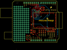

Contents
========

* [PROJ-SPAR-9954-STAN-01>WiFly-Shield](#proj-spar-9954-stan-01wifly-shield)
	* [Images](#images)
	* [OOMP Parts](#oomp-parts)
	* [Tags](#tags)
  
![][im]
# PROJ-SPAR-9954-STAN-01>WiFly-Shield

- ID: PROJ-SPAR-9954-STAN-01
- Hex ID: PRS9954
- Name: WiFly-Shield
- Description: 

## Images
  
  

|eagleImage|kicadPcb3dFront|kicadPcb3dBack|kicadPcb3d|
| :---: | :---: | :---: | :---: |
|||||

## OOMP Parts
  

|OOMP Parts|
| :---: |
|CAPC-0402-X-NF100-V50, C1, 26.669999999999998, 10.16, 180,C1, 0.1uF, 0402-CAP, SparkFun, (1.05, 0.4), R180|
|CAPC-UNMATCHED-X-UNMATCHED-01, C2, 24.13, 13.97, 90,C2, 10uF, EIA3216, SparkFun, (0.95, 0.55), R90|
|CAPC-0402-X-UNMATCHED-01, C3, 40.64, 44.449999999999996, 90,C3, 18pF, 0402-CAP, SparkFun, (1.6, 1.75), R90|
|CAPC-0402-X-UNMATCHED-01, C4, 40.64, 41.91, 90,C4, 18pF, 0402-CAP, SparkFun, (1.6, 1.65), R90|
|HEAD-I01-X-PI2-01, JP7, 31.75, 11.43, 0,JP7, FIDUCIAL1X2, FIDUCIAL-1X2, SparkFun, (1.25, 0.45), R0|
|HEAD-I01-X-PI2-01, JP8, 22.86, 44.449999999999996, 0,JP8, FIDUCIAL1X2, FIDUCIAL-1X2, SparkFun, (0.9, 1.75), R0|
|UNMATCHED-0603-X-UNMATCHED-01, LED1, 34.29, 15.239999999999998, 180,LED1, BLUE, LED-0603, SparkFun, (1.35, 0.6), R180|
|UNMATCHED-0603-X-UNMATCHED-01, LED2, 36.83, 15.239999999999998, 180,LED2, YELLOW, LED-0603, SparkFun, (1.45, 0.6), R180|
|UNMATCHED-0603-X-UNMATCHED-01, LED3, 39.37, 15.239999999999998, 180,LED3, RED, LED-0603, SparkFun, (1.55, 0.6), R180|
|UNMATCHED-0603-X-UNMATCHED-01, LED4, 41.91, 15.239999999999998, 180,LED4, GREEN, LED-0603, SparkFun, (1.65, 0.6), R180|
|UNMATCHED-UNMATCHED-X-UNMATCHED-01, Q1, 38.099999999999994, 43.18, 270,Q1, 14.7456MHz, CRYSTAL-SMD-5X3, SparkFun, (1.5, 1.7), R270|
|RESE-0402-X-O223-01, R1, 54.60999999999999, 16.509999999999998, 0,R1, 22k, 0402-RES, SparkFun, (2.15, 0.65), R0|
|<table><tr><td></td><td> R2</td><td>[RESE-0402-X-O103-01 SMD (0402) 10k Ohm Resistor](https://github.com/oomlout/oomlout_OOMP_parts/tree/main/RESE-0402-X-O103-01/)</td><td>[R42103](https://github.com/oomlout/oomlout_OOMP_parts/tree/main/RESE-0402-X-O103-01/)</td></tr></table>|
|RESE-0402-X-O493-01, R3, 24.13, 22.86, 270,R3, 49k, 0402-RES, SparkFun, (0.95, 0.9), R270|
|RESE-0402-X-O221-01, R4, 34.29, 12.7, 90,R4, 220, 0402-RES, SparkFun, (1.35, 0.5), R90|
|RESE-0402-X-O221-01, R5, 36.83, 12.7, 90,R5, 220, 0402-RES, SparkFun, (1.45, 0.5), R90|
|RESE-0402-X-O221-01, R6, 39.37, 12.7, 90,R6, 220, 0402-RES, SparkFun, (1.55, 0.5), R90|
|RESE-0402-X-O221-01, R7, 41.91, 12.7, 90,R7, 220, 0402-RES, SparkFun, (1.65, 0.5), R90|
|RESE-0402-X-UNMATCHED-01, R8, 35.687, 39.37, 180,R8, 1k, 0402-RES, SparkFun, (1.405, 1.55), R180|
|RESE-0402-X-UNMATCHED-01, R9, 35.559999999999995, 43.18, 270,R9, 1M, 0402-RES, SparkFun, (1.4, 1.7), R270|
|RESE-0402-X-UNMATCHED-01, R10, 24.13, 33.019999999999996, 270,R10, 1k, 0402-RES, SparkFun, (0.95, 1.3), R270|
|UNMATCHED-UNMATCHED-X-UNMATCHED-01, S1, 20.32, 6.35, 90,S1, TACTILE_SWITCH_SMD, SparkFun, (0.8, 0.25), R90|
|UNMATCHED-UNMATCHED-X-UNMATCHED-01, U1, 0.0, 53.339999999999996, 270,U1, ARDUINO_SHIELD, DUEMILANOVE_SHIELD, SparkFun, (0, 2.1), R270|
|UNMATCHED-UNMATCHED-X-UNMATCHED-01, U2, 26.669999999999998, 38.099999999999994, 270,U2, WIFLY_GSX, WIFLY_GSX, SparkFun, (1.05, 1.5), R270|
|UNMATCHED-UNMATCHED-X-UNMATCHED-01, U3, 31.75, 43.18, 180,U3, SC16IS750, QFN-24, SparkFun, (1.25, 1.7), R180|
|UNMATCHED-UNMATCHED-X-UNMATCHED-01, U4, 27.94, 13.97, 0,U4, 3.3V, SOT23-5, SparkFun, (1.1, 0.55), R0|

## Tags

- hexID: PRS9954
- oompType: PROJ
- oompSize: SPAR
- oompColor: 9954
- oompDesc: STAN
- oompIndex: 01
- oompName: WiFly-Shield
- sources: All source files from https://github.com/sparkfun/WiFly-Shield (source licence details in srcLicense.md)
- linkBuyPage: https://www.sparkfun.com/products/9954
- oompPart: CAPC-0402-X-NF100-V50, C1, 26.669999999999998, 10.16, 180
- oompPart: CAPC-UNMATCHED-X-UNMATCHED-01, C2, 24.13, 13.97, 90
- oompPart: CAPC-0402-X-UNMATCHED-01, C3, 40.64, 44.449999999999996, 90
- oompPart: CAPC-0402-X-UNMATCHED-01, C4, 40.64, 41.91, 90
- oompPart: SKIP-UNMATCHED-X-UNMATCHED-01, JP1, 48.26, 13.97, 270
- oompPart: SKIP-UNMATCHED-X-UNMATCHED-01, JP2, 50.8, 13.97, 270
- oompPart: SKIP-UNMATCHED-X-UNMATCHED-01, JP3, 53.339999999999996, 13.97, 270
- oompPart: SKIP-UNMATCHED-X-UNMATCHED-01, JP4, 45.72, 13.97, 270
- oompPart: HEAD-I01-X-PI2-01, JP7, 31.75, 11.43, 0
- oompPart: HEAD-I01-X-PI2-01, JP8, 22.86, 44.449999999999996, 0
- oompPart: UNMATCHED-0603-X-UNMATCHED-01, LED1, 34.29, 15.239999999999998, 180
- oompPart: UNMATCHED-0603-X-UNMATCHED-01, LED2, 36.83, 15.239999999999998, 180
- oompPart: UNMATCHED-0603-X-UNMATCHED-01, LED3, 39.37, 15.239999999999998, 180
- oompPart: UNMATCHED-0603-X-UNMATCHED-01, LED4, 41.91, 15.239999999999998, 180
- oompPart: UNMATCHED-UNMATCHED-X-UNMATCHED-01, Q1, 38.099999999999994, 43.18, 270
- oompPart: RESE-0402-X-O223-01, R1, 54.60999999999999, 16.509999999999998, 0
- oompPart: RESE-0402-X-O103-01, R2, 52.06999999999999, 16.509999999999998, 180
- oompPart: RESE-0402-X-O493-01, R3, 24.13, 22.86, 270
- oompPart: RESE-0402-X-O221-01, R4, 34.29, 12.7, 90
- oompPart: RESE-0402-X-O221-01, R5, 36.83, 12.7, 90
- oompPart: RESE-0402-X-O221-01, R6, 39.37, 12.7, 90
- oompPart: RESE-0402-X-O221-01, R7, 41.91, 12.7, 90
- oompPart: RESE-0402-X-UNMATCHED-01, R8, 35.687, 39.37, 180
- oompPart: RESE-0402-X-UNMATCHED-01, R9, 35.559999999999995, 43.18, 270
- oompPart: RESE-0402-X-UNMATCHED-01, R10, 24.13, 33.019999999999996, 270
- oompPart: UNMATCHED-UNMATCHED-X-UNMATCHED-01, S1, 20.32, 6.35, 90
- oompPart: UNMATCHED-UNMATCHED-X-UNMATCHED-01, U1, 0.0, 53.339999999999996, 270
- oompPart: UNMATCHED-UNMATCHED-X-UNMATCHED-01, U2, 26.669999999999998, 38.099999999999994, 270
- oompPart: UNMATCHED-UNMATCHED-X-UNMATCHED-01, U3, 31.75, 43.18, 180
- oompPart: UNMATCHED-UNMATCHED-X-UNMATCHED-01, U4, 27.94, 13.97, 0
- rawPart: C1, 0.1uF, 0402-CAP, SparkFun, (1.05, 0.4), R180
- rawPart: C2, 10uF, EIA3216, SparkFun, (0.95, 0.55), R90
- rawPart: C3, 18pF, 0402-CAP, SparkFun, (1.6, 1.75), R90
- rawPart: C4, 18pF, 0402-CAP, SparkFun, (1.6, 1.65), R90
- rawPart: JP1, SJ_2S-NO, SparkFun, (1.9, 0.55), R270
- rawPart: JP2, SJ_2S-NO, SparkFun, (2, 0.55), R270
- rawPart: JP3, SJ_2S-NO, SparkFun, (2.1, 0.55), R270
- rawPart: JP4, SJ_2S-NO, SparkFun, (1.8, 0.55), R270
- rawPart: JP7, FIDUCIAL1X2, FIDUCIAL-1X2, SparkFun, (1.25, 0.45), R0
- rawPart: JP8, FIDUCIAL1X2, FIDUCIAL-1X2, SparkFun, (0.9, 1.75), R0
- rawPart: LED1, BLUE, LED-0603, SparkFun, (1.35, 0.6), R180
- rawPart: LED2, YELLOW, LED-0603, SparkFun, (1.45, 0.6), R180
- rawPart: LED3, RED, LED-0603, SparkFun, (1.55, 0.6), R180
- rawPart: LED4, GREEN, LED-0603, SparkFun, (1.65, 0.6), R180
- rawPart: Q1, 14.7456MHz, CRYSTAL-SMD-5X3, SparkFun, (1.5, 1.7), R270
- rawPart: R1, 22k, 0402-RES, SparkFun, (2.15, 0.65), R0
- rawPart: R2, 10k, 0402-RES, SparkFun, (2.05, 0.65), R180
- rawPart: R3, 49k, 0402-RES, SparkFun, (0.95, 0.9), R270
- rawPart: R4, 220, 0402-RES, SparkFun, (1.35, 0.5), R90
- rawPart: R5, 220, 0402-RES, SparkFun, (1.45, 0.5), R90
- rawPart: R6, 220, 0402-RES, SparkFun, (1.55, 0.5), R90
- rawPart: R7, 220, 0402-RES, SparkFun, (1.65, 0.5), R90
- rawPart: R8, 1k, 0402-RES, SparkFun, (1.405, 1.55), R180
- rawPart: R9, 1M, 0402-RES, SparkFun, (1.4, 1.7), R270
- rawPart: R10, 1k, 0402-RES, SparkFun, (0.95, 1.3), R270
- rawPart: S1, TACTILE_SWITCH_SMD, SparkFun, (0.8, 0.25), R90
- rawPart: U1, ARDUINO_SHIELD, DUEMILANOVE_SHIELD, SparkFun, (0, 2.1), R270
- rawPart: U2, WIFLY_GSX, WIFLY_GSX, SparkFun, (1.05, 1.5), R270
- rawPart: U3, SC16IS750, QFN-24, SparkFun, (1.25, 1.7), R180
- rawPart: U4, 3.3V, SOT23-5, SparkFun, (1.1, 0.55), R0
- oompID: PROJ-SPAR-9954-STAN-01

[im]: kicadPcb3d_450.png
