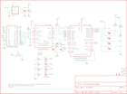

Contents
========

* [PRS9954 > WiFly-Shield](#prs9954--wifly-shield)
	* [Schematic](#schematic)
	* [PCB](#pcb)
	* [Images](#images)
	* [Tags](#tags)
  
![][im]
# PRS9954 > WiFly-Shield

- ID: PROJ-SPAR-9954-STAN-01
- Hex ID: PRS9954
- Name: Sparkfun
- Description: Sparkfun
- Long Link: [http://oom.lt/PROJ-SPAR-9954-STAN-01](http://oom.lt/PROJ-SPAR-9954-STAN-01)
- Short Link: [http://oom.lt/PRS9954](http://oom.lt/PRS9954)

## Schematic
  

## PCB
  

## Images
  
  

|kicadPcb3d|kicadPcb3dFront|kicadPcb3dBack|eagleImage|eagleSchemImage|
| :---: | :---: | :---: | :---: | :---: |
||||||

## Tags

- hexID: PRS9954
- oompType: PROJ
- oompSize: SPAR
- oompColor: 9954
- oompDesc: STAN
- oompIndex: 01
- oompName: WiFly-Shield
- sources: All source files from https://github.com/sparkfun/WiFly-Shield (source licence details in srcLicense.md)
- linkBuyPage: https://www.sparkfun.com/products/9954
- oompID: PROJ-SPAR-9954-STAN-01
- rawParts: C1,0.1uF,CAP0402-CAP,0402-CAP,Capacitor,,
- rawParts: C2,10uF,CAP_POL1206,EIA3216,Capacitor Polarized,,
- rawParts: C3,18pF,CAP0402-CAP,0402-CAP,Capacitor,,
- rawParts: C4,18pF,CAP0402-CAP,0402-CAP,Capacitor,,
- rawParts: JP1,,JUMPER-2SMD-NO,SJ_2S-NO,Jumper,,
- rawParts: JP2,,JUMPER-2SMD-NO,SJ_2S-NO,Jumper,,
- rawParts: JP3,,JUMPER-2SMD-NO,SJ_2S-NO,Jumper,,
- rawParts: JP4,,JUMPER-2SMD-NO,SJ_2S-NO,Jumper,,
- rawParts: JP6,LOGO-SFENEW,LOGO-SFENEW,SFE-NEW-WEBLOGO,Spark Fun Electronics PCB Logo,,
- rawParts: JP7,FIDUCIAL1X2,FIDUCIAL1X2,FIDUCIAL-1X2,Fiducial Alignment Points,,
- rawParts: JP8,FIDUCIAL1X2,FIDUCIAL1X2,FIDUCIAL-1X2,Fiducial Alignment Points,,
- rawParts: JP9,LOGO-SFESK,LOGO-SFESK,SFE-LOGO-FLAME,Spark Fun Electronics PCB Logo,,
- rawParts: LED1,BLUE,LED0603,LED-0603,LEDs,,
- rawParts: LED2,YELLOW,LED0603,LED-0603,LEDs,,
- rawParts: LED3,RED,LED0603,LED-0603,LEDs,,
- rawParts: LED4,GREEN,LED0603,LED-0603,LEDs,,
- rawParts: Q1,14.7456MHz,CRYSTAL5X3,CRYSTAL-SMD-5X3,Crystals,,
- rawParts: R1,22k,RESISTOR0402-RES,0402-RES,Resistor,,
- rawParts: R2,10k,RESISTOR0402-RES,0402-RES,Resistor,,
- rawParts: R3,49k,RESISTOR0402-RES,0402-RES,Resistor,,
- rawParts: R4,220,RESISTOR0402-RES,0402-RES,Resistor,,
- rawParts: R5,220,RESISTOR0402-RES,0402-RES,Resistor,,
- rawParts: R6,220,RESISTOR0402-RES,0402-RES,Resistor,,
- rawParts: R7,220,RESISTOR0402-RES,0402-RES,Resistor,,
- rawParts: R8,1k,RESISTOR0402-RES,0402-RES,Resistor,,
- rawParts: R9,1M,RESISTOR0402-RES,0402-RES,Resistor,,
- rawParts: R10,1k,RESISTOR0402-RES,0402-RES,Resistor,,
- rawParts: S1,,TAC_SWITCHSMD,TACTILE_SWITCH_SMD,Momentary Switch,,
- rawParts: U$1,CREATIVE_COMMONS,CREATIVE_COMMONS,CREATIVE_COMMONS,,,
- rawParts: U1,ARDUINO_SHIELD,ARDUINO_SHIELDLABEL,DUEMILANOVE_SHIELD,,,
- rawParts: U2,WIFLY_GSX,WIFLY_GSX,WIFLY_GSX,,,
- rawParts: U3,SC16IS750,SC16IS750,QFN-24,,,
- rawParts: U4,3.3V,V_REG_LDOSMD,SOT23-5,Voltage Regulator LDO,,

[im]: kicadPcb3d_450.png
