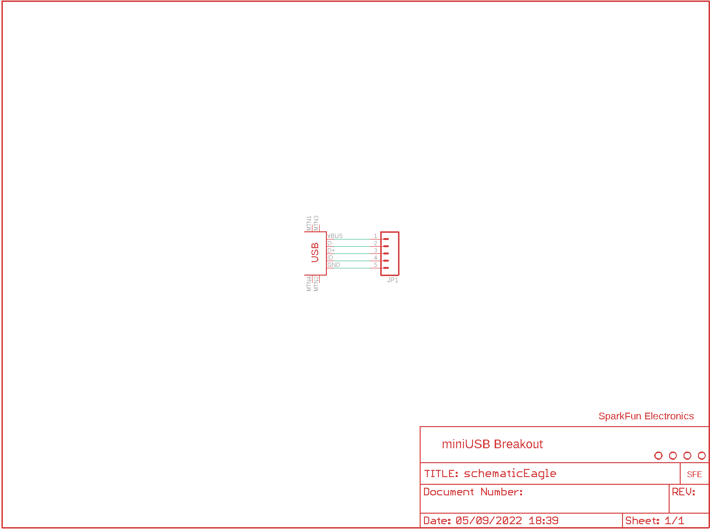
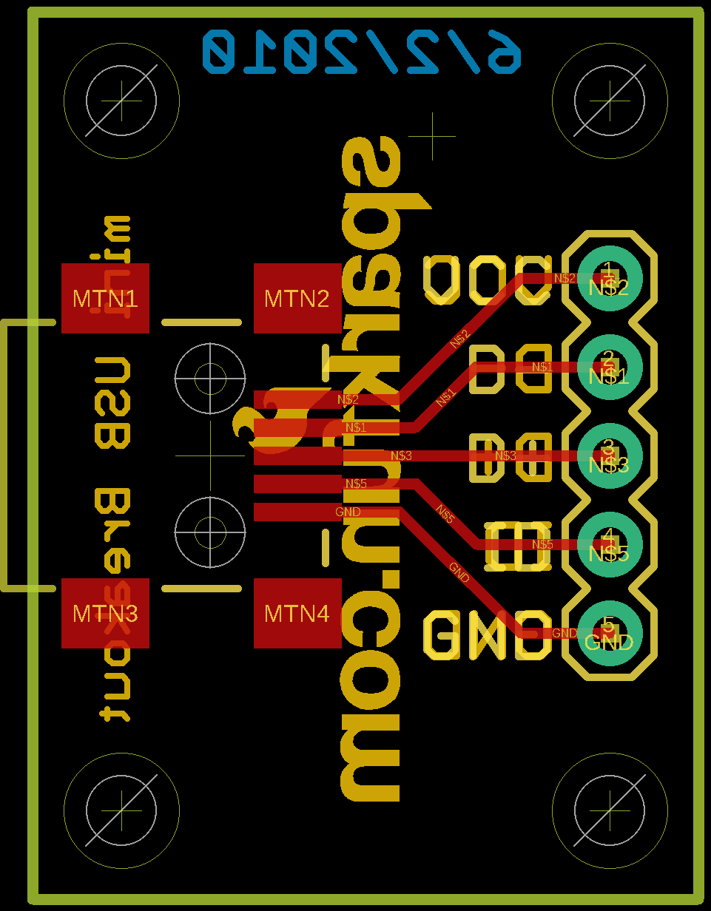
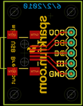

Contents
========

* [PRS9966 > USB miniB Breakout](#prs9966--usb-minib-breakout)
	* [Schematic](#schematic)
	* [PCB](#pcb)
	* [OOMP Parts](#oomp-parts)
	* [Images](#images)
	* [Tags](#tags)
  
![][im]
# PRS9966 > USB miniB Breakout

- ID: PROJ-SPAR-9966-STAN-01
- Hex ID: PRS9966
- Name: Sparkfun
- Description: Sparkfun
- Long Link: [http://oom.lt/PROJ-SPAR-9966-STAN-01](http://oom.lt/PROJ-SPAR-9966-STAN-01)
- Short Link: [http://oom.lt/PRS9966](http://oom.lt/PRS9966)

## Schematic
  

## PCB
  

## OOMP Parts
  

|OOMP ID|Name|Identifier|
| :---: | :---: | :---: |
|[HEAD-I01-X-PI05-01](https://github.com/oomlout/oomlout_OOMP_parts/tree/main/HEAD-I01-X-PI05-01/)|[2.54 mm 5 Pin Header](https://github.com/oomlout/oomlout_OOMP_parts/tree/main/HEAD-I01-X-PI05-01/)|[JP1](https://github.com/oomlout/oomlout_OOMP_parts/tree/main/HEAD-I01-X-PI05-01/)|
|UNMATCHED-UNMATCHED-X-UNMATCHED-01||U$1|

## Images
  
  

|kicadPcb3d|kicadPcb3dFront|kicadPcb3dBack|eagleImage|eagleSchemImage|
| :---: | :---: | :---: | :---: | :---: |
||||||

## Tags

- hexID: PRS9966
- oompType: PROJ
- oompSize: SPAR
- oompColor: 9966
- oompDesc: STAN
- oompIndex: 01
- oompName: USB miniB Breakout
- sources: All source files from https://github.com/sparkfun/USB_miniB_Breakout (source licence details in srcLicense.md)
- linkBuyPage: https://www.sparkfun.com/products/9966
- oompID: PROJ-SPAR-9966-STAN-01
- oompParts: JP1,HEAD-I01-X-PI05-01
- oompParts: U$1,UNMATCHED-UNMATCHED-X-UNMATCHED-01
- rawParts: JP1,,M05PTH,1X05,Header 5,,
- rawParts: U$1,USB-MINIB-5PIN,USB-MINIB-5PIN,USB-MINIB,,,
- rawParts: U$2,STAND-OFF,STAND-OFF,STAND-OFF,Stand Off,,
- rawParts: U$3,STAND-OFF,STAND-OFF,STAND-OFF,Stand Off,,
- rawParts: U$4,STAND-OFF,STAND-OFF,STAND-OFF,Stand Off,,
- rawParts: U$5,STAND-OFF,STAND-OFF,STAND-OFF,Stand Off,,
- rawParts: U$6,LOGO-SFENEW,LOGO-SFENEW,SFE-NEW-WEBLOGO,Spark Fun Electronics PCB Logo,,

[im]: kicadPcb3d_450.png
