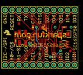

Contents
========

* [PROJ-SPAR-9981-STAN-01>SC16IS750 Breakout](#proj-spar-9981-stan-01sc16is750-breakout)
	* [Images](#images)
	* [OOMP Parts](#oomp-parts)
	* [Tags](#tags)
  
![][im]
# PROJ-SPAR-9981-STAN-01>SC16IS750 Breakout

- ID: PROJ-SPAR-9981-STAN-01
- Hex ID: PRS9981
- Name: SC16IS750 Breakout
- Description: 

## Images
  
  

|eagleImage|kicadPcb3dFront|kicadPcb3dBack|kicadPcb3d|
| :---: | :---: | :---: | :---: |
|||||

## OOMP Parts
  

|OOMP Parts|
| :---: |
|CAPC-0402-X-UNMATCHED-01, C1, 5.08, 10.16, 270,C1, 18pF, 0402-CAP, SparkFun, (0.2, 0.4), R270|
|CAPC-0402-X-UNMATCHED-01, C2, 5.08, 12.7, 270,C2, 18pF, 0402-CAP, SparkFun, (0.2, 0.5), R270|
|CAPC-UNMATCHED-X-UNMATCHED-01, C3, 22.86, 12.7, 180,C3, 10uF, EIA3216, SparkFun, (0.9, 0.5), R180|
|CAPC-0402-X-NF100-V50, C4, 22.86, 15.239999999999998, 0,C4, 0.1uF, 0402-CAP, SparkFun, (0.9, 0.6), R0|
|UNMATCHED-UNMATCHED-X-UNMATCHED-01, IC1, 15.239999999999998, 12.7, 0,IC1, SC16IS750, QFN-24, SparkFun, (0.6, 0.5), R0|
|HEAD-I01-X-PI11-01, JP2, 1.27, 21.59, 0,JP2, M11PTH, 1X11, SparkFun, (0.05, 0.85), R0|
|HEAD-I01-X-PI11-01, JP4, 26.669999999999998, 1.27, 180,JP4, M11PTH, 1X11, SparkFun, (1.05, 0.05), R180|
|HEAD-I01-X-PI2-01, JP5, 6.35, 16.509999999999998, 0,JP5, FIDUCIAL1X2, FIDUCIAL-1X2, SparkFun, (0.25, 0.65), R0|
|HEAD-I01-X-PI2-01, JP6, 25.1206, 6.476999999999999, 0,JP6, FIDUCIAL1X2, FIDUCIAL-1X2, SparkFun, (0.989, 0.255), R0|
|UNMATCHED-UNMATCHED-X-UNMATCHED-01, Q1, 7.619999999999999, 11.43, 90,Q1, 14.7456MHz, CRYSTAL-SMD-5X3, SparkFun, (0.3, 0.45), R90|
|RESE-0402-X-UNMATCHED-01, R1, 10.16, 11.43, 90,R1, 1M, 0402-RES, SparkFun, (0.4, 0.45), R90|
|RESE-0402-X-UNMATCHED-01, R2, 16.509999999999998, 7.619999999999999, 270,R2, 1k, 0402-RES, SparkFun, (0.65, 0.3), R270|
|RESE-0402-X-UNMATCHED-01, R3, 11.43, 15.239999999999998, 90,R3, 1k, 0402-RES, SparkFun, (0.45, 0.6), R90|
|UNMATCHED-UNMATCHED-X-UNMATCHED-01, U1, 22.86, 8.889999999999999, 90,U1, 3.3V, SOT23-5, SparkFun, (0.9, 0.35), R90|

## Tags

- hexID: PRS9981
- oompType: PROJ
- oompSize: SPAR
- oompColor: 9981
- oompDesc: STAN
- oompIndex: 01
- oompName: SC16IS750 Breakout
- sources: All source files from https://github.com/sparkfun/SC16IS750_Breakout (source licence details in srcLicense.md)
- linkBuyPage: https://www.sparkfun.com/products/9981
- oompPart: CAPC-0402-X-UNMATCHED-01, C1, 5.08, 10.16, 270
- oompPart: CAPC-0402-X-UNMATCHED-01, C2, 5.08, 12.7, 270
- oompPart: CAPC-UNMATCHED-X-UNMATCHED-01, C3, 22.86, 12.7, 180
- oompPart: CAPC-0402-X-NF100-V50, C4, 22.86, 15.239999999999998, 0
- oompPart: UNMATCHED-UNMATCHED-X-UNMATCHED-01, IC1, 15.239999999999998, 12.7, 0
- oompPart: HEAD-I01-X-PI11-01, JP2, 1.27, 21.59, 0
- oompPart: HEAD-I01-X-PI11-01, JP4, 26.669999999999998, 1.27, 180
- oompPart: HEAD-I01-X-PI2-01, JP5, 6.35, 16.509999999999998, 0
- oompPart: HEAD-I01-X-PI2-01, JP6, 25.1206, 6.476999999999999, 0
- oompPart: UNMATCHED-UNMATCHED-X-UNMATCHED-01, Q1, 7.619999999999999, 11.43, 90
- oompPart: RESE-0402-X-UNMATCHED-01, R1, 10.16, 11.43, 90
- oompPart: RESE-0402-X-UNMATCHED-01, R2, 16.509999999999998, 7.619999999999999, 270
- oompPart: RESE-0402-X-UNMATCHED-01, R3, 11.43, 15.239999999999998, 90
- oompPart: UNMATCHED-UNMATCHED-X-UNMATCHED-01, U1, 22.86, 8.889999999999999, 90
- rawPart: C1, 18pF, 0402-CAP, SparkFun, (0.2, 0.4), R270
- rawPart: C2, 18pF, 0402-CAP, SparkFun, (0.2, 0.5), R270
- rawPart: C3, 10uF, EIA3216, SparkFun, (0.9, 0.5), R180
- rawPart: C4, 0.1uF, 0402-CAP, SparkFun, (0.9, 0.6), R0
- rawPart: IC1, SC16IS750, QFN-24, SparkFun, (0.6, 0.5), R0
- rawPart: JP2, M11PTH, 1X11, SparkFun, (0.05, 0.85), R0
- rawPart: JP4, M11PTH, 1X11, SparkFun, (1.05, 0.05), R180
- rawPart: JP5, FIDUCIAL1X2, FIDUCIAL-1X2, SparkFun, (0.25, 0.65), R0
- rawPart: JP6, FIDUCIAL1X2, FIDUCIAL-1X2, SparkFun, (0.989, 0.255), R0
- rawPart: Q1, 14.7456MHz, CRYSTAL-SMD-5X3, SparkFun, (0.3, 0.45), R90
- rawPart: R1, 1M, 0402-RES, SparkFun, (0.4, 0.45), R90
- rawPart: R2, 1k, 0402-RES, SparkFun, (0.65, 0.3), R270
- rawPart: R3, 1k, 0402-RES, SparkFun, (0.45, 0.6), R90
- rawPart: U1, 3.3V, SOT23-5, SparkFun, (0.9, 0.35), R90
- oompID: PROJ-SPAR-9981-STAN-01

[im]: kicadPcb3d_450.png
