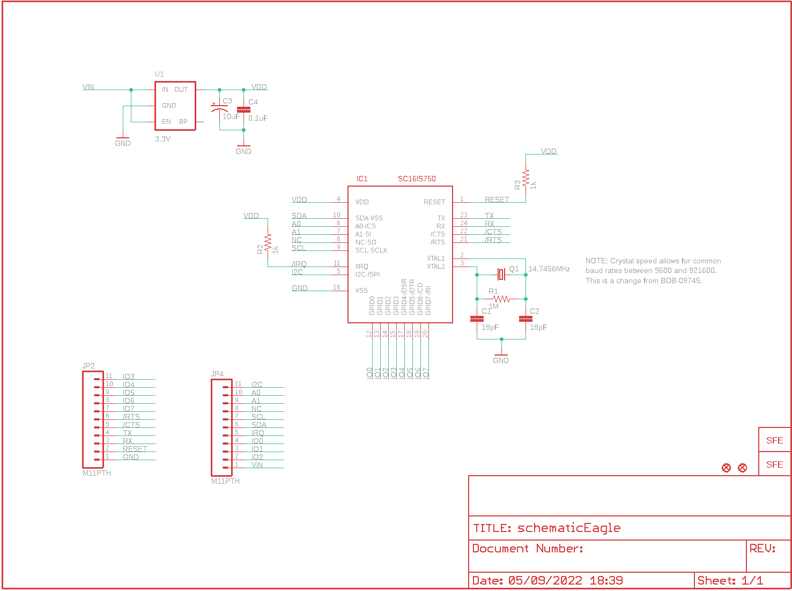
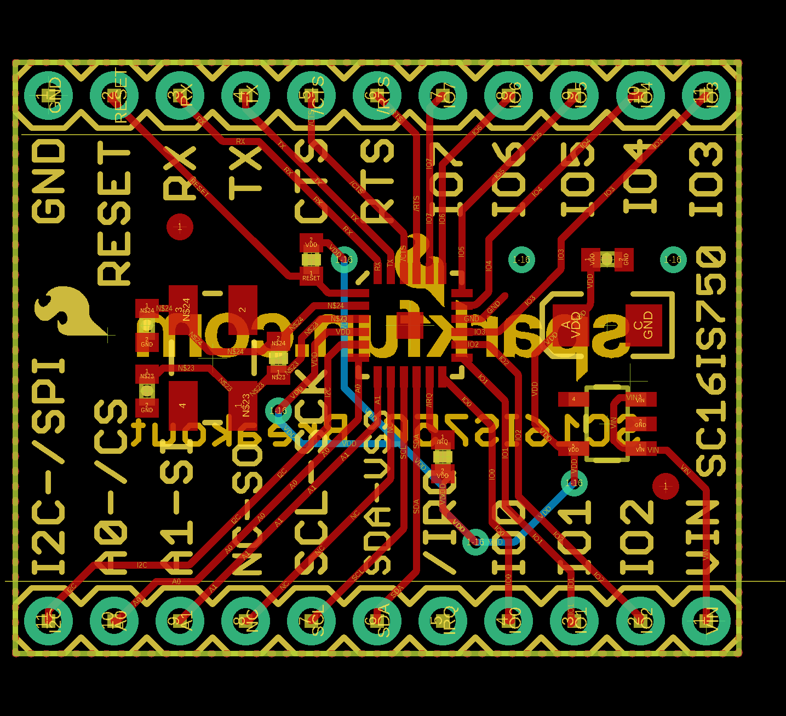
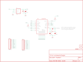

Contents
========

* [PRS9981 > SC16IS750 Breakout](#prs9981--sc16is750-breakout)
	* [Schematic](#schematic)
	* [PCB](#pcb)
	* [Images](#images)
	* [Tags](#tags)
  
![][im]
# PRS9981 > SC16IS750 Breakout

- ID: PROJ-SPAR-9981-STAN-01
- Hex ID: PRS9981
- Name: Sparkfun
- Description: Sparkfun
- Long Link: [http://oom.lt/PROJ-SPAR-9981-STAN-01](http://oom.lt/PROJ-SPAR-9981-STAN-01)
- Short Link: [http://oom.lt/PRS9981](http://oom.lt/PRS9981)

## Schematic
  

## PCB
  

## Images
  
  

|kicadPcb3d|kicadPcb3dFront|kicadPcb3dBack|eagleImage|eagleSchemImage|
| :---: | :---: | :---: | :---: | :---: |
||||||

## Tags

- hexID: PRS9981
- oompType: PROJ
- oompSize: SPAR
- oompColor: 9981
- oompDesc: STAN
- oompIndex: 01
- oompName: SC16IS750 Breakout
- sources: All source files from https://github.com/sparkfun/SC16IS750_Breakout (source licence details in srcLicense.md)
- linkBuyPage: https://www.sparkfun.com/products/9981
- oompID: PROJ-SPAR-9981-STAN-01
- rawParts: C1,18pF,CAP0402-CAP,0402-CAP,Capacitor,,
- rawParts: C2,18pF,CAP0402-CAP,0402-CAP,Capacitor,,
- rawParts: C3,10uF,CAP_POL1206,EIA3216,Capacitor Polarized,,
- rawParts: C4,0.1uF,CAP0402-CAP,0402-CAP,Capacitor,,
- rawParts: IC1,SC16IS750,SC16IS750,QFN-24,,,
- rawParts: JP1,LOGO-SFENEW,LOGO-SFENEW,SFE-NEW-WEBLOGO,Spark Fun Electronics PCB Logo,,
- rawParts: JP2,M11PTH,M11PTH,1X11,Header 11,,
- rawParts: JP3,LOGO-SFESK,LOGO-SFESK,SFE-LOGO-FLAME,Spark Fun Electronics PCB Logo,,
- rawParts: JP4,M11PTH,M11PTH,1X11,Header 11,,
- rawParts: JP5,FIDUCIAL1X2,FIDUCIAL1X2,FIDUCIAL-1X2,Fiducial Alignment Points,,
- rawParts: JP6,FIDUCIAL1X2,FIDUCIAL1X2,FIDUCIAL-1X2,Fiducial Alignment Points,,
- rawParts: Q1,14.7456MHz,CRYSTAL5X3,CRYSTAL-SMD-5X3,Crystals,,
- rawParts: R1,1M,RESISTOR0402-RES,0402-RES,Resistor,,
- rawParts: R2,1k,RESISTOR0402-RES,0402-RES,Resistor,,
- rawParts: R3,1k,RESISTOR0402-RES,0402-RES,Resistor,,
- rawParts: U1,3.3V,V_REG_LDOSMD,SOT23-5,Voltage Regulator LDO,,

[im]: kicadPcb3d_450.png
