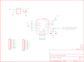

Contents
========

* [PRS9981 > Sparkfun](#prs9981--sparkfun)
	* [Schematic](#schematic)
	* [Images](#images)
	* [Tags](#tags)
  
![][im]
# PRS9981 > Sparkfun

- ID: PROJ-SPAR-9981-STAN-01
- Hex ID: PRS9981
- Name: Sparkfun
- Description: Sparkfun
- Long Link: [http://oom.lt/PROJ-SPAR-9981-STAN-01](http://oom.lt/PROJ-SPAR-9981-STAN-01)
- Long Link: [http://oom.lt/PRS9981](http://oom.lt/PRS9981)

## Schematic
  
![][schem]
## Images
  
  

|kicadPcb3d|kicadPcb3dFront|kicadPcb3dBack|eagleImage|eagleSchemImage|
| :---: | :---: | :---: | :---: | :---: |
||||||

## Tags

- hexID: PRS9981
- oompType: PROJ
- oompSize: SPAR
- oompColor: 9981
- oompDesc: STAN
- oompIndex: 01
- oompName: SC16IS750 Breakout
- sources: All source files from https://github.com/sparkfun/SC16IS750_Breakout (source licence details in srcLicense.md)
- linkBuyPage: https://www.sparkfun.com/products/9981
- oompID: PROJ-SPAR-9981-STAN-01

[im]: kicadPcb3d_450.png
[schem]: eagleSchemImage.png
